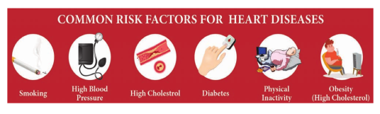

# Diagnosis and Treatment

**Angiogram** 

Angiogram is a procedure that uses a special dye and X-ray to see how blood flows through the coronary arteries of the heart and it can be used to detect abnormality in the blood vessels through out the body.

**Angioplasty** 

Angioplasty is the stretching of an artery that is narrowed due to atherosclerosis. The risk involved in this procedure is minimal. During an angioplasty a small long balloon catheter is threaded through the blocked artery. A deflated balloon is attached to the catheter and the balloon is inflated to widen the arterial wall. Then the tube and the balloon are removed. A small metal scaffold called stent is left in place. This scaffolding keeps the blood vessel open and allows free flow of blood. Slow releasing stents are now available that can release chemicals to prevent further block of the artery.

**Bypass Surgery**

When the arteries that bring blood to the heart muscles (coronary artery) are blocked by **plaque** (accumulation of fat, cholesterol and other substances) the person is advised to undergo Bypass surgery. After the surgery the blood flow to coronary artery is increased and the person is relieved from chest pain. This is a major surgery where damaged blood vessel is replaced by the healthy one taken from different part of the body. Mostly it is taken from legs. During this surgery patients blood system is connected with a pump oxygenator (heart lung machine). After the completion of the surgery the blood vessel is connected to normal the circulation and the blood flows freely.

**Heart Transplantation** 

A heart transplant is a surgical transplantation procedure which is done to replace a diseased or a damaged heart. This procedure is performed on a patient with end stage heart failure or severe coronary artery disease, when other medical ailments or surgical treatments have failed. The most common procedure is to take a functioning heart from a brain dead person (organ donor) and is transplanted in a person with a damaged heart. After the heart transplant the average life span of the person increases.

**Cardio Pulmonary Resuscitation (CPR)** 

In 1956, **James Elam** and **Peter Safar** were the first to use **mouth to mouth resuscitation**. CPR is a life saving procedure that is done at the time of emergency conditions such as when a person’s breath or heart beat has stopped abruptly in case of drowning, electric shock or heart attack. CPR includes rescue of breath, which is achieved by mouth to mouth breathing, to deliver oxygen to the victim’s lungs by external chest compressions which helps to circulate blood to the vital organs. CPR  

must be performed within 4 to 6 minutes after cessation of breath to prevent brain damage or death. Along with CPR, defibrillation is also done. Defibrillation means a brief electric shock is given to the heart to recover the function of the heart.

Each year over several million people worldwide die of heart disease, than from other conditions. For some patients heart transplant is the only hope. Raju was 62 years old when muscles of both the ventricles had deteriorated. He was lucky enough because biomedical engineers were able develop a pumping device called **‘total artificial heart’**. Raju’s heart was completely removed and an artificial heart was put in place. He was able to go home within a few weeks. This artificial heart would have kept him in alive until suitable real heart was available for transplant.

