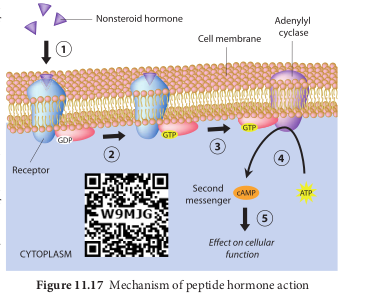
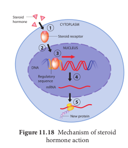
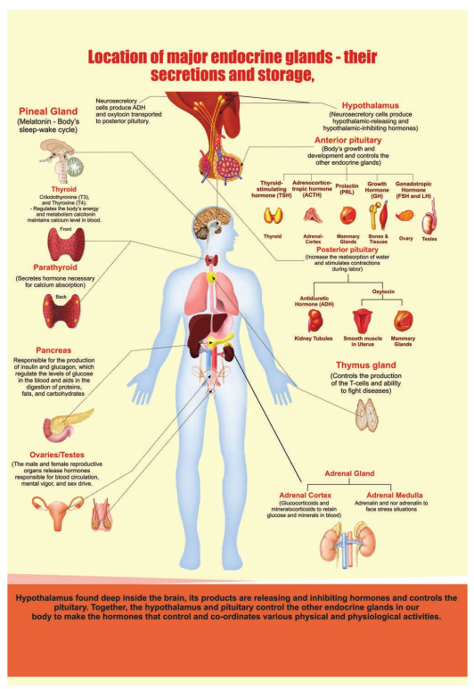

### Mechanism of hormone action

Hormones circulate in the blood but their concentration can increase or decrease based on the requirement of the body. This is controlled by feedback mechanisms. These mechanisms control the secretion of endocrine glands by stimulating the hypothalamus, pituitary or both, which inturn governs the secretion of a particular hormone. In positive feedback, the secretion of the hormone increases where as in negative feedback further secretion of hormone slows down. Feedback mechanisms are the key factors for maintaining homeostasis in our body.

Hormones are classified into three major groups as peptide hormones, steroid hormones and amino acid derived hormones based on their chemical structure.

Peptide hormones cannot cross the phospolipid cell membrane and bind to the receptors on the exterior cell surface. They are are transported to the golgi, which is the site of modification. It acts as a **first messenger** in the cell. Hormones on binding to their receptors do not enter the target cell but generate the production of **second messengers** such as cyclic AMP (c AMP), which in turn regulates cellular metabolism. This is catalyzed by the enzyme **adenylate cyclase**. The interaction between the hormone at the surface and the effect brought out by cAMP within the cell is known as signaling cascade. At each step there is a possibility of amplification. (Figure 11.17) 
1. One hormone molecule may bind to multiple receptor molecules before it is degraded.   

2\. Each receptor may activate several adenylate cyclases each of which make much c AMP.

3\. Thus there is more signal after each step. The actions of cAMP are terminated by phosphodiesterases. The effect of peptide hormones like insulin, glucagon, somatotropin are usually short lived because they work through second messenger system.

Steroid hormones can easily cross the cell membrane, and bind to their receptors, which are intracellular or intranuclear. Upon binding to the receptors, they pair up with another receptor – hormone complex (dimerize).This dimer can then bind to DNA and alter its transcription. (Figure 11.18)

The effect of steroid hormones such as aldosterone, oestrogen, FSH are long lived, as they alter the amount of mRNA and protein in a cell.

Amino acid derived hormones are derived from one or two aminoacid with a few additional modifications. Thyroid hormone is synthesised from tyrosine and includes the addition of several iodine atoms. Epinephrine

  

an amino acid derivative may function through second messenger system like peptide hormones or they may actually enter the cell and function like steroid hormones.

**Avoid use of steroid components** The abuse of anabolic steroids can cause serious health problems like high BP, heart diseases, liver damage, cancer, stroke and blood clots. Other side effects of steroid use includes nausea, vomiting, ligament and tendon injuries, head ache, joint pain, muscle cramps, diarrhoea, sleep problem etc.

**Summary**
 Endocrine glands: secrete hormones

which diffuse into blood and induce the target organs. They are chemical messengers or organic catalysts which interact with receptor in the target organs.

Hormones speed up or slow down or alter the activities of target organs. The hypo or hyper secretion of hormones leads to serious effects on human beings. Hormones coordinate different physical and mental activities to maintain homeostasis.

Hypothalamus interlinks nervous system and endocrine system. It is located in the diencephalon of cerebrum and controls the pituitary secretion. Pituitary gland secretes six tropic hormones which regulates various physiological functions of our body. Posterior pituitary gland secretes vasopressin that regulates water and electrolyte balance. Oxytocin helps during child birth. Melatonin secreted by pineal gland regulates circadian rhythm of our body. The thyroid gland secretes thyroxine which stimulates the nervous  

system, skeletal growth, and regulates basal metabolic rate.

Parathyroid gland regulates calcium level in our body. Thymus gland plays a vital role in cell mediated immunity by promoting T lymphocytes maturation. Pancreas regulates blood glucose homeostasis through its secretion of insulin and glucagon.

Adrenal cortex secretes mineralocorticoids which regulates mineral metabolism, glucocorticoids regulates carbohydrate metabolism. Adrenal medulla secretes the hormones adrenalin and noradrenalin. In male, reproductive functions are controlled by testosterone secreted by the testis. In female, ovary secretes three hormones oestrogen, progesterone and relaxin that regulates reproductive functions.

Hormonal deficiency causes serious harmful effects in human. It alters physiological and biochemical functions of the body. This leads into various disorders like acromegaly, dwarfism, tetany, diabetes etc.

  
