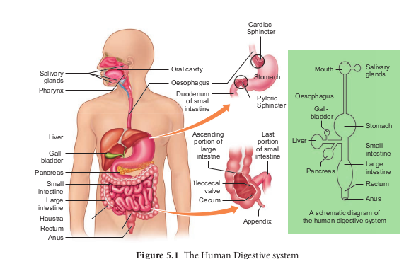
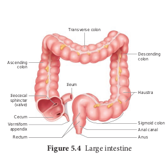
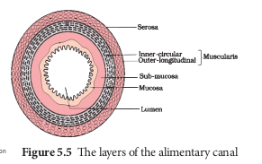
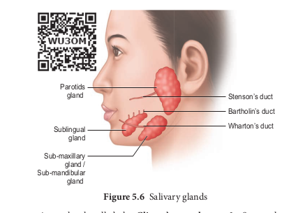
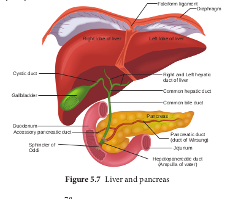
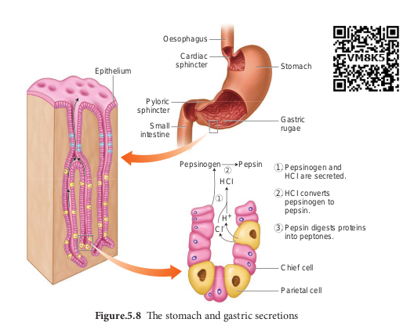
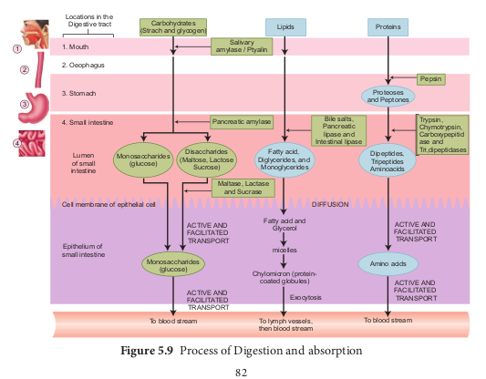
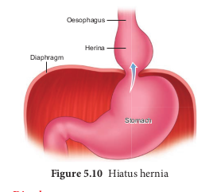
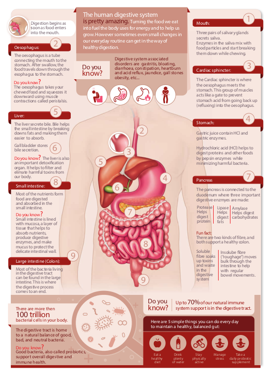

# 5.1 Digestive system
The process of digestion involves intake of the food (Ingestion), breakdown of the food into micromolecules (Digestion), absorption of these molecules into the blood stream (Absorption), the absorbed substances becoming components of cells (Assimilation) and elimination of the undigested substances (Egestion). Digestive system includes the alimentary canal and associated digestive glands.

## 5.1.1 Structure of the alimentary canal

The alimentary canal is a continuous, muscular digestive tract that begins with an anterior opening, the mouth and opens out posteriorly through the anus. The alimentary canal consists of mouth, buccal cavity, pharynx, oesophagus, stomach, intestine, rectum and anus (Figure. 5.1). The mouth is concerned with the reception of food and leads to the buccal cavity or oral cavity (Figure. 5.2). Mechanical digestion is initiated in the buccal cavity by chewing with the help of teeth and tongue. Chemical digestion is through salivary enzymes secreted by the salivary glands.

Each tooth is embedded in a socket in the jaw bone this type of attachment is called **thecodont**. Human beings and many mammals form two sets of teeth during their life time, a set of 20 temporary milk teeth (deciduous teeth) which gets replaced by a set of 32 permanent teeth (adult teeth). This type of dentition is called **diphyodont**. The permanent teeth  

are of four different types (**heterodont**), namely, Incisors (I) chisel like cutting teeth, Canines (C) dagger shaped tearing teeth, Pre molars (PM) for grinding, and Molars (M) for grinding and crushing. Arrangement of teeth in each half of the upper and lower jaw, in the order of I, C, PM and M can be represented by a dental formula, in human the dental formula is

2123/2123 x 2

Mineral salts like calcium and magnesium are deposited on the teeth and form a hard layer of ‘**tartar’ or calculus** called plaque. If the plaque formed on teeth is not removed regularly, it would spread down the tooth into the narrow gap between the gums and enamel and causes inflammation called **gingivitis**, which leads to redness and bleeding of the gums and to bad smell. The hard chewing surface of the teeth is made of enamel and helps in mastication of food.

Tongue is a freely movable muscular organ attached at the posterior end by the frenulum to the floor of the buccal cavity and is free in the front. It acts as a universal tooth brush and helps in intake food, chew and mix food with saliva, to swallow food and also to speak. The upper surface of the tongue has small projections called papillae with taste buds.

The oral cavity leads into a short common passage for food and air called pharynx. The oesophagus and the trachea (wind pipe) open into the pharynx. Food passes into the oesophagus through a wide opening called gullet at the back of the pharynx. A cartilaginous flap called epiglottis prevents the entry of food into the glottis (opening of trachea) during

swallowing. Two masses of lymphoid tissue called tonsils are also located at the sides of the pharynx.

Oesophagus is a thin long muscular tube concerned with conduction of the food to a ‘J’ shaped stomach passing through the neck, thorax and diaphragm. A cardiac sphincter (gastro oesphageal sphincter) regulates the opening of oesophagus into the stomach (Figure. 5.1). If the cardiac sphincter does not contract properly during the churning action of the stomach the gastric juice with acid may flow back into the oesophagus and cause heart burn, resulting in **GERD** (Gastero Oesophagus Reflex Disorder).

The stomach functions as the temporary storage organ for food and is located in the upper left portion of the abdominal cavity. It consists of three parts – a cardiac portion into which the oesophagus opens a fundic portion and a pyloric portion that opens into the duodenum. The opening of the stomach into the duodenum is guarded by the pyloric sphincter. It periodically allows partially digested food to enter the duodenum and also prevents regurgitation of food. The inner wall of stomach has many folds called **gastric rugae** which unfolds to accommodate a large meal.

The small intestine assists in the final digestion and absorption of food. It is the longest part of the alimentary canal and has three regions, a ‘U’ shaped duodenum (25cm long), a long coiled middle portion jejunum (2.4m long) and a highly coiled ileum (3.5m long). The wall of the duodenum has **Brunner’s glands** which secrete mucus and enzymes. Ileum is the longest part of the small intestine and opens into the caecum of the large intestine. The ileal mucosa has numerous vascular projections called **villi** which are

involved in the process of absorption and the cells lining the villi produce numerous microscopic projections called microvilli giving a brush border appearance that increase the surface area enormously. Along with villi, the ileal mucosa also contain mucus secreting goblet cells and lymphoid tissue known as **Peyer’s patches** which produce lymphocytes. The wall of the small intestine bears crypts between the base of villi called **crypts of Leiberkuhn** ( Figure.5.3).

The large intestine consists of caecum, colon and rectum. The caecum is a small blind pouch like structure that opens into the colon and it possesses a narrow finger like tubular projection called **vermiform appendix**. Both caecum and vermiform appendix are large in herbivorous animal and act as an important site for cellulose digestion with the help of symbiotic bacteria. The colon is divided into four regions – an ascending, a transverse, a descending part and a sigmoid colon. The colon is lined by dilations called **haustra** (singular – haustrum) (Figure.5.4). The “S” shaped sigmoid colon (pelvic colon) opens into the rectum. Rectum is concerned with temporary storage of faeces. The rectum open out through the anus. The anus is guarded by two anal sphincter muscles. The anal mucosa is folded into several vertical folds and contains arteries and veins called anal columns. Anal column may get enlarged and causes **piles** or **haemorrhoids**.

### 5.1.2 Histology of the Gut

The wall of the alimentary canal from oesophagus to rectum consists of four layers (Figure 5.5) namely **serosa, muscularis, sub-mucosa and mucosa.** The serosa (visceral peritoneum) is the outermost layer and is made up of thin squamous epithelium with some connective tissues. Muscularis is made of smooth circular and longitudinal muscle fibres with a network of nerve cells and parasympathetic nerve fibres which controls peristalsis. The submucosal layer is formed of loose connective tissue containing nerves, blood, lymph vessels and the sympathetic nerve fibres that control the secretions of intestinal juice. The innermost layer lining the lumen of the alimentary canal is the mucosa which secretes mucous.

### 5.1.3 Digestive glands

Digestive glands are exocrine glands which secrete biological catalysts called enzymes. The digestive glands associated with the alimentary canal are salivary glands, liver and pancreas. Stomach wall has gastric glands that secrete gastric juice and the intestinal mucosa secretes intestinal juice.

**Salivary glands** 
There are three pairs of salivary glands in the mouth. They are the largest parotids gland in the cheeks, the sub-maxillary/ sub-mandibular in the lower jaw and the sublingual beneath the tongue. These glands have ducts such as **Stenson’s duct, Wharton’s duct and Bartholin’s duct or duct of Rivinis** respectively (Figure. 5.6)**.** The salivary juice secreted by the salivary glands reaches the mouth through these ducts. The daily secretion of saliva from salivary glands ranges from 1000 to 1500mL.

**Gastric glands** 
The wall of the stomach is lined by gastric glands. Chief cells or **peptic cells or zymogen cells** in the gastric glands secrete gastric enzymes and **Goblet cells** secrete mucus. The **Parietal or oxyntic cells** secrete HCl and an intrinsic factor responsible for the absorption of Vitamin B12 called **Castle’s intrinsic factor**.

**Liver** 
The liver, the largest gland in our body is situated in the upper right side of the abdominal cavity, just below the diaphragm. The liver consists of two major left and right lobes and two minor lobes. These lobes are connected with diaphragm. Each lobe has many hepatic lobules (functional unit of liver) and is covered by a thin connective

tissue sheath called the **Glisson’s capsule**. Liver cells (hepatic cells) secrete bile which is stored and concentrated in a thin muscular sac called the gall bladder. The duct of gall bladder (cystic duct) along with the hepatic duct from the liver forms the common bile duct. The bile duct passes downwards and joins with the main pancreatic duct to form a common duct called hepato-pancreatic duct. The opening of the hepato-pancreatic duct into the duodenum is guarded by a sphincter called the **sphincter of Oddi (**Figure.5.7)**.** Liver has high power of regeneration and liver cells are replaced by new ones every 3-4 weeks.

Apart from bile secretion, the liver also performs several functions 

1. Destroys aging and defective blood cells

2. Stores glucose in the form of glycogen or disperses glucose into the blood stream with the help of pancreatic hormones

3. Stores fat soluble vitamins and iron 

4. Detoxifies toxic substances. 

5. Involves in the synthesis of non-essential amino acids and urea.

**Pancreas** 

The second largest gland in the digestive system is the Pancreas, which is a yellow coloured, compound elongated organ consisting of exocrine and endocrine cells. It is situated between the limbs of the ‘U’ shaped duodenum. The exocrine portion secretes pancreatic juice containing enzymes such as pancreatic amylase, trypsin and pancreatic lipase and the endocrine part called Islets of Langerhans, secretes hormones such as insulin and glucagon. The pancreatic duct directly opens into the duodenum.

# 5.2 Digestion of food and role of digestive enzymes

The process of digestion converts the solid food into absorbable and assimilable forms. This is accomplished by mechanical and chemical processes.

**Digestion in the buccal cavity**

The smell, sight and taste as well as the mechanical stimulation of food in the mouth, triggers a reflex action which results in the secretion of saliva. The mechanical digestion starts in the mouth by grinding and chewing of food. It is called mastication. The saliva contain water, electrolytes (Na+, K+, Cl–, HCO3–), salivary amylase (ptyalin), antibacterial agent lysozyme and a lubricating agent mucus (a glycoprotein). The mucus in saliva prepares the food for swallowing by moistening, softening, lubricating and adhering the masticated food into a bolus. About 30 percent of polysaccharide, starch is hydrolyzed by the salivary amylase enzyme into disaccharides (maltose). The **bolus** is then passed into the pharynx and then into the oesophagus by swallowing or **deglutition. The bolus further passes down** through the oesophagus to the stomach by successive waves of muscular contraction called peristalsis. The gastro oesphageal **sphincter** controls the passage of food into the stomach.

**Digestion in the stomach**

Food remains in the stomach for 4 to 5 hours, the rhythmic peristaltic movement churns and mixes the food with gastric juice and make it into a creamy liquid called **chyme**. The gastric secretion is partly controlled by autonomic reflexes. The secretion of gastric juice begins when the food is in the mouth. The gastric juice contains HCl and proenzymes. The proenzyme pepsinogen, on exposure to HCl gets converted into the active enzyme pepsin which converts proteins into proteoses and peptones (peptides). The HCl provides an acidic medium which is optimum for pepsin, kills bacteria and other harmful organisms and avoids putrifaction. The mucus and bicarbonates present in the gastric juice play an important role in lubrication and protection of the mucosal epithelium from the eroding nature of the highly acidic HCl (Figure. 5.8). Another proteolytic enzyme found in gastric juice of infants is rennin helps in the digestion of milk protein, caseinogen to casein in the presence of calcium ions. This enzyme secretion gradually reduces with aging.

**Digestion in the small intestine**

The bile, pancreatic juice and intestinal juice are the secretions released into the small intestine. Movements generated by the muscularis layer of the small intestine helps in the thorough mixing of the food with various secretions in the intestine and thereby facilitate digestion.

The bile contains bile pigments (bilirubin and biliverdin) as the break down products of hemoglobin of dead RBCs, bile salts,

cholesterol and phospholipids but has no enzymes. Bile helps in emulsification of fats. Bile salts reduce the surface tension of fat droplets and break them into small globules. Bile also activates lipases to digest lipids Proteins and partially digested proteins in the chyme on reaching the intestine are acted upon by the proteolytic enzymes of pancreatic juice.The pancreatic juice contains enzymes such as trypsinogen, chymotrypsinogen, carboxypeptidases, pancreatic amylases, pancreatic lipases and nucleases. Trypsinogen is activated by an enzyme, enterokinase, secreted by the intestinal mucosa into active trypsin, which in turn activates the enzyme chymotrypsinogen in the pancreatic juice.
  

Trypsin hydrolyses proteins into polypeptides and peptones, while chymotrypsin hydrolyses peptide bonds associated with specific amino acids.

The pancreatic amylase converts glycogen and starch into maltose. Lipase acts on emulsified fat (triglycerides) and hydrolyses them into free fatty acid and monoglycerides. Monoglycerides are further hydrolysed to fatty acid and glycerol. Nucleases in the pancreatic juice break the nucleic acid into nucleotides and nucleosides.

The secretions of the Brunner's gland along with the secretions of the intestinal glands constitute the intestinal juice or **succus entericus. The enzymes in the** intestinal juice such as maltase, lactase, sucrase (invertase), peptidases, lipases, nucleotidases and nucleosidases act on the breakdown products of bile and pancreatic digestion.

The mucus along with the bicarbonate ions from the pancreas provides an alkaline medium (pH 7.8) for the enzymatic action. As a result of digestion, all macromolecules of food are converted into their corresponding monomeric units.

The simple substances thus formed are absorbed in the jejunum and ileum region of the small intestine. The undigested and unabsorbed substances are propelled into the large intestine. The activities of the gastro-intestinal tract are carried out by the neural and hormonal control for proper coordination of different parts. Gastric and intestinal secretions are stimulated by neural signals. Hormonal control of the secretion of digestive juices is carried out by local hormones produced by the gastric and intestinal mucosa.

# 5.3 Absorption and assimilation of proteins, carbohydrates and fats

Absorption is a process by which the end product of digestion passes through the intestinal mucosa into the blood and lymph. The villi in the lumen of ileum are the absorbing units, consisting of a lacteal duct in the middle surrounded by fine network of blood capillaries. The process of absorption involves active, passive and facilitated transport. Small amounts of glucose, amino acids and electrolytes like chloride ions are generally absorbed by simple diffusion. The passage of these substances into the blood depends upon concentration gradients. However, some of the substances like fructose are absorbed with the help of the carrier ions like Na+. This mechanism is called facilitated transport.

Nutrients like amino acids, glucose and electrolytes like Na+ are absorbed into the blood against the concentration gradient by active transport. The insoluble substances like fatty acids, glycerol and fat soluble vitamins are first incorporated into small, spherical water soluble droplets called micelles and are absorbed into the intestinal mucosa where they are re-synthesized into protein coated fat globules called chylomicrons which are then transported into the lacteals within the intestinal villi and eventually empty into lymphatic duct. The lymphatic ducts ultimately release the absorbed substances into the blood stream. While the fatty acids are absorbed by the lymph duct, other materials are absorbed either actively or passively by the capillaries of the villi (Figure. 5.9). Water soluble vitamins are absorbed by simple

diffusion or active transport. Transport of water depends upon the osmotic gradient.

Absorption of substances in the alimentary canal takes place in mouth, stomach, small intestine and large intestine. However maximum absorption takes place in the small intestine. Absorption of simple sugars, alcohol and medicines takes place in the stomach. Certain drugs are absorbed by blood capillaries in the lower side of the tongue and mucosa of mouth. Large intestine is also involved in absorption of more amounts of water, vitamins, some minerals and certain drugs.

Absorbed substances are transported through blood and lymph to the liver through the hepatic portal system. From the liver, nutrients are transported to all other regions of the body for utilization. All the body tissues utilize the absorbed substance for their activities and incorporate into their protoplasm, this process is called assimilation.

# 5.4 Egestion

The digestive waste and unabsorbed substances in the ileum enter into the large intestine and it mostly contains fibre called roughage. The roughage is utilized by symbiotic bacteria in the large intestine for the production of substances like vitamin K and other metabolites. All these substances are absorbed in the colon along with water. The waste is then solidified into faecal matter in the rectum. The faecal matter initiates a neural reflex causing an urge or desire for its removal. The egestion of faeces through the anal opening is called defaecation. It is a voluntary process and is carried out by a peristaltic movement.

# 5.5 Nutrients, Vitamins and Minerals

Food comprises of macronutrients and micronutrients. The nutrients required in larger quantities are called macronutrients, whereas those required in small quantities are called micronutrients. Essential nutrients cannot be synthesized by the body; they have to be included in the diet. Macronutrients are lipids, carbohydrates, proteins and the micronutrients are vitamins and minerals. Water plays an important role in the metabolic processes and prevents dehydration of the body.

Intake of too much of food or lesser amount of food than the basic requirement is called **malnutrition**. A diet which can provide all the metabolic requirements of the body in a right proportion is called **balanced diet**. That means it should contain carbohydrates and fats for energy yielding, proteins for growth and replacement; and vitamins, minerals and water for physiological regulation.

**Vitamins** 

Vitamins are naturally occurring organic substances regularly needed in minute quantities for maintaining normal health as metabolic regulators. The identified vitamins are classified as fat soluble (A,D,E and K) (Table 5.1) and vitamin B and vitamin C are water soluble (Table 5.2). Vitamin A, D, E and K, if consumed beyond required level may cause defects, commonly referred to as hypervitaminosis.

**Minerals** 

These are the inorganic chemical elements, i.e., Ca, Fe, I, K, Mg, Na, P, S, etc needed for regulation of various physiological functions. These can be classified into major minerals (Na, P, K, Ca, Mg, S, Cl) and others are trace minerals such as Fe, Cu, Zn, Co, Mn, I, and fluorine. Sodium ions are more abundant than any other cation in the body fluids.

# 5.6 Caloric value of carbohydrates, proteins and fats Caloric value of carbohydrates, proteins and fats

We obtain 50% energy from carbohydrates 35% from fats and 15% from proteins. We require about 400 to 500 gm of carbohydrates, 60 to 70 gm of fats and 65 to 75 gm of proteins per day. Balanced diet of each individual will vary according to their age, gender, level of physical activity and others conditions such as pregnancy and lactation.

**Carbohydrates** are sugar and starch. These are the major source of cellular fuel which provides energy. The caloric value of carbohydrate is 4.1 Kcal per gram and its physiological fuel value is 4 Kcal per gram.

**Lipids** are fats and derivatives of fats, are also the best reserved food stored in our body which is used for production of energy. Fat has a caloric value of 9.45 Kcal and a physiological fuel value of 9 Kcal per gram.

**Proteins** are source of amino acids required for growth and repair of body cells. They are stored in the body only to a certain extent large quantities are excreted as nitrogenous waste. The caloric value and physiological fuel value of one gram of protein are 5.65 Kcal and 4 Kcal respectively. According to ICMR (Indian Council of Medical Research and WHO (World Health Organization , the daily requirement of protein for an average Indian is 1gm per 1 kg body weight.

# 5.7 Nutritional and digestive disorders

Intestinal tract is more prone to bacterial, viral and parasitic worm infections. This infection may cause inflammation of the inner lining of colon called colitis. The most common symptoms of colitis are rectal bleeding, abdominal cramps, and diarrhoea.

**Protein energy malnutrition: (PEM)** 

Growing children require more amount of protein for their growth and development. Protein deficient diet during early stage of children may lead to protein energy malnutrition such as **Marasmus and Kwashiorkor**. Symptoms are dry skin, pot-belly, oedema in the legs and face, stunted growth, changes in hair colour, weakness and irritability. Marasmus is an acute form of protein malnutrition. This condition is due to a diet with inadequate carbohydrate and protein. Such children are suffer from diarrhoea, body becomes lean and weak (emaciated) with reduced fat and muscle tissue with thin and folded skin. 

**Indigestion:** 

It is a digestive disorder in which the food is not properly digested leading to a feeling of fullness of stomach. It may be due to inadequate enzyme secretion, anxiety, food poisoning, over eating, and spicy food.

**Constipation:** 

In this condition, the faeces are retained within the rectum because of irregular bowel movement due to poor intake of fibre in the diet and lack of physical activities.

**Vomiting:** 

It is reverse peristalsis. Harmful substances and contaminated food from stomach are ejected through the mouth. This action is controlled by the vomit centre located in the medulla oblongata. A feeling of nausea precedes vomiting.

**Jaundice:** 

It is the condition in which liver is affected and the defective liver fails to break down haemoglobin and to remove bile pigments from the blood. Deposition of these pigments changes the colour of eye and skin yellow. Sometimes, jaundice is caused due to hepatitis viral infections.

**Liver Cirrhosis:** 

Chronic disease of liver results in degeneration and destruction of liver cells resulting in abnormal blood vessel and bile duct leading to the formation of fibrosis. It is also called deserted liver or scarred liver. It is caused due to infection, consumption of poison, malnutrition and alcoholism.

**Gall Stones:** 

Any alteration in the composition of the bile can cause the formation of stones in the gall bladder. The stones are mostly formed of crystallized cholesterol in the bile. The gall stone causes obstruction in the cystic duct, hepatic duct and also hepato- pancreatic duct causing pain, jaundice and pancreatitis.

**Appendicitis:** 

It is the inflammation of the vermiform appendix, leading to severe abdominal pain. The treatment involves the removal of appendix by surgery. If treatment is delayed the appendix may rupture and results in infection of the abdomen, called **peritonitis**. **Hiatus Hernia (Diaphragmatic Hernia):** It is a structural abnormality in which superior part of the stomach protrudes slightly above the diaphragm. The exact cause of hiatus hernias is not known. In some people, injury or other damage may weaken muscle tissue, by applying too much pressure (repeatedly) on the muscles around the stomach while coughing, vomiting, and straining during bowel movement and lifting heavy object. Heart burn is also common in those with a hiatus hernia. In this condition, stomach contents travel back into the oesophagus or even into oral cavity and causes pain in the centre of the chest due to the eroding nature of acidity (Figure.5.10).

**Diarrhoea:** 

It is the most common gastrointestinal disorder worldwide. It is sometimes caused by bacteria or viral infections through food or water. When the colon is infected, the lining of the intestine is damaged by the pathogens, thereby the colon is unable to absorb fluid. The abnormal frequency of bowel movement and increased liquidity of the faecal discharge is known as diarrhoea. Unless the condition is treated, dehydration can occur. Treatment is known as **oral hydration therapy. This involves drinking** plenty of fluids – sipping small amounts of water at a time to rehydrate the body. 

**Peptic Ulcer:** 

It refers to an eroded area of the tissue lining (mucosa) in the stomach or duodenum. Duodenal ulcer occurs in people in the age group of 25 - 45 years. Gastric ulcer is more common in persons above the age of 50 years. Ulcer is mostly due to infections caused by the bacterium **_Helicobacter pylori_.** It may also be caused due to uncontrolled usage of aspirin or certain antiinflammatory drugs. Ulcer may also be caused due to smoking, alcohol, caffeine and psychological stress.

**Obesity:** 

It is caused due to the storage of excess of body fat in adipose tissue. It may induce hypertension, atherosclerotic heart disease and diabetes. Obesity may be genetic or due to excess intake of food, endocrine and metabolic disorders. Degree of obesity is assessed by body mass index (**BMI**). A normal BMI range for adult is 19-25 above 25 is considered as obese. BMI is calculated as body weight in Kg, divided by the square of body height in meters. For example, a 50 Kg person with a height of 160 cms would have a BMI of 19.5.

That is BMI = 50 /(1.6)2= 19.5

