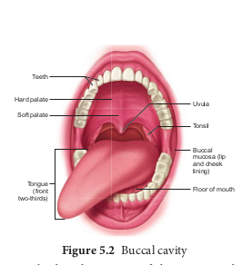
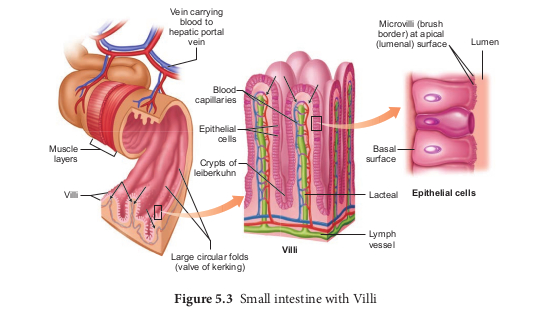

# Digestive system
The process of digestion involves intake of the food (Ingestion), breakdown of the food into micromolecules (Digestion), absorption of these molecules into the blood stream (Absorption), the absorbed substances becoming components of cells (Assimilation) and elimination of the undigested substances (Egestion). Digestive system includes the alimentary canal and associated digestive glands.

## Structure of the alimentary canal

The alimentary canal is a continuous, muscular digestive tract that begins with an anterior opening, the mouth and opens out posteriorly through the anus. The alimentary canal consists of mouth, buccal cavity, pharynx, oesophagus, stomach, intestine, rectum and anus (Figure. 5.1). The mouth is concerned with the reception of food and leads to the buccal cavity or oral cavity (Figure. 5.2). Mechanical digestion is initiated in the buccal cavity by chewing with the help of teeth and tongue. Chemical digestion is through salivary enzymes secreted by the salivary glands.

Each tooth is embedded in a socket in the jaw bone this type of attachment is called **thecodont**. Human beings and many mammals form two sets of teeth during their life time, a set of 20 temporary milk teeth (deciduous teeth) which gets replaced by a set of 32 permanent teeth (adult teeth). This type of dentition is called **diphyodont**. The permanent teeth  

are of four different types (**heterodont**), namely, Incisors (I) chisel like cutting teeth, Canines (C) dagger shaped tearing teeth, Pre molars (PM) for grinding, and Molars (M) for grinding and crushing. Arrangement of teeth in each half of the upper and lower jaw, in the order of I, C, PM and M can be represented by a dental formula, in human the dental formula is

2123/2123 x 2

Mineral salts like calcium and magnesium are deposited on the teeth and form a hard layer of ‘**tartar’ or calculus** called plaque. If the plaque formed on teeth is not removed regularly, it would spread down the tooth into the narrow gap between the gums and enamel and causes inflammation called **gingivitis**, which leads to redness and bleeding of the gums and to bad smell. The hard chewing surface of the teeth is made of enamel and helps in mastication of food.

Tongue is a freely movable muscular organ attached at the posterior end by the frenulum to the floor of the buccal cavity and is free in the front. It acts as a universal tooth brush and helps in intake food, chew and mix food with saliva, to swallow food and also to speak. The upper surface of the tongue has small projections called papillae with taste buds.

The oral cavity leads into a short common passage for food and air called pharynx. The oesophagus and the trachea (wind pipe) open into the pharynx. Food passes into the oesophagus through a wide opening called gullet at the back of the pharynx. A cartilaginous flap called epiglottis prevents the entry of food into the glottis (opening of trachea) during

swallowing. Two masses of lymphoid tissue called tonsils are also located at the sides of the pharynx.

Oesophagus is a thin long muscular tube concerned with conduction of the food to a ‘J’ shaped stomach passing through the neck, thorax and diaphragm. A cardiac sphincter (gastro oesphageal sphincter) regulates the opening of oesophagus into the stomach (Figure. 5.1). If the cardiac sphincter does not contract properly during the churning action of the stomach the gastric juice with acid may flow back into the oesophagus and cause heart burn, resulting in **GERD** (Gastero Oesophagus Reflex Disorder).

The stomach functions as the temporary storage organ for food and is located in the upper left portion of the abdominal cavity. It consists of three parts – a cardiac portion into which the oesophagus opens a fundic portion and a pyloric portion that opens into the duodenum. The opening of the stomach into the duodenum is guarded by the pyloric sphincter. It periodically allows partially digested food to enter the duodenum and also prevents regurgitation of food. The inner wall of stomach has many folds called **gastric rugae** which unfolds to accommodate a large meal.

The small intestine assists in the final digestion and absorption of food. It is the longest part of the alimentary canal and has three regions, a ‘U’ shaped duodenum (25cm long), a long coiled middle portion jejunum (2.4m long) and a highly coiled ileum (3.5m long). The wall of the duodenum has **Brunner’s glands** which secrete mucus and enzymes. Ileum is the longest part of the small intestine and opens into the caecum of the large intestine. The ileal mucosa has numerous vascular projections called **villi** which are

involved in the process of absorption and the cells lining the villi produce numerous microscopic projections called microvilli giving a brush border appearance that increase the surface area enormously. Along with villi, the ileal mucosa also contain mucus secreting goblet cells and lymphoid tissue known as **Peyer’s patches** which produce lymphocytes. The wall of the small intestine bears crypts between the base of villi called **crypts of Leiberkuhn** ( Figure.5.3).

The large intestine consists of caecum, colon and rectum. The caecum is a small blind pouch like structure that opens into the colon and it possesses a narrow finger like tubular projection called **vermiform appendix**. Both caecum and vermiform appendix are large in herbivorous animal and act as an important site for cellulose digestion with the help of symbiotic bacteria. The colon is divided into four regions – an ascending, a transverse, a descending part and a sigmoid colon. The colon is lined by dilations called **haustra** (singular – haustrum) (Figure.5.4). The “S” shaped sigmoid colon (pelvic colon) opens into the rectum. Rectum is concerned with temporary storage of faeces. The rectum open out through the anus. The anus is guarded by two anal sphincter muscles. The anal mucosa is folded into several vertical folds and contains arteries and veins called anal columns. Anal column may get enlarged and causes **piles** or **haemorrhoids**.

### Histology of the Gut

The wall of the alimentary canal from oesophagus to rectum consists of four layers (Figure 5.5) namely **serosa, muscularis, sub-mucosa and mucosa.** The serosa (visceral peritoneum) is the outermost layer and is made up of thin squamous epithelium with some connective tissues. Muscularis is made of smooth circular and longitudinal muscle fibres with a network of nerve cells and parasympathetic nerve fibres which controls peristalsis. The submucosal layer is formed of loose connective tissue containing nerves, blood, lymph vessels and the sympathetic nerve fibres that control the secretions of intestinal juice. The innermost layer lining the lumen of the alimentary canal is the mucosa which secretes mucous.

### Digestive glands

Digestive glands are exocrine glands which secrete biological catalysts called enzymes. The digestive glands associated with the alimentary canal are salivary glands, liver and pancreas. Stomach wall has gastric glands that secrete gastric juice and the intestinal mucosa secretes intestinal juice.

**Salivary glands** 
There are three pairs of salivary glands in the mouth. They are the largest parotids gland in the cheeks, the sub-maxillary/ sub-mandibular in the lower jaw and the sublingual beneath the tongue. These glands have ducts such as **Stenson’s duct, Wharton’s duct and Bartholin’s duct or duct of Rivinis** respectively (Figure. 5.6)**.** The salivary juice secreted by the salivary glands reaches the mouth through these ducts. The daily secretion of saliva from salivary glands ranges from 1000 to 1500mL.

**Gastric glands** 
The wall of the stomach is lined by gastric glands. Chief cells or **peptic cells or zymogen cells** in the gastric glands secrete gastric enzymes and **Goblet cells** secrete mucus. The **Parietal or oxyntic cells** secrete HCl and an intrinsic factor responsible for the absorption of Vitamin B12 called **Castle’s intrinsic factor**.

**Liver** 
The liver, the largest gland in our body is situated in the upper right side of the abdominal cavity, just below the diaphragm. The liver consists of two major left and right lobes and two minor lobes. These lobes are connected with diaphragm. Each lobe has many hepatic lobules (functional unit of liver) and is covered by a thin connective

tissue sheath called the **Glisson’s capsule**. Liver cells (hepatic cells) secrete bile which is stored and concentrated in a thin muscular sac called the gall bladder. The duct of gall bladder (cystic duct) along with the hepatic duct from the liver forms the common bile duct. The bile duct passes downwards and joins with the main pancreatic duct to form a common duct called hepato-pancreatic duct. The opening of the hepato-pancreatic duct into the duodenum is guarded by a sphincter called the **sphincter of Oddi (**Figure.5.7)**.** Liver has high power of regeneration and liver cells are replaced by new ones every 3-4 weeks.

Apart from bile secretion, the liver also performs several functions 

1. Destroys aging and defective blood cells

2. Stores glucose in the form of glycogen or disperses glucose into the blood stream with the help of pancreatic hormones

3. Stores fat soluble vitamins and iron 

4. Detoxifies toxic substances. 

5. Involves in the synthesis of non-essential amino acids and urea.

**Pancreas** 

The second largest gland in the digestive system is the Pancreas, which is a yellow coloured, compound elongated organ consisting of exocrine and endocrine cells. It is situated between the limbs of the ‘U’ shaped duodenum. The exocrine portion secretes pancreatic juice containing enzymes such as pancreatic amylase, trypsin and pancreatic lipase and the endocrine part called Islets of Langerhans, secretes hormones such as insulin and glucagon. The pancreatic duct directly opens into the duodenum.

