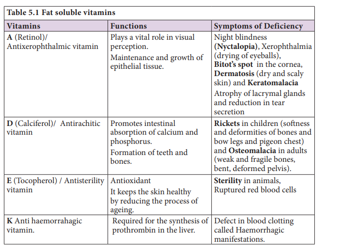
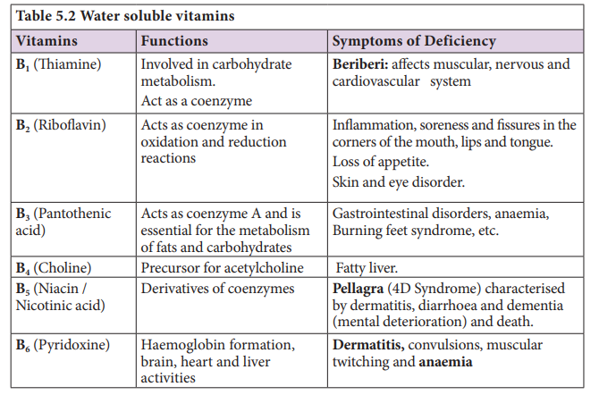
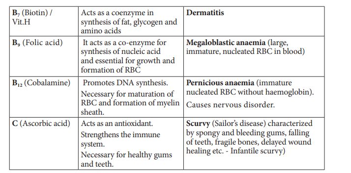

# Nutrients, Vitamins and Minerals

Food comprises of macronutrients and micronutrients. The nutrients required in larger quantities are called macronutrients, whereas those required in small quantities are called micronutrients. Essential nutrients cannot be synthesized by the body; they have to be included in the diet. Macronutrients are lipids, carbohydrates, proteins and the micronutrients are vitamins and minerals. Water plays an important role in the metabolic processes and prevents dehydration of the body.

Intake of too much of food or lesser amount of food than the basic requirement is called **malnutrition**. A diet which can provide all the metabolic requirements of the body in a right proportion is called **balanced diet**. That means it should contain carbohydrates and fats for energy yielding, proteins for growth and replacement; and vitamins, minerals and water for physiological regulation.

**Vitamins** 

Vitamins are naturally occurring organic substances regularly needed in minute quantities for maintaining normal health as metabolic regulators. The identified vitamins are classified as fat soluble (A,D,E and K) (Table 5.1) and vitamin B and vitamin C are water soluble (Table 5.2). Vitamin A, D, E and K, if consumed beyond required level may cause defects, commonly referred to as hypervitaminosis.

**Minerals** 

These are the inorganic chemical elements, i.e., Ca, Fe, I, K, Mg, Na, P, S, etc needed for regulation of various physiological functions. These can be classified into major minerals (Na, P, K, Ca, Mg, S, Cl) and others are trace minerals such as Fe, Cu, Zn, Co, Mn, I, and fluorine. Sodium ions are more abundant than any other cation in the body fluids.

 
 
