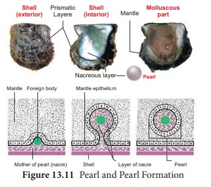
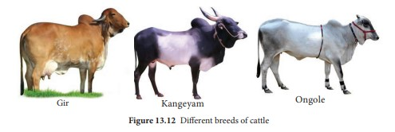
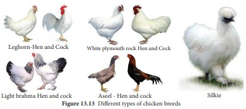

 Animal Husbandry and Management

Animal husbandry is the practice of breeding and raising livestock cattles like cows, buffaloes, and goats and birds etc. that are useful to human beings. Parameters such as adequate ventilation, temperature, sufficient light, water and proper housing accommodation should be taken into account to maintain dairy and poultry farms. Animals should be cared and protected from diseases. Records should be maintained after the regular visits by Veterinarian. More over the selection of good breeds with high yielding potential combined and resistance to diseases is very important.

**Animal Breeding**
 Human beings have been depending on animals and animal products for food from very early times. Generally high yielding animals produced by hybridization are reared in poultry and dairy farms. In earlier days, animals were produced and selected based on specific characters. With the gain in knowledge on the principles of heredity and genetics, human beings have been successful in rearing animals with the superior qualities through hybridization experiments. Complex issues are faced by

the animal breeder during hybridization experiments. Hence animals with maximum desirable characters should be selected.

A group of animals related by descent and with similar characters like general appearance, features, size etc., are said to belong to a breed. Why should we breed animals? Through animal breeding, improved breeds of animals can be produced by improving their genotype through selective breeding.

**Objectives of Animal breeding:**
 a. To improve growth rate
  b. Enhancing the production of milk,meat. Egg etc.,
 c. Increasing the quality of the animal
products 
d. Improved resistance to diseases
 e. Increased reproductive rate

**Methods of Animal breeding:** There are two methods of animal breeding, namely inbreeding and outbreeding
 **1\. Inbreeding:** Breeding between animals of the same breed for 4-6 generations is called inbreeding. Inbreeding increases

  

homozygosity and exposes the harmful recessive genes. Continuous inbreeding reduces fertility and even productivity, resulting in“inbreeding depression”. This can be avoided by breeding selected animals of the breeding population and they should be mated with superior animals of the same breed but unrelated to the breeding population. It helps to restore fertility and yield. 
**2\. Outbreeding: The breeding between** unrelated animals is called outbreeding. Individuals produced do not have common ancestors for 4-6 generations. Outbreeding helps to produce new and favourable traits, to produce hybrids with superior qualities and helps to create new breeds. New and favourable genes can be introduced into a population through outbreeding.

i. **Out crossing**: It is the breeding between unrelated animals of the same breed but having no common ancestry. The offspring of such a cross is called outcross. This method is suitable for breeding animals below average in productivity.

ii. **Cross breeding:** Breeding between a superior male of one breed with a superior female of another breed. The cross bred progeny has superior traits (hybrid vigour or heterosis).

iii. **Interspecific hybridization:** In this method of breeding mating is

between male and female of two different species. The progeny obtained from such crosses are different from their parents, and may possess the desirable traits of the parents. Have you heard about Mule? It was produced by the process of interspecific hybridization between a male donkey and a female horse.  

**Controlled breeding experiments Artificial insemination:** Artificial insemination is a technique in which the semen collected from the male is injected to the reproductive tract of the selected female. Artificial insemination is economical measure where fewer bulls are required and maximum use can be made of the best sire.

**Advantages of artificial insemination** 
i. It increases the rate of conception

ii. It avoids genital diseases iii. Semen can be collected from injured

bulls which have desirable traits. 
iv. Superior animals located apart can be
bred successfully.

**Multiple ovulation embryo transfer technology (MOET)** It is another method of propagation of animals with desirable traits. This method is applied when the success rate of crossing is low even after artificial insemination. In this method Follicle stimulating hormone (FSH) is administered to cows for inducing follicular maturation and super ovulation. Instead of one egg per cycle, 6-8 eggs can be produced by this technology. The eggs are carefully recovered non-surgically from the genetic mother and fertilized artificially

  

The embryos at 8-32 celled stages are recovered and transferred to a surrogate mother. For another round of ovulation, the same genetic mother is utilized. This technology can be applied to cattle, sheep and buffaloes. Advantage of this technology is to produce high milk yielding females and high-quality meat yielding bulls in a short time.

**Breeds of Dairy animals** Dairying is the production and marketing of milk and its products. Dairy operation consists of proper maintenance of cattle, the collection and processing the milk and its by products. There are 26 well defined breeds of cattle and 6 breeds of buffaloes in India. Cattles are classified under three groups based on the purpose they serve to man (Figure 13. 12). They are

i. Dairy breeds or Milch breeds: They are high milk yielders with extended lactation. Eg., Sindhi, Gir, Sahiwal, Jersy, Brown Swiss, Holstein cattle.

ii. **Draught purpose breeds**: Bullocks are good for draught purpose. Eg. Kangayam, Malvi.

iii. **Dual Purpose breeds**: Cows are meant for yielding more milk and bullocks are used for better drought purpose. Eg. Ongole, Hariana.
  

To meet the milk demand of the growing population, milk breeds are preferred by farmers in small scale farms. Goats are also used all over India for supplementing deficiencies in milk production. Some of the breeds of cattle that are good milkers are Jamunapari in Ganga-Jamuna riverine tracts, Beetal in Punjab, Bar–bari in Uttarpradesh.

  

**Common diseases of cattle:** A healthy animal eat, drinks and sleeps well regularly. Healthy cattle appear bright, alert and active in their movement with a shiny coat. Cattle are affected by a large number of diseases. Cattle in ill health appear dull, restless and change posture frequently with drop in milk yield. The main diseases of dairy cattle are rinderpest, foot and mouth disease, cow pox, hemorrhagic fever, anthrax.

**Uses of dairy products:
 Milk products:** Milk is produced by dairy animals which is an emulsion of fat and lactose. Milk also contains enzymes which are destroyed during pasteurization. Milk is a rich source of vitamin A, B1, B2, and deficient in Vitamin C. Due to its high nutrition value, it serves as a complete food for infants. Dairy products such as yoghurt, cheese, butter, ice cream, condensed milk, curd, and milk powder processed from milk make dairy, a highly farming attraction. 
 **Meat:** Meat is rich in protein and also contains many minerals like iron, zinc, vitamins and selenium. It also contains vitamins needed for human diet. **Land management:** Grazing of livestock is sometimes used as a way to control weeds and undergrowth. 
 **Manure:** Manure can be spread on agriculture fields to increase crop yields.

**Poultry Farming** The word poultry refers to the rearing and propagation of avian species such as chicken, ducks, turkeys, geese, quail and guinea fowls. The most common and commercially farmed birds are chicken and ducks. Poultry farming is essential for the purpose of meat, eggs and feather production. Commercial poultry farming is also profitable. In this part we are discussing about an overview of the chicken and duck breeds, farming practices and its advantages
. **Types of Chicken breeds: There are more** than 100 breeds. The commonly farmed chicken breeds are categorized into five based on the purpose for which it is farmed. They are egg layers, broiler type, dual type, games and ornamental types (Figure 13.13). 1
**Egg layers:** These are farmed mainly for the production of egg. 
**Leghorn**: This is the most popular commercial breed in India and originated from Italy. They are small, compact with a single comb and wattles with white, brown or black colour. They mature early and begin to lay eggs at the age of 5 or 6 months. Hence these are preferred in commercial farms. They can also thrive well in dry areas.

**Chittagong:** It is the breed chiefly found in West Bengal. They are golden or light yellow coloured. The beak is long and yellow in colour. Ear lobes and wattles are small and red in colour. They are good egg layers and are delicious. 
2. **Broiler type:** These are well known for

fast growth and soft quality meat.
 **White Plymouth rock:** They have  white plumage throughout the body. It is commonly used in broiler production. This is an American breed. It is a fast growing breed and well suitable for growing intensively in confined farms.
 3. **Dual purpose breeds:** These are for both meat and egg production purpose. 
**Brahma:** It is a breed popularly known
for its massive body having heavy bones, well feathered and proportionate body. Pea comb is one of the important breed characters. It has two common varieties namely, Light Brahma and Dark Brahma.

  

4\. **Game breeds:** Since ancient times, special breed of roosters have been used for the sport of cockfighting. 
**Aseel**: This breed is white or black in colour. The hens are not good egg layers but are good in incubation of eggs. It is found in all states of India. Aseel is noted for its pugnacity, high stamina, and majestic gait and dogged fighting qualities. Although poor in productivity, this breed is well- known for their meat qualities.
 5. **Ornamental breeds:** Ornamental chicken are reared as pets in addition to their use for egg production and meat. **Silkie**: It is a breed of chicken has a typical fluffy plumage, which is said to feel like silk and satin. The breed has numerous additional special characters, such as black skin and bones, blue earlobes, and five toes on each foot, while the majority chickens only have four. They are exhibited in poultry shows, and come out in various colours. Silkies are well recognized for their calm, friendly temperament. Silkie chicken is especially simple to maintain as pets.

**Types of Poultry farming**: There are different methods used to rear both broiler and layer chicken. The types of poultry farming are Free range farming, Organic method, Yarding method, Battery cage method and Furnished cage method.

**Figure 13.13 Different t**

Among these, Battery cage method is widely used in large scale poultry farms. The Free range, Organic and Yarding methods are eco-friendly and the eggs produced by such farming practices are preferred in the market.
 **Stages involved in rearing:** There are some steps involved in rearing of chicken. 
**1\. Selection of the best layer:** An active

intelligent looking bird, with a bright comb, not obese should be selected.

**2\. Selection of eggs for hatching:** Eggs should be selected very carefully. Eggs should be fertile, medium sized, dark brown shelled and freshly laid eggs are preferred for rearing. Eggs should be washed, cleaned and dried.

**3\. Incubation and hatching: The** maintenance of newly laid eggs in optimum condition till hatching is called incubation. The fully developed chick emerges out of egg after an incubation period of 21 – 22 days. There are two types of incubation namely natural incubation and artificial incubation.In the natural incubation method, only a limited number of eggs can be incubated by a mother hen. In artificial incubation, more number of eggs can be incubated in a chamber (**Incubator)**.

  

**4\. Brooding:** Caring and management of young chicks for 4 – 6 weeks immediately after hatching is called brooding. It can also be categorized into two types namely natural and artificial brooding. 
**5\. Housing of Poultry:** To protect the poultry from sun, rain and predators it is necessary to provide housing to poultry. Poultry house should be moisture- proof, rat proof and it should be easily cleanable and durable. 
**6\. Poultry feeding: The diet of chicks** should contain adequate amount of water, carbohydrates, proteins, fats, vitamins and minerals.

**Poultry products:** The main products of poultry farming are eggs and meat. In India, the primary aim of poultry farming is to obtain eggs. The eggs and poultry meat are the richest sources of proteins and vitamins. 
**Poultry byproducts:** The feathers of poultry birds are used for making pillows and quilts. Droppings of poultry can be used as manure in fields. The droppings are rich in nitrogen, potash and phosphates.

A number of poultry byproducts like blood-meal, feather meal, poultry by- product meal and hatchery by-product meal are used as good sources of nutrients for meat producing animals and poultry. These byproducts supply proteins, fats, vitamins and good amount of minerals.

**Poultry diseases:** Ranikhet, Coccidiosis, and Fowl pox are some common poultry diseases. 
**Benefits of Poultry farming:** The advantages of poultry farming are • It does not require high capital for

construction and maintenance of the poultry farming.  

• It does not require a big space.
 • It ensures high return of investment within a very short period of time.
 • It provides fresh and nutritious food and has a huge global demand.
 • It provides employment opportunities for the people.

Chickens communicate with more than 24 vocalizations, each with a distinct meaning, including warning their friends about different types of predators or letting their mothers know whether they’re comfortable

**Duck Farming** Duck is an aquatic bird and forms only 6% of our country’s poultry population. There are about 20 breeds of ducks. The native one includes Indian Runner and Syhlet meta. The exotic breeds include Muscori, Pekin, Aylesbury and Campbell. Domesticated ducks have been derived from the wild duck named Mallard (Anas boscas). Farming ducks is profitable as it can be combined with aquafarming practices. **Peculiarity of ducks:** The body is fully covered with oily feathers. They have a layer of fat under their skin which prevents it from getting wet. They lay eggs at night or in the morning. The ducks feed on rice bran, kitchen wastes, waste fish and snails. 
**Types of breeds: There are three types of** ducks depending on the purpose for which it is formed. They are meat productive duck breeds, egg productive duck breeds, and breeds for both meat and egg production. 
**Advantages of duck farming:** They can be reared in small backyards where water is available and needs less care and management as they are very hardy. They can adapt themselves to all types of environmental conditions and are breed for feed efficiency, growth rate and resistance to diseases.

  

**Summary**
 Economic Zoology involves the study

of application of animals for human welfare. The need of Zoology is to improve our economic condition, to provide food security and employment opportunities. Based on the economic importance, animals can be categorized as Animals for food and food products, economically beneficial animals, Animals of aesthetic importance and Animals for scientific research. Vermiculture is the process of using earthworms to decompose organic food waste, into a nutrient-rich material capable of supplying necessary nutrients to sustain plant growth. Sericulture is the production of silk from the silk worm. It is an agro-based industry comprising three main components. They are cultivation of food plants for the silkworms, rearing of silkworms and reeling and spinning of silk. Care and management of honey bees for the production of honey is called Apiculture. Lac is produced by the lac insect.

Aquaponics is a combined technique of aquaculture and hydroponics. It prevents toxic  

water runoff and also maintains ecosystem balance by recycling the waste and excretory products produced by the fish. Aquaculture deals with the farming of aquatic organisms such as fish, molluscs, crustaceans and aquatic plants. On the basis of water resources, aquaculture can be classified into Freshwater aquaculture, brackish water aquaculture and Marine water aquaculture. It includes culture of fishes, prawn, crab and oyster.

Animal husbandry is the practice of breeding and raising livestock cattles like cows, buffaloes, and goats and birds etc. that are useful to human beings. Dairying is the production and marketing of milk and its products. Dairy operation consists of proper maintenance of cattle, collection and processing the milk and its byproducts. Poultry refers to the rearing and propagation of avian species such as chicken, ducks, turkeys, geese, quail and guinea fowls. The commonly farmed chicken breeds are categorized into five based on the purpose for which it is farmed. They are egg layers, broiler type, dual type, games and ornamental types.

  

**Evaluation** 1\. Which one of the

following is not related to vermiculture? i. Maintains soil fertility ii. Breakdown of inorganic matter iii. Gives porosity, aeration and moister

holding capacity iv. Degradation of non biodegradable

solid waste

a. i and ii is correct a. iii and iv is correct b. ii and iv is not correct c. i and iii is not correct

2\. Which one of the following is not an endemic species of earthworm? _a. Perionyx a. Lampito b. Eudrillus c. Octochaetona_

3\. Match the following and select the correct option

1_. Bombyx mori -_ i. Champa - I. Muga 2_. Antheraea_

_assamensis_ - ii. Mulberry - II. Eri 3_. Antheraea mylitta_ - iii. Arjun - III. Tassar 4_. Attacus ricini_ - iv. Castor - IV. Mulberry a) 1 – ii – IV b) 2 – iii – II c) 3 - i - I d) 4 - iv - III

4\. Silk is obtained from …. a. _Laccifer lacca_ b._Nosema bombycis_ c._Attacus ricini_ d._Attacus mylitta_

5. **Assertion_:_** Nuptial flight is a unique flight taken the queen bee followed by several drones.  

**Reason:** The queen bee produces a chemical substance called pheromone. The drones in that area are attracted to the pheromone and then mating takes place. a. Assertion and reason is correct but

not related b. Assertion and reason is incorrect but

related c. Assertion and reason is correct but

related d. Assertion and reason is incorrect but

not related

6\. Rearing of honey bee is called a. Sericulture b. Lac culture c. Vermiculture d. Apiculture

7\. Which of the statement regarding Lac insect is TRUE? a. A microscopic, resinous crawling

scale insect b. Inserts its proboscis into plant tissue

suck juices and grows c. Secretes lac from the hind end of

body. d. The male lac insect is responsible for

large scale production of lac.

8\. Prawn belongs to the class a. crustacea b. Annelida c. Coelenterata d. Echinodermata

9\. Aquaponics is a technique which is a. A combination of aquaculture and

fish culture b. A combination of aquaculture and

hydroponics

  

c. A combination of vermiculture and hydroponics

d. A combination of aquaculture and prawn culture.

10\. Inland fisheries are

a. deep sea fishing

b. capturing fishes from sea coast

c. Raising and capturing fishes in fresh water

d. oil extraction from fish

11\. Induced breeding technique is used in

a. Marine fishery

b. Capture fishery

c. Culture fishery

d. Inland fishery

12\. Isinglass is used in a. Preparation b. Clearing of wines c. Distillation of wines d. Preservation of wines

13\. Choose the correctly matched pair

a. Egg layers – Brahma

b. Broiler types - Leghorn

c. Dual purpose – White Plymouth rock

d. Ornamental breeds – Silkie

14\. Animal husbandry is the science of rearing, feeding and caring, breeding and disease control of animals. It ensures supply of proper nutrition to our growing population through activities like increased production and improvement of animal products like milk, eggs, meat, honey, etc.  

a. Poultry production depends upon the photoperiod. Discuss.

b. Polyculture of fishes is of great importance. Discuss.

15\. Write the advantages of vermi- composting.

16\. Name the three castes in a honey bee colony.

17\. Name the following: i. The largest bee in the colony.

ii. The kind of flight which the new virgin queen takes along with the drones out of the hive.

18\. What are the main duties of a worker bee?

19\. What happens to the drones after mating flight?

20\. Give the economic importance of Silkworm.

21\. What are the Nutritive values of fishes?

22\. Give the economic importance of prawn fishery.

23\. Give the economic importance of lac insect.

24\. Name any two trees on which lac insect grows.

25\. Define cross breeding.

26\. What are the advantages of artificial insemination?

27\. Discuss the various techniques adopted in cattle breeding?

28\. Mention the advantages of MOET.

29\. Write the peculiar characters of duck.

30\. Explain the life cycle of _bombyx mori._

