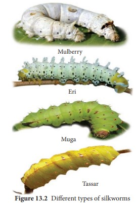
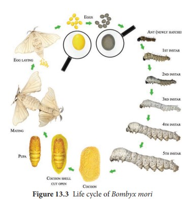

## Sericulture
 Silk is Nature’s gift to mankind and a commercial fiber of animal origin other than wool. Being eco-friendly, biodegradable and self-sustaining material; silk has assumed special relevance in present age. Sericulture is an agro –based industry, the term which denotes commercial production of silk through silkworm rearing. Historical evidence reveals that sericulture was practiced in China long back and they preserved the secret for more than 3000 years and maintained monopoly in silk trade with the rest of the world. According to Western historians, mulberry cultivation spread to India about 140BC from China through Tibet. The fabulous silk from China and India were carried to European countries. The 7000 mile lengthy road, historically called the “**Silk road**” passing through Baghdad, Tashkent, Damascus and Istanbul was used for silk transport. Today more than 29 countries in the world are practicing sericulture and producing different kinds of silk. India stands second in silk production next to China.

Production of silk from the silk worm, by rearing practices on a commercial

!
[]Different type os silkworm(../13.1.jpg)

  

scale is called sericulture. It is an agro- based industry comprising three main components: i) cultivation of food plants for the silkworms, ii) rearing of silkworms, and iii) reeling and spinning of silk. The

 

first two are agricultural and the last one is an industrial component. Only few species of silkworms are used in the sericulture industry (Table 13. 1 and Figure 13. 2).

**Life cycle of _Bombyx mori_** The adult of Bombyx mori is about 2.5 cm in length and pale creamy white in colour. Due to heavy body and feeble wings, flight is not possible by the female moth. This moth is unisexual in nature and does not feed during its very short life period of 2-3 days. Just after emergence, male moth copulates with female for about 2-3 hours and if not separated, they may die after few hours of copulating with female. Just after copulation, female starts egg laying which is completed in1-24 hours. A single female moth lays 400 to 500 eggs depending upon the climatic conditions. Two types of eggs are generally found namely diapause type and non-diapause type. The diapause type is laid by silkworms inhabiting the temperate regions, whereas silkworms belonging to subtropical regions like India lay non-diapause type of eggs. The eggs after ten days of incubation hatch into larva called as caterpillar. The newly hatched caterpillar is

about 3 mm in length and is pale, yellowish- white in colour. The caterpillars are provided with well developed mandibulate type of mouth-parts adapted to feed easily on the mulberry leaves.

After 1st, 2nd, 3rd and 4th moultings caterpillars get transformed into 2nd, 3rd, 4th and 5th instars respectively (Figure13.3). It takes about 21 to 25 days after hatching. The fully grown caterpillar is 7.5 cm in length. It develops salivary glands, stops feeding and undergoes pupation. The caterpillars stop feeding and move towards the corner among the leaves and secretes a sticky fluid through their silk gland. The secreted fluid comes out through spinneret (a narrow pore situated on the hypopharynx) and takes the form of long fine thread of silk which hardens on exposure to air and is wrapped around the body of caterpillar in the form

of a covering called as cocoon. It is the white coloured bed of the pupa whose outer threads are irregular while the inner threads are regular. The length of continuous thread secreted by a caterpillar for the formation of cocoon is about 1000-1200 metres which requires 3 days to complete. The pupal period lasts for 10 to 12 days and the pupae cut through the cocoon and emerge into adult moth.

On the basis of the moults which they undergo during their larval life, _B. mori_ is divided into three races – tri-moulters, tetra- moulters and penta- moulters. Based on voltinism (the number of broods raised per year), three kinds of races are recognized in mulberry silkworm – univoltines (one brood only), bivoltines (two broods only) and multivoltines (more than two broods).

**Cultivation of food plants for the silkworms** The first component, is to grow the food plants for the silkworms. Mulberry leaves

  

are widely used as food for silkworm _Bombyx mori_ and the cultivation of mulberry is called as **Moriculture**. Presently improved mulberry varieties like Victory1, S36, G2 and G4 which can withstand various agro - climatic and soil conditions are used for planting. The favourable season for cultivating of the mulberry plants is June, July, November and December. The mulberry crop production technology includes land preparation, preparation of cutting, planting techniques, maintenance of mulberry nursery, disease and pest management and uprooting for raising new mulberry gardens. Mulberry is also being grown as tree plant at an height of 123-152 cm with 20 x 20 cm or 25 x 25 cm spacing to harvest better silkworm cocoon crops.

**Rearing of silkworms** The second component is the rearing of silkworm. A typical rearing house (6m x 4m x 3.5m) is constructed on an elevated place under shade to accommodate 100 dfls (disease free layings). Space of 1m should be provided surrounding the rearing house. Sufficient windows and ventilators should be provided for free circulation of air inside the rearing house. The windows and ventilators should be covered with nylon net to restrict the entry of uzi flies and other insects. Apart from the specified area of the rearing house; the following appliances such as hygrometer, power sprayers, rearing stands, foam pads, wax coated paraffin papers, nylon nets, baskets for keeping leaves, gunny bags, rotary or bamboo mountages and drier are needed for effective rearing of silkworms. The steps involved in rearing process of  

silkworm are disinfection of rearing house, incubation of eggs, brushing, young larval rearing and late age larval rearing.

The selected healthy silk moths are allowed to mate for 4 hours. Female moth is then kept in a dark plastic bed, it lays about 400 eggs in 24 hours; the female is taken out, crushed and examined for any disease, only certified disease-free eggs are reared for industrial purpose. The eggs are incubated in an incubator. The small larvae (caterpillars) hatch between 7-10 days. These larvae are kept in trays inside a rearing house at a temperature of about 20°C - 25°C. These are first fed on chopped mulberry leaves. After 4-5 days fresh leaves are provided. As the larvae grow, they are transferred to fresh leaves on clean trays, when fully grown they spin cocoons. Their maturity is achieved in about 45 days. At this stage the salivary glands (silk glands) starts secreting silk to spin cocoons.

**Post cocoon processing**
 The method of obtaining silk thread from the cocoon is known as post cocoon processing. This includes **stifling** and **reeling.**

The process of killing the cocoons is called stifling. The process of removing the threads from the killed cocoon is called reeling. For reeling silk the cocoons are gathered about 8 -10 days after spinning had begun. The cocoons are first treated by steam or dry heat to kill the insect inside. This is necessary to prevent the destruction of the continuous fibre by the emergence of the moth. The cocoons are then soaked in hot water (95° -97°C) for 10-15 minutes to soften the gum that binds the silk threads together. This process is called cooking. The “cooked” cocoons

  

are kept in hot water and the loose ends of the thread are caught by hand. Threads from several cocoons are wound together on spinning wheels (Charakhas) to form the reels of raw silk. Only about one- half of the silk of each cocoon is reelable, the remainder is used as a silk waste and formed into spun silk. Raw silk thus obtained is processed through several treatments to bring about the luster on the thread.

New silkworm diet produces coloured silk. The Institute of Materials Research and

Engineering (IMRE) in Singapore has developed a way to replace the traditional dying process necessary to make coloured silk. A simple dietary change (feeding a diet of mulberries treated with fluorescent dye) for the silkworm larva and they are able to produce silk in a variety of colors. The colour directly integrated into the fibers.

**Uses of Silk** 1\. Silk fibers are utilized in preparing silk clothes. Silk fibers are now combined  

with other natural or synthetic fibers to manufacture clothes like **Teri-Silk, Cot-Silk** etc. Silk is dyed and printed to prepare ornamented fabrics. They are generally made from Eri-silk or spun silk.

2\. Silk is used in industries and for military purposes.

3\. It is used in the manufacture of fishing fibers, parachutes, cartridge bags, insulation coils for telephone, wireless receivers, tyres of racing cars, filter fibres, in medical dressings and as suture materials.

**Diseases and Pests of Silkworm:**

The profitable silk industry is threatened by various diseases caused by the virus, fungal, bacterial and protozoan infections but also by insect predators, birds and other higher animals. Ants, crows, kites, rats, feed upon silk worms thereby causing a great loss to silk industry. Pebrine, is a dangerous disease to in silkworms and the causative organism is Nosema bombycis , a protozoan. This silkworm disease is transmitted through the egg of the mother silkworm and also through ingestion of contaminated food. Flacherie generally occurs in the mature larvae and is caused mainly by bacteria like _Streptococcus_ and _Staphylococcus_. Grasserie is a most dominant and serious viral disease. It is caused by _Bombyx mori_ nuclear polyhedrosis virus (BmNPV) a _Baculovirus_, which belongs to sub group ‘A’ of the Baculoviridae. Among the fungal diseases, white muscardine is common. This disease is caused by fungus _Beauveria bassiana_.

  

