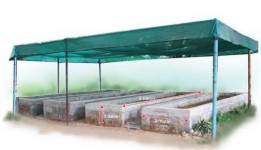
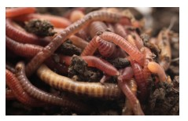

## Vermiculture 
Vermiculture is the process of using earthworms to decompose organic food waste, into a nutrient-rich material capable of supplying necessary nutrients which helps to sustain plant growth. The aim is to continually increase the number of worms to have a sustainable harvest. The excess worms can either be used to expand a vermicomposting operation or sold to customers. Vermicompost is the primary goal of vermiculture. Technically,  

the worm castings are pure worm waste and are fine and nutrient rich organic soil amendment. Vermicompost on the other hand, is comprised of the castings, bits of bedding and other organic matter. Essentially, though the terms are used interchangeably, they are both worm manure and are valuable for improving soil health. Applications of earthworm in technology of composting and bioremediation of soils and other activities is called Vermitech (Sultan Ismail, 1992).

The disposal of solid wastes (bio- degradable and non- biodegradable) remains a serious challenge in most of the countries. Earthworms play a vital role in maintaining soil fertility; hence these worms are called as **“farmer’s friends”**. These are also called as **“biological indicators of soil fertility”**. The reason is that they support bacteria, fungi, protozoans and a host of other organisms which are essential for sustaining a healthy soil. The breakdown of organic matter by the activity of the earthworms and its elimination from its body is called vermicast. It is a finely divided granular material and is noted for its porosity, aeration, drainage and moisture holding capacity and serves as rich organic manure.

Earthworms are divided into two major groups. The first group, the **humus formers,** dwell on the surface and feed on organic matter. They are generally darker in colour. These worms are used for vermicomposting. The second group, the **humus feeders,** are burrowing worms that are useful in making the soil porous, and mixing and distributing humus through out the soil. There are different **endemic** (native) species of earthworms cultured

  

in India for vermicomposting such as _Periyonyx excavatus, Lampito mauritii, Octochaetona serrata._ Some earthworm species have been introduced from other countries and called as **exotic species** Eg. _Eisenia fetida, Eudrilus eugeniae._

**Vermicomposting**

**Vermicompost** is the compost produced by the action of earthworms in association with all other organisms in the compost unit. Vermicompost bed may be selected on upland or an elevated level as it prevents the stagnation of water. You may construct a cement pit of 3x2x1m size (LxWxD) over ground surface using bricks. The size of pit may vary as per availability of raw materials. Cement pot or well rings are practically good. Provision should be made for excess water to drain. The vermibed should not be exposed to direct sunlight and hence shade may be provided (Figure. 13.1). The first layer of vermibed contains gravel at about 5 cm in height, followed by coarse sand to a thickness of 3.5 cm, which will facilitate the drainage of excess water.

Earthworms collected from native soil prefer a layer of local soil in their compost beds. If local soil earthworms are used, add a layer of native loamy soil for about 15 cm

on top of the gravel sand layer and introduce earthworms into it. For exotic species such as _Eisenia fetida_ and _Eudrilus eugeniae,_the layer of soil is not needed. The unit can now be loaded with digested biomass or animal dung such as cow dung that has lost its heat. The number of earthworms to be introduced in an unit depends on the size of the vermibed prepared. Earthworms such as _Periyonyx excavatus, Eisenia fetida_ or _Eudrilus eugeniae_ are introduced on the top. Jute bags or cardboards or broad leaves are used to cover the unit. As worms require moisture, water management is most important for the survival of the earthworms. Too little or too much of water is not good for the worms.
Earthworms release their castings on the surface. One can start harvesting this from the surface on noticing the castings on the surface. It may take several days for the entire biomass to be composted depending on the amount of biomass. When all the compost is harvested, earthworms can be handpicked by creating small conical heaps of harvested compost and leaving in sunlight for a few hours. The earthworms then move down and settle at the bottom of the heap as a cluster. Earthworms from the lower layers of the compost can be recovered and the worms can be transferred to new composting units.

**Vermiwash is a liquid collected after** the passage of water through a column

  

of vermibed. It is useful as a foliar spray to enhance plant growth and yield. It is obtained from the burrows or **drilospheres** formed by earthworms. Nutrients, plant growth promoter substances and some useful microorganisms are present in vermiwash.

Earthworms can be used for recycling of waste food, leaf, litter and biomass to prepare a good fertilizer in container known as **wormery** or **wormbin**.

**Earthworm Pests and Diseases** Earthworms are subjected to attack by a variety of pests. Most outbreaks are the result of poor bed management. Earthworm enemies include ants, springtails, centipedes, slugs, mites, certain beetle larvae, birds, rats, snakes, mice, toads, and other insects or animals which feed on worms. The earthworm has a number of internal parasites including numerous protozoa, some nematodes, and the larvae of certain flies. Larger predators can be excluded from worm beds by proper construction of the bins, and by use of screens or gratings at the bottom and top of the beds.

My vermicompost manufacturing unit is plagued by a number of red ants. Are there any bio-friendly measures to tackle the menace as I do not want to use any chemicals?

**Advantages of Using Vermicompost** People are aware about benefits of organic inputs in farming. Vermicompost is excellent organic manure for sustainable agro- practices. So, marketing vermicompost is now a potential and flourishing industry. Retail marketing of vermicompost in urban areas is most promising. Vermicompost is neatly packed in designed and printed packets for sale. People of different age groups  

are involved in the production and selling of vermicompost. Marketing of vermicompost can provide a supplementary income.

i. Vermicompost is rich in essential plant nutrients.

ii. It improves soil structure texture, aeration, and water holding capacity and prevents soil erosion

iii. Vermicompost is a rich in nutrients and an eco-friendly amendment to soil for farming and terrace gardening.

iv. It enhances seed germination and ensures good plant growth

