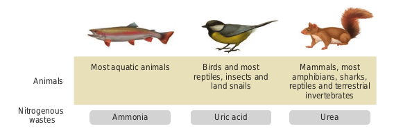
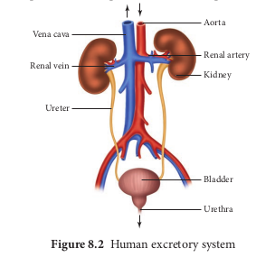
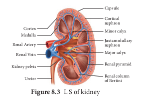
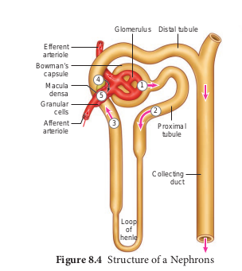
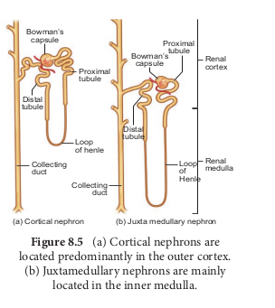
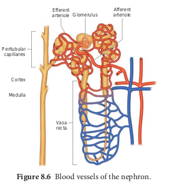
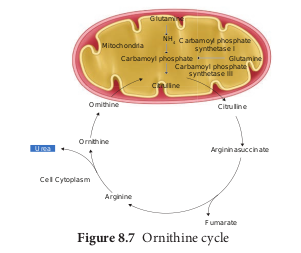
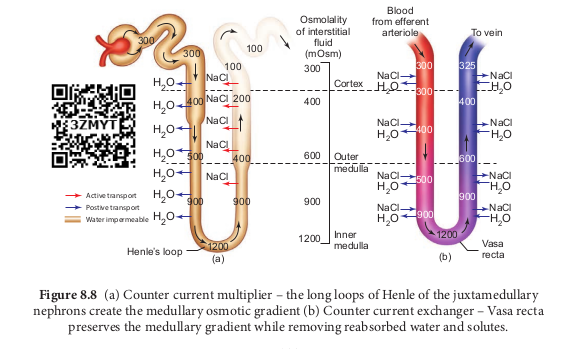
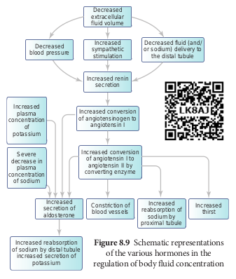
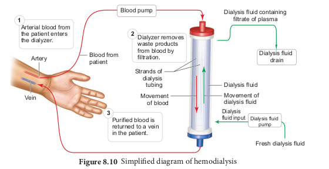

  

Earliest animal life forms arose around 700 million years ago. They were marine organisms like the modern sponges. Each cell of a modern sponge is surrounded  

by sea water, but it maintains an intracellular ionic composition different from that of the sea water. Evolution led to changes in the organisation of the tissue layers followed by formation of specialized external tissue layers. This provided a barrier between the external environment and internal fluid resulting in the formation of extracellular fluid. Major changes in osmoregulation and ionic regulation occurred during the evolution of chordates. The ability to control extracellular fluid composition was essential for the diversification of animals to inhabit brackish water, fresh water and land. Animals that invaded land had the risk of desiccation and were unable to excrete metabolic waste directly into the water; hence there was a need for an alternate pathway to dispose the nitrogenous wastes.

Most animals rely on kidneys to control ionic and water balance. Some animals depend on external tissues such as the gills, skin and digestive mucosa to collectively regulate three homeostatic processes namely, osmotic regulation, ionic regulation and nitrogen excretion. Osmotic regulation is the control of tissue osmotic pressure which acts as a driving force for movement of water across biological membranes. Ionic regulation is the control of the ionic composition of body fluids. The process by which the body gets rid of the nitrogenous waste products of protein metabolism is called excretion. Nitrogen excretion is the pathway by which animals excrete ammonia, the toxic nitrogenous end product of protein catabolism. The removal of ammonia or other metabolic alternatives such as urea and uric acid is linked to ionic and osmotic homeostasis.

Fresh water vertebrates maintain higher salt concentrations in their body fluids; marine vertebrates maintain lower salt concentrations in their body fluids and terrestrial animals have more water in their body than the surrounding hence tend to lose water by evaporation. Osmoconformers are able to change their internal osmotic concentration with change in external environment as in marine molluscs and sharks. Osmoregulators maintain their internal osmotic concentration irrespective of their external osmotic environment (example: Otters). Depending on the ability to tolerate changes in the external environment, animals are classified as stenohaline and euryhaline. The stenohaline animals can tolerate only narrow fluctuations in the salt concentration (example: Gold fish), whereas the euryhaline animals are able to tolerate wide fluctuations in the salt concentrations eg., Artemia, Tilapia and Salmons.

The major nitrogenous waste products are ammonia, urea and uric acid. Other waste products of protein metabolism are trimethyl amine oxide (TMO) in marine teleosts, guanine in spiders, hippuric acid, allantonin, allantoic acid, ornithuric acid, creatinine, creatine, purines, pyramidines and pterines.

# 8.1 Modes of Excretion
Excretory system helps in collecting nitrogenous waste and expelling it into the external environment. Animals have evolved different strategies to get rid of these nitrogenous wastes. Ammonia produced during amino acid breakdown is toxic hence must be excreted either as ammonia, urea or uric acid. The type of nitrogenous end product an animal excretes depends upon the habitat of the animal. Ammonia requires large amount of water for its elimination, whereas uric acid, being the least toxic can be removed with the minimum loss of water, and urea can be stored in the body for considerable periods of time, as it is less toxic and less soluble in water than ammonia.

Animals that excrete most of its nitrogen in the form of ammonia are called ammonoteles. Many fishes, aquatic amphibians and aquatic insects are ammonotelic. In bony fishes, ammonia diffuses out across the body surface or through gill surface as ammonium ions. Reptiles, birds, land snails and insects excrete uric acid crystals, with a minimum loss of water and are called **uricoteles**. In terrestrial animals, less toxic urea and



uric acid are produced to conserve water. Mammals and terrestrial amphibians mainly excrete urea and are called **ureoteles**. Earthworms while in soil are ureoteles and when in water are ammonoteles. Figure 8.1 shows the excretory products in different groups of animals.

The animal kingdom presents a wide variety of excretory structures. Most invertebrates have a simple tubular structure in the form of primitive kidneys called **protonephridia** and **metanephridia.** Vertebrates have complex tubular organs called kidneys. Protonephridia are excretory structures with specialized cells in the form of flame cells (cilia) in Platyhelminthes (example tapeworm) and **Solenocytes** (flagella) in Amphioxus. Nematodes have **rennette cells,** **Metanephridia** are the tubular excretory structures in annelids and molluscs. **Malpighian tubules** are the excretory structures in most insects. **Antennal glands** or **green glands** perform excretory function in crustaceans like prawns. Vertebrate kidney differs among taxa in relation to the environmental conditions. Nephron is the structural and functional unit of kidneys. Reptiles have reduced glomerulus or lack glomerulus and Henle’s loop and hence produce very little hypotonic urine, whereas mammalian kidneys produce concentrated (hyperosmotic) urine due to the presence of long Henle’s loop. The Loop of Henle of the nephron has evolved to form hypertonic urine. Aglomerular kidneys of marine fishes produce little urine that is isoosmotic to the body fluid. Amphibians and fresh water fish lack Henle’s loop hence produce dilute urine (hypoosmotic).

```The average bladder holds between 300ml and 600ml of urine. If the urinary system is healthy, urine may stay in the bladder for up to about 5 hours before excretion, depending on the amount of liquid consumed. Nerves send signals to the brain when the bladder needs to be emptied, with this indication one will feel the urge to empty the bladder. The muscle in the bladder wall is called the ‘detrusor’ muscle. One may suffer from stress if the muscles supporting the bladder are weakened. Pelvic floor exercise helps to strengthen these muscles.```


# 8.2 Human excretory system 

## 8.2.1 Structure of kidney


Excretory system in human consists of a pair of kidneys, a pair of ureters, urinary bladder and urethra (Figure. 8.2). Kidneys are reddish brown, bean shaped structures that lie in the superior lumbar region between the levels of the last thoracic and third lumber vertebra close to the dorsal inner wall of the abdominal cavity. The right kidney is placed slightly lower than the left kidney. Each kidney weighs an average of 120-170 grams. The outer layer of the kidney is covered by three layers of supportive tissues namely, renal fascia, perirenal fat capsule and fibrous capsule.





The longitudinal section of kidney (Figure. 8.2.png 8.3) shows, an outer cortex, inner medulla and pelvis. The medulla is divided into a few conical tissue masses called medullary pyramids or renal pyramids. The part of cortex that extends in between the medullary pyramids is the renal columns of **Bertini.** The centre of the inner concave surface of the kidney has a notch called the renal **hilum,** through which ureter, blood vessels and nerves innervate. Inner to the hilum is a broad funnel shaped space called the renal pelvis with projection called calyces. The renal pelvis is continuous with the ureter once it leaves the hilum. The walls of the calyces, pelvis and ureter have smooth muscles which contracts rhythmically. The calyces collect the urine and empties into the ureter, which is stored in the urinary bladder temporarily. The urinary bladder opens into the urethra through which urine is expelled out.




### 8.2.2 Structure of a nephron


Each kidney has nearly one million complex tubular structures called nephron (Figure 8.4). Each nephron consists of a filtering corpuscle called renal corpuscle (malpighian body) and a renal tubule. The renal tubule opens into a longer tubule called the collecting duct. The renal tubule begins with a double walled cup shaped structure called the Bowman’s capsule, which encloses a ball of capillaries that delivers fluid to the tubules, called the glomerulus. The Bowman’s capsule and the glomerulus together constitute the **renal corpuscle. The endothelium of glomerulus** has many pores (fenestrae). The external parietal layer of the Bowman's capsule is made up of simple squamous epithelium and the visceral layer is made of epithelial cells called podocytes. The podocytes end in foot processes which cling to the basement membrane of the glomerulus. The openings between the foot processes are called filtration slits.




The renal tubule continues further 8.4.png to form the proximal convoluted tubule [PCT] followed by a U-shaped loop of Henle (Henle’s loop) that has a thin descending and a thick ascending limb. The ascending limb continues as a highly coiled tubular region called the distal convoluted tubule [DCT]. The DCT of many nephrons open into a straight tube called collecting duct. The collecting duct runs through the medullary pyramids in the region of the pelvis. Several collecting ducts fuse to form papillary duct that delivers urine into the calyces, which opens into the renal pelvis.

In the renal tubules, PCT and DCT of the nephron are situated in the cortical region of the kidney whereas the loop of Henle is in the medullary region. In majority of nephrons, the loop of Henle is too short and extends only very little into the medulla and are called **cortical nephrons.** Some nephrons have very long loop of Henle that run deep into the medulla and are called **juxta medullary nephrons (JMN)** (Figure 8.5 a and b)  







**The capillary bed of the nephrons**- First capillary bed of the nephron is the glomerulus and the other is the peritubular capillaries. The glomerular capillary bed is different from other capillary beds in that it is supplied by the afferent and drained by the efferent arteriole. The efferent arteriole that comes out of the glomerulus forms a fine capillary network around the renal tubule called the peritubular capillaries. The efferent arteriole serving the juxta medullary nephron forms bundles of long straight vessel called vasa recta and runs parallel to the loop of Henle. Vasa recta is absent or reduced in cortical nephrons (Figure 8.6).

```What is the importance of having a long loop of Henle and short loop of Henle in a nephron?```


# 8.3 Mechanism of urine formation in human


The nitrogenous waste formed as a result of breakdown of amino acids is converted to urea in the liver by the Ornithine cycle or urea cycle (Figure 8.7).





Urine formation involves three main processes namely, glomerular filtration, tubular reabsorption and tubular secretion.  

i) **Glomerular Filtration**: Blood enters the kidney from the renal artery, into the glomerulus. Blood is composed of large quantities of water, colloidal proteins, sugars, salts and nitrogenous end product. The first step in urine formation is the filtration of blood that takes place in the glomerulus. This is called glomerular filtration which is a passive process. The fluid that leaves the glomerular capillaries and enters the Bowman’s capsule is called the glomerular filtrate. The glomerular membrane has a large surface area and is more permeable to water and small molecules present in the blood plasma. Blood enters the glomerulus faster with greater force through the afferent arteriole and leaves the glomerulus through the efferent arterioles, much slower. This force is because of the difference in sizes between the afferent and efferent arteriole (afferent arteriole is wider than efferent arteriole) and glomerular hydrostatic pressure which is around 55mm Hg.

Kidneys produce about 180L of glomerular filtrate in 24 hours. The molecules such as water, glucose, amino acids and nitrogenous substances pass freely from the blood into the glomerulus. Molecules larger than 5nm are barred from entering the tubule. Glomerular pressure is the chief force that pushes water and solutes out of the blood and across the filtration membrane. The glomerular blood pressure (approximately 55 mmHg) is much higher than in other capillary beds. The two opposing forces are contributed by the plasma proteins in the capillaries. These includes, colloidal osmotic pressure (30 mmHg) and the capsular hydrostatic pressure (15 mmHg) due to the fluids in the glomerular capsule. The net filtration pressure of 10 mmHg is responsible for the renal filtration.

Net filtration Pressure = Glomerular hydrostatic pressure - (Colloidal osmotic pressure + Capsular hydrostatic pressure).

Net filtration pressure = 55 mmHg - (30 mmHg + 15 mmHg) 5 = 10mmHg

The effective glomerular pressure of 10 mmHg results in ultrafiltration. Glomerular filtration rate (GFR) is the volume of filtrate formed min21 in all nephrons (glomerulus) of both the kidneys. In adults the GFR is approximately 120- 125mL/min. Blood from the glomerulus is passed out through the efferent arteriole. The smooth muscle of the efferent arteriole contract resulting in vasoconstriction. Table 8.1 shows the relative concentrations of substances in the blood plasma and the glomerular filtrate. The glomerular filtrate is similar to blood plasma except that there are no plasma proteins. In cortical nephrons, blood from efferent arteriole flows into peritubular capillary beds and enters the venous system carrying with it recovered solutes and water from the interstitial fluid that surrounds the tubule.

**Table 8.1** Concentration of substances in the blood plasma and in the glomerular filtrate

| Substance |Concentrationin bloodPlasma/g dm-3 |Concentrationin glomerularltrate/g dm-3 |
|------|------|------|
| Water |900 |900 |
| Proteins |80.0 |0.05 |
| Aminoacids |0.5 |0.5 |
| Glucose |1.0 |1.0 |
| Urea |0.3 |0.3 |
| Uric acid |0.04 |0.04 |
| Creatinine |0.01 |0.01 |
| Inorganic ions (mainlyNa , K  and Cl )1 1 2 |7.2 |7.2 |

```A person with cirrhosis of the liver has lower than normal levels of plasma proteins and higher than normal GFR. Explain why a decrease in plasma protein would increase GFR.```


**ii) Tubular Reabsorption** 

This involves movement of the filtrate back into the circulation. The volume of filtrate formed per day is around 170-180 L and the urine released is around 1.5 L per day, i.e., nearly 99% of the glomerular filtrate that has to be reabsorbed by the renal tubules as it contains certain substances needed by the body. This process is called selective reabsorption. Reabsorption takes place by the tubular epithelial cells in different segments of the nephron either by active transport or passive transport, diffusion and osmosis.

**Proximal convoluted Tubule (PCT)**- Glucose, lactate, amino acids, Na1 and water in the filtrate is reabsorbed in the PCT. Sodium is reabsorbed by active transport through sodium- potassium (Na1 K1) pump in the PCT. Small amounts of urea and uric acid are also reabsorbed.

**Descending limb** of Henle’s loop is permeable to water due the presence of aquaporins, but not permeable to salts. Water is lost in the descending limb, hence Na1 and Cl2 gets concentrated in the filtrate.

**Ascending limb of Henle’s loop** is impermeable to water but permeable to solutes such as Na1, Cl2 and K1.

The **distal convoluted tubule** recovers water and secretes potassium into the tubule. Na1, Cl2 and water remains in the filtrate of the DCT. Most of the reabsorption from this point is dependent on the body’s need and is regulated by hormones. Reabsorption of bicarbonate (HCO32) takes place to regulate the blood pH. Homeostasis of K1 and Na1 in the blood is also regulated in this region.

```Aquaporins are water–permeable channels (membrane transport proteins) that allow water to move across the epithelial cells in relation to the osmotic difference from the lumen to the interstitial fluid.```


**Collecting duct** is permeable to water, secretes K1 (potassium ions are actively transported into the tubule) and reabsorbs Na1 to produce concentrated urine. The change in permeability to water is due to the presence of number of water- permeable channels called **aquaporins**.

**Tubular secretion-** Substances such as H1, K1, NH41, creatinine and organic acids move into the filtrate from the peritubular capillaries into the tubular fluid. Most of the water is absorbed in the proximal convoluted tubule and Na1 is exchanged for water in the loop of Henle. Hypotonic fluid enters the distal convoluted tubule and substances such as urea and salts pass from peritubular blood into the cells of DCT. The urine excreted contains both filtered and secreted substances. Once it enters the collecting duct, water is absorbed and concentrated hypertonic urine is formed. For every H1 secreted into the tubular filtrate, a Na1 is absorbed by the tubular cell. The H1 secreted combines with HCO32, HPO3 2 and NH3 2 and gets fixed as H2CO4 1, H2PO4 1 and NH4 1 respectively. Since H1 gets fixed in the fluid, reabsorption of H1 is prevented.  

```Osmolarity - The solute concentration of a solution of water is known as the solutions osmolarity, expressed as milliosmoles /liter (mOsm/L)```


**Formation of concentrated urine** Formation of concentrated urine is accomplished by kidneys using counter current mechanisms. The major function of Henle’s loop is to concentrate Na1 and

Cl2. There is low osmolarity near the cortex and high osmolarity towards the medulla. This osmolarity in the medulla is due to the presence of the solute transporters and is maintained by the arrangement of the loop of Henle, collecting duct and vasa recta. This arrangement allows movement of solutes from the filtrate to the interstitial fluid. At the transition between the proximal convoluted tubule and the descending loop of Henle the osmolarity of the interstitial fluid is similar to that of the blood – about 300mOsm.

**Ascending and descending limbs of Henle, create a counter current multiplier** (interaction between flow of filtrate through the limbs of Henle’s and JMN) by active transport. Figure 8.8 (a) shows the counter current multiplier created by the long loops of **Henle of the JM nephrons which creates medullary osmotic gradient.**

As the fluid enters the descending limb, water moves from the lumen into the interstitial fluid and the osmolarity of interstitial fluid decreases. To counteract this dilution the region of the ascending limb actively pumps solutes from the lumen into the interstitial fluid and the osmolarity increases to about 1200mOsm in medulla. This mismatch between water and salts creates osmotic gradient in the medulla. The osmotic gradient is also due to the permeability of the collecting duct to urea.

T**he vasa recta, maintains the medullary osmotic gradient via counter current exchanger (the flow of blood** through the ascending and descending vasa recta blood vessels) by passive transport. Figure 8.8 (b) shows counter current exchanger where the vasa recta preserves the medullary gradient while removing reabsorbed water and solutes. This system **does not produce an osmotic gradient, but protects the medulla** by removal of excess salts from the interstitial fluid and removing reabsorbed water. The vasa recta leave the kidney at the junction between the cortex and medulla. The interstitial fluid at this point is iso-osmotic to the blood.

When the blood leaves the efferent arteriole and enters vasa recta the osmolarity in the medulla increases (1200mOsm) and



results in passive uptake of solutes and loss of water in descending vasa recta. As the blood enters the cortex, the osmolarity in the blood decreases (300mOsm) and the blood loses solutes and gains water.

At the final stage in collecting duct to form concentrated urine (hypertonic). Human kidneys can produce urine nearly four times concentrated than the initial filtrate formed.

```List the pathways involved in the homeostatic compensation in case of severe dehydration.```


# 8.4 Regulation of kidney function


**ADH and Diabetes insipidus**

The functioning of kidneys is efficiently monitored and regulated by hormonal feedback control mechanism involving the hypothalamus, juxta glomerular

e long loops of Henle of the juxtamedullary t (b) Counter current exchanger – Vasa recta emoving reabsorbed water and solutes.


apparatus and to a certain extent the heart. Osmoreceptors in the hypothalamus are activated by changes in the blood volume, body fluid volume and ionic concentration. When there is excessive loss of fluid from the body or when there is an increase in the blood pressure, the osmoreceptors of the hypothalamus respond by stimulating the neurohypophysis to secrete the antidiuretic hormone (ADH) or vasopressin (a positive feedback). ADH facilitates reabsorption of water by increasing the number of aquaporins on the cell surface membrane of the distal convoluted tubule and collecting duct. This increase in aquaporins causes the movement of water from the lumen into the interstitial cells, thereby preventing excess loss of water by diuresis. When you drink excess amounts of your favourite juice, osmoreceptors of the hypothalamus is no longer stimulated and the release of ADH is suppressed from the neurohypophysis (negative feedback) and the aquaporins of the collecting ducts move into the cytoplasm. This makes the collecting ducts impermeable to water and the excess fluid flows down the collecting duct without any water loss. Hence dilute urine is produced to maintain the blood volume. Vasopressin secretion is controlled by positive and negative feedback mechanism. Defects in ADH receptors or inability to secrete ADH leads to a condition called diabetes insipidus, characterized by excessive thirst and excretion of large quantities of dilute urine resulting in dehydration and fall in blood pressure.

**Renin angiotensin**

Juxta glomerular apparatus (JGA) is a specialized tissue in the afferent arteriole of the nephron that consists of macula densa and granular cells. The macula densa cells sense distal tubular flow and affect afferent arteriole diameter, whereas the granular cells secrete an enzyme called renin. A fall in glomerular blood flow, glomerular blood pressure and glomerular filtration rate, can activate JG cells to release renin which converts a plasma protein, angiotensinogen


```Angiotensin Converting Enzyme inhibitors (ACE inhibitors) are used to treat high blood pressure. Using a flow chart, explain why these drugs are helpful in treating hypertension.```




(synthesized in the liver) to angiotensin I. Angiotensin converting enzyme (ACE) converts angiotensin I to angiotensin II. Angiotensin II stimulates Na1 reabsorption in the proximal convoluted tubule by vasoconstriction of the blood vessels and increases the glomerular blood pressure. Angiotensin II acts at different sites such as heart, kidney, brain, adrenal cortex and blood vessels. It stimulates adrenal cortex to secrete aldosterone that causes reabsorption of Na1, K1 excretion and absorption of water from the distal convoluted tubule and collecting duct. This increases the glomerular blood pressure and glomerular filtration rate. This complex mechanism is generally known as **Renin- Angiotensin- Aldosterone System** (RAAS). Figure 8.9 shows the schematic representation of the various hormones in the regulation of body fluid concentration.

**Atrial natriuretic factor**

Excessive stretch of cardiac atrial cells cause an increase in blood flow to the atria of the heart and release Atrial Natriuretic Peptide or factor (ANF) travels to the kidney where it increases Na1 excretion and increases the blood flow to the glomerulus, acting on the afferent glomerular arterioles as a vasodilator or on efferent arterioles as a vasoconstrictor. It decreases aldosterone release from the adrenal cortex and also decreases release of renin, thereby decreasing angiotensin II. ANF acts antagonistically to the renin- angiotensin system, aldosterone and vasopressin.


# 8.5 Micturition
The process of release of urine from the bladder is called micturition or urination. Urine formed by the nephrons is ultimately carried to the urinary bladder where it is stored till it receives a voluntary signal from the central nervous system. The stretch receptors present in the urinary bladder are stimulated when it gets filled with urine. Stretching of the urinary bladder stimulates the CNS via the sensory neurons of the parasympathetic nervous system and brings about contraction of the bladder. Simultaneously, somatic motor neurons induce the sphincters to close. Smooth muscles contracts resulting in the opening of the internal sphincters passively and relaxing the external sphincter. When the stimulatory and inhibitory controls exceed the threshold, the sphincter opens and the urine is expelled out.

An adult human on an average excretes 1 to 1.5 L of urine per day. The urine formed is a yellow coloured watery fluid which is slightly acidic in nature (pH 6.0), Changes in diet may cause pH to vary between 4.5 to 8.0 and has a characteristic odour. The yellow colour of the urine is due to the presence of a pigment, urochrome. On an average, 25-30 gms of

```Hypotonic urine is formed when osmotic pressure of the body fluid is decreased due to water retention or solute loss when ADH secretion is lowered. If you drink large volume of water without eating anything salty, the total body fluid volume increases quickly and the osmolarity decreases. The kidneys increases the volume of urine excreted. The reverse happens when you eat salty food without drinking water.```


urea is excreted per day. Various metabolic disorders can affect the composition of urine. Analysis of urine helps in clinical diagnosis of various metabolic disorders and the malfunctioning of the kidneys. For example the presence of glucose (glucosuria) and ketone bodies (ketonuria) in the urine are indications of diabetes mellitus.

# 8.6 Role of other organs in excretion


Apart from kidneys, organs such as lungs, liver and skin help to remove wastes. Our lungs remove large quantities of carbon dioxide (18 L/day) and significant quantities of water every day. Liver secretes bile containing substances like, bilirubin and biliverdin, cholesterol, steroid hormones, vitamins and drugs which are excreted out along with the digestive wastes.

Sweat and sebaceous glands in the skin eliminate certain wastes through their secretions. Sweat produced by the sweat glands primarily helps to cool the body and secondarily excretes Na1 and Cl2, small quantities of urea and lactate. Sebaceous glands eliminate certain substances like sterols, hydrocarbons and waxes through sebum that provides a protective oily covering for the skin. Small quantities of nitrogenous wastes are also excreted through saliva.

# 8.7 Disorders related to the Excretory System


**Urinary tract infection** 

Female’s urethra is very short and its external opening is close to the anal opening, hence improper toilet habits can easily carry faecal bacteria into the urethra. The urethral mucosa is continuous with the urinary tract and the inflammation of the urethra (urethritis) can ascend the tract to cause bladder inflammation (cystitis) or even renal inflammation (pyelitis or pyelonephritis). Symptoms include dysuria (painful urination), urinary urgency, fever and sometimes cloudy or blood tinged urine. When the kidneys are inflammed, back pain and severe headache often occur. Most urinary tract infections can be treated by antibiotics.

**Renal Failure (Kidney Failure)**

Failure of the kidneys to excrete wastes may lead to accumulation of urea with marked reduction in the urine output. Renal failure are of two types, Acute and chronic renal failure. In acute renal failure the kidney stops its function abruptly, but there are chances for recovery of kidney functions. In chronic renal failure there is a progressive loss of function of the nephrons which gradually decreases the function of kidneys.

**Uremia** 

Uremia is characterized by increase in urea and other non-protein nitrogenous substances like uric acid and creatinine in blood. Normal urea level in human blood is about 17-30mg/100mL of blood. The urea concentration rises as 10 times of normal levels during chronic renal failure.

**Renal calculi** 

Kidney stone or calculi, also called renal stone or nephrolithiasis, is the formation of hard stone like masses in the renal tubules of renal pelvis. It is mainly due to the accumulation of soluble crystals of salts of sodium oxalates and certain phosphates. This result in severe pain called “renal colic




pain” and can cause scars in the kidneys. Renal stones can be removed by techniques like pyleothotomy or lithotripsy.

**Glomerulonephritis** 

It is also called Bright’s disease and is characterized by inflammation of the glomeruli of both kidneys and is usually due to post- streptococcal infection that occurs in children. Symptoms are haematuria, proteinuria, salt and water retention, oligouria, hypertension and pulmonary oedema.

# 8.8 Haemodialysis

Malfunctiong of the kidneys can lead to accumalation of urea and other toxic substances, leading to kidney failure. In such patients toxic urea can be removed from the blood by a process called haemodialysis. A dialyzing machine or an artificial kidney is connected to the patient’s body. A dialyzing machine consists of a long cellulose tube surrounded by the dialysing fluid in a water bath. The patient’s blood is drawn from a conveinent artery and pumped into the dialysing unit after adding an anticoagulant like heparin. The tiny pores in the dialysis tube allows small molecules such as glucose, salts and urea to enter into the water bath, whereas blood cells and protein molecules do not enter these pores. This stage is similar to the filtration process in the glomerulus. The dialysing liquid in the water bath consists of solution of salt and sugar in correct proportion in order to prevent loss of glucose and essential salts from the blood. The cleared blood is then pumped back to the body through a vein Figure 8.10. 

**Kidney Transplantation**

It is the ultimate method for correction of acute renal failures. This involves transfer of healthy kidney from one person (donor) to another person with kidney failure. The donated kidney may be taken from a healthy person who is declared brain dead or from sibling or close relatives to minimise the chances of rejection by the immune system of the host. Immunosuppressive drugs are usually administered to the patient to avoid tissue rejection.