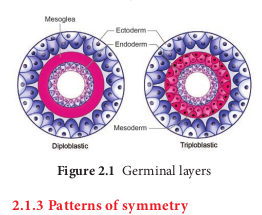
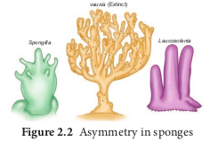
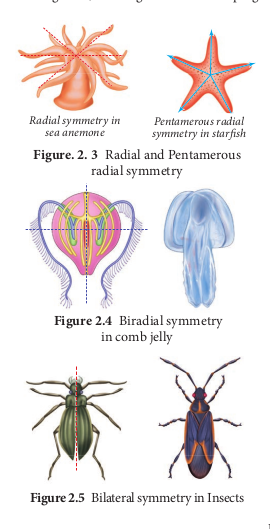
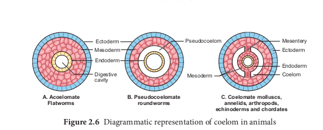

# Basis of classification##

Multicellular organisms are structurallyand functionally different but yet they possess certain common fundamental features such as the arrangement of cell layers, the levels of organisation, nature of coelom, the presence or absence of segmentation, notochord and the organisation of the organ system.

## Levels of organisation

All members of Kingdom Animalia are metazoans (multicellular animals) and exhibit different patterns of cellular organisation. The cells of the metazoans are not capable of independent existence and exhibit division of labour. Among the metazoans, cells may be functionally isolated or similar kinds of cells may be grouped together to form tissues, organ and organ systems.

**Cellular level of organisation**

This basic level of organisation is seen in sponges. The cells in the sponges are arranged as loose aggregates and do not form tissues, i.e. they exhibit cellular level of organisation. There is division of labour among the cells and different types of cells are functionally isolated. In sponges, the outer layer is formed of pinacocytes (plate- like cells that maintain the size and structure of the sponge) and the inner layer is formed of choanocytes. These are flagellated collar cells that create and maintain water flow through the sponge thus facilitating respiratory and digestive functions.

> Animals such as sponges lack nervous tissue and muscle tissue, what does this tell you about sponges?

**Tissue level of organisation**

In some animals, cells that perform similar functions are aggregated to form tissues. The cells of a tissue integrate in a highly coordinated fashion to perform a common function, due to the presence of nerve cells and sensory cells. This tissue level of organisation is exhibited in diploblastic animals like cnidarians. The formation of tissues is the first step towards evolution of body plan in animals (_Hydra_ \- Coelenterata).

**Organ system level of organisation**

The most efficient and highest level of organisation among the animals is exhibited by flatworms, nematodes, annelids, arthropods, molluscs, echinoderms and chordates. The evolution of mesoderm in these animals has led to their structural complexity. The tissues are organised to form organs and organ systems. Each system is associated with a specific function and show organ system level of organisation. Highly specialized nerve and sensory cells coordinate and integrate the functions of the organ systems, which can be very primitive and simple or complex depending on the individual animal. For example, the digestive system of Platyhelminthes has only a single opening to the exterior which serves as both mouth and anus, and hence called an **incomplete digestive system**. From Aschelminthes to Chordates, all animals have a **complete digestive system** with two openings, the mouth and the anus.

Similarly, the circulatory system is of two types, the **open type**: in which the blood remains filled in tissue spaces due to the absence of blood capillaries. (arthropods, molluscs, echinoderms and urochordates) and the **closed type:** in which the blood is circulated through blood vessels of varying diameters (arteries, veins and capillaries) as in annelids, cephalochordates and vertebrates.

## Diploblastic and Triploblastic organisation

During embryonic development, the tissues and organs of animals originate from two or three embryonic germ layers. On the basis of the origin and develop- ment, animals are classified into two cate- gories: Diploblastic and Triploblastic.

Animals in which the cells are arranged in two embryonic layers (Figure 2.1), the external ectoderm, and internal endoderm are called **diploblastic animals**. In these animals the ectoderm gives rise to the epidermis (the outer layer of the body wall) and endoderm gives rise to gastrodermis (tissue lining the gut cavity). An undifferentiated layer present between the ectoderm and endoderm is the mesoglea. (Corals, Jellyfish, Sea anemone)

Animals in which the developing embryo has three germinal layers are called **triploblastic** animals and consists of outer ectoderm (skin, hair, neuron, nail, teeth, etc), inner endoderm (gut, lung, liver) and middle mesoderm (muscle, bone, heart). Most of the triploblastic animals show organ system level of organisation (Flat worms to Chordates).

## Patterns of symmetry

Symmetry is the body arrangement in which parts that lie on opposite side of an axis are identical. An animal’s body plan results from the animal’s pattern of development. The simplest body plan is seen in sponges (Figure 2.2). They do not display symmetry and are **asymmetrical**. Such animals lack a definite body plan or are irregular shaped and any plane passing through the centre of the body does not divide them into two equal halves (Sponges). An asymmetrical body plan is also seen in adult gastropods (snails).

Symmetrical animals have paired body parts that are arranged on either side of a plane passing through the central axis. When any plane passing through the central axis of the body divides an organism into two identical parts, it is called **radial symmetry**. Such radially symmetrical animals have a top and bottom side but no dorsal (back) and ventral (abdomen) side, no right and left side. They have a body plan in which the body parts are organised in a circle around an axis. It is the principal symmetry in diploblastic animals. Cnidarians such as sea anemone and corals (Figure 2.3) are radially symmetrical. However, triploblastic animals like echinoderms (e.g., starfish) have five planes of symmetry and show **Pentamerous** **radial symmetry**.

Animals which possess two pairs of symmetrical sides are said to be **biradially symmetrical** (Figure 2.4). Biradial symmetry is a combination of radial and bilateral symmetry as seen in ctenophores. There are only two planes of symmetry, one through the longitudinal and sagittal axis and the other through the longitudinal and transverse axis. (e.g., Comb jellyfish – _Pleurobrachia_)

Animals which have two similar halves on either side of the central plane show **bilateral symmetry** (Figure 2.5). It is an advantageous type of symmetry in triploblastic animals, which helps in seeking food, locating mates and escaping

from predators more efficiently. Animals that have dorsal and ventral sides, anterior and posterior ends, right and left sides are bilaterally symmetrical and exhibit cephalisation, in which the sensory and brain structures are concentrated at the anterior end of the animal.

## Coelom

The presence of body cavity or coelom is important in classifying animals. Most animals possess a body cavity between the body wall and the alimentary canal, and is lined with mesoderm (Figure 2.6)

Animals which do not possess a body cavity are called **acoelomates**. Since there is no body cavity in these animals their body is solid without a perivisceral cavity, this restricts the free movement of internal organs. (e.g., Flatworms)

In some animals, the body cavity is not fully lined by the mesodermal epithelium, but the mesoderm is formed as scattered pouches between the ectoderm and endoderm. Such a body cavity is called a **pseudocoel** and is filled with pseudocoelomic fluid. Animals that possess a pseudocoel are called **pseudocoelomates e.g., Round worms. The** pseudocoelomic fluid in the pseudocoelom acts as a hydrostatic skeleton and allows free movement of the visceral organs and for circulation of nutrients.

**Eucoelom** or true coelom is a fluid- filled cavity that develops within the mesoderm and is lined by mesodermal epithelium called peritoneum. Such animals with a true body cavity are called coelomates or **eucoelomates**. Based on the mode of formation of coelom, the eucoelomates are classified into two types, **Schizocoelomates** – in these animals the

body cavity is formed by splitting of mesoderm. (e.g., annelids, arthropods, molluscs). In **Enterocoelomate animals** the body cavity is formed from the mesodermal pouches of archenteron. (e.g., Echinoderms, hemichordates and chordates) (Figure 2.7).

**Development of Schizocoelom** Ectoderm Gut

Endoderm

Early mesoderm

cells

Split in mesoderm Developing

coelom **Development of Enterocelom**

Early mesoderm

cells Gut

Ectoderm

Endoderm Separation of

pouches from gut Developing

coelom

## Development of Schizocoelomata and Enterocoelomata 2.7.png

## Diagrammatic repre 2.6.png

What is the advantage of true coelom over a pseudocoelom?

## Segmentation and Notochord

In some animals, the body is externally and internally divided into a series of repeated units called segments with a serial repetition of some organs **(Metamerism)**. The simplest form of segmentation is

found in Annelids in which each unit of the body is very similar to the next one. But in arthropods (cockroach), the segments may look different and has different functions.

Animals which possess notochord at any stage of their development are called chordates. Notochord is a mesodermally derived rod like structure formed on the dorsal side during embryonic development in some animals. Based on the presence or absence of notochord, animals are classified as chordates (Cephalochordates, Urochordates, Pisces to Mammalia) and nonchordates (Porifera to Hemichordata).
