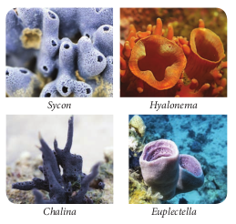

**Non Chordates (Invertebrata)**
**2.3.1 Phylum: Porifera**
(L. _poros_\-pore; _ferre_\-to bear)

These pore bearing animals are commonly called **sponges**. They are aquatic, mostly marine, asymmetrical and a few species live in freshwaters. They are primitive, multicellular, sessile animals with cellular level of organisation in which the cells are loosely arranged. They are either radially symmetrical or asymmetrical animals.

They possess a water transport system or **canal system** where water enters through minute pores called **ostia** lining the body wall through which the water enters into a
central
cavity (**spongocoel)** and goes out through the osculum. This water transport system is helpful in food gathering, circulation, respiration and removal of waste. **Choanocytes** or collar cells are special flagellated cells lining the spongocoel and the canals. The body is supported by a skeleton made up of calcareous and siliceous **spicules** or **spongin** or both. Nutrition is holozoic and intracellular. All sponges are hermaphrodites (i.e.) the ova and sperms are produced by the same individual. They also reproduce asexually by fragmentation or **gemmule formation** and sexually by the formation of gametes. Development is indirect with different types of larval stages such as **parenchymula and amphiblastula**.

Examples: _Sycon_ (Scypha), _Spongilla_ (fresh water sponge), _Euspongia_ (bath sponge) Euplectella (Venus flower basket) (Figure 2.9).

**Figure 2.9**Examples of Porifera

>The underwater sea bed is the new habitat where the discovery and development of Marine Pharmaceuticals are in peak. Anticancerous, Antimalarial drugs and other bioactive molecules have been isolated and tested successfully.

### Phylum: Cnidaria

(G. _knode_ -needle or sting cells) Cnidarians (were previously called
Coelenterata), are aquatic, sessile or free swimming, solitary or colonial forms with radial symmetry The name Cnidaria is derived from **cnidocytes** or **cnidoblasts** with **stinging cells** or **nematocyst** on tentacles. Cnidoblasts are used for anchorage, defense, and to capture the prey. Cnidarians are the first group of animals to exhibit tissue level organisation and are diploblastic. They have a central vascular cavity or **coelenteron** (serves both digestion and circulatory function) with a single opening called mouth or hypostome, which serves the process of ingestion and egestion. Digestion is both extracellular and intracellular. The nervous system is primitive and is formed of diffused nerve net. Cnidarians like corals have a skeleton made up of calcium carbonate. Cnidarians exhibit two basic body forms, polyp and medusa. The polyp forms are sessile and cylindrical (e.g. _Hydra, Adamsia_), whereas the **medusa** are umbrella shaped and free swimming. Cnidarians which exist

**Figure 2.10** Examples of Cnidarians 

in both forms, also exhibit alternation of generations in their life cycle (**Metagenesis**). The polyp represents the asexual generation and medusa represents the sexual generation. Polyps produce medusa asexually and medusa forms polyps sexually. Development is indirect and includes a free swimming ciliated **planula larva**.

Examples: _Physalia_ (Portugese man of war), _Adamsia_ (Sea anemone), Pennatula (Sea pen), _Meandrina_ (Brain coral) (Figure 2.10).

>Compare the advantages and disadvantages of direct and indirect development.

### Phylum: Ctenophora

(G. _Ktenos_ -comb; _phoros_ -bearing) Ctenophora are exclusively marine,biradially symmetrical, diploblastic animals with tissue level of organisation. Though they are diploblastic, their mesoglea is different from that of cnidaria. It contains amoebocytes and smooth muscle cells. They have eight external rows of ciliated comb plates (comb jellies) which help in locomotion, hence commonly called **comb jellies** or **sea walnuts**. **Bioluminescence** (the ability of a living organism to emit light) is well marked in ctenophores. They lack nematocysts but possess special cells called **lasso cells** or **colloblasts** which help in food capture. Digestion is both extracellular and intracellular. Sexes are not separate (monoecious). They reproduce only by sexual means. Fertilization is external and development is indirect and includes a larval stage called **cydippid larva**. e.g., _Pleurobrachia_ (Figure 2.11).

Examples : _Pleurobrachia and Ctenoplana_.

### Phylum: Platyhelminthes (Flatworms)

(G. _Platy_ -broad or flat; _helmin_\-worm) They have a dorsoventrally  flattened
body and hence called flatworms. These animals are bilaterally symmetrical, triploblastic, acoelomate with organ system level of organisation. They show moderate cephalization and unidirectional movement. They are, mostly endoparasites of animals including human beings. Hooks and suckers are present in the parasitic forms and serve as organs of attachment. Their body is not segmented, but some exhibit pseudosegmentation. Some of the parasitic flatworms absorb nutrients directly from the host through their body surface. However, flatworms like liver fluke have an incomplete digestive system. Specialized excretory cells called **flame cells** help in osmoregulation and excretion. Sexes are not separate (monoecious); fertilisation is internal and development is through larval stages (miracidium, sporocyst, redia, cercaria). **Polyembryony**

is common in some flatworms (Liver flukes). Some members like _Planaria_ show high regeneration capacity ( Figure 2.12).

Examples: _Taenia_ _solium_ (Tape worm), _Fasciola hepatica_ (Liver fluke), _Schistosoma_ (Blood fluke).

### Phylum: Aschelminthes (Round Worms)

(G. _Askes_ –cavity; _helminths_ – worms) Previously called Nematoda, this phylum is now named as Aschelminthes. The body of these worms is circular (round) in cross section and hence are called round worms. They are free living or parasitic on aquatic and terrestrial plants and animals. They are bilaterally symmetrical, triploblastic and pseudocoelomate animals with organ system level of organisation. The body is unsegmented and covered by a transparent,

tough and protective collagenous layer called cuticle. The alimentary canal is complete with a well developed mouth, muscular pharynx and anus. Excretory system consists of renette glands. Sexes are separate; and exhibit sexual dimorphism; often females are longer than males. Fertilisation is internal; majority are oviparous (e.g. _Ascaris_) few are ovoviviparous (_Wuchereria_). Development may be direct or indirect.

Examples. _Ascaris_ _lumbricoides_ (Round worm), _Enterobius_ _vermicularis_ (Pin worm), _Wuchereria bancrofti (Filarial worm), Ancylostoma_a \_deuodenale_ (Hook worm) (Figure 2.13).

### Phylum: Annelida (Segmented worm)

(L. _annulus_ -a ring, and G. _edios_\- form) Annelids were the first    segmented
animals to evolve. They are aquatic or terrestrial, free living but some are parasitic. They are triploblastic, bilaterally

symmetrical, schizocoelomates and exhibit organ system level of body organisation. The coelom with coelomic fluid creates a hydrostatic skeleton and aids in locomotion. Their elongated body is metamerically segmented and the body surface is divided into segment or metameres. Internally the segments are divided from one another by partitions called septa. This phenomenon is known as metamerism. The longitudinal and circular muscles in the body wall help in locomotion. Aquatic annelids like _Nereis_ have lateral appendages called **parapodia**, which help in swimming. Chitinous setae in Earthworms, and suckers in Leech help in locomotion. The circulatory system is of closed type and the respiratory pigments are **haemoglobin** and **chlorocruorin**. Nervous system consists of paired ganglion connected by the lateral nerves to the double ventral nerve cord. They reproduce sexually. Development is direct or indirect and includes a **trochophore larva**. Some are monoecious (earthworms) while some are dioecious (Neries and Leech). (Figure 2.14)

Examples: _Lampito mauritii_ (earthworm), _Neries_ (sand worm), _Hirudinaria_ (leech).

>How is cephalisation advantageous to animals in finding food?

>**Filariasis** has been a major public health problem in India next only to malaria. The disease was recorded in India as early as 6th century B.C. by the famous Indian physician, Susruta in his book **Susruta Samhita.** In 7 th century A.D., **Madhavakara** described signs and symptoms of the disese in his treatise ‘ Madhava Nidhana’ which holds good even today. In 1709, Clarke identified elephantoid legs in Cochin. The microfilariae in the peripheral blood was first identified by Lewis in 1872 in Calcutta (Kolkata).

### Phylum: Arthropoda

(G. _arthros_\- jointed; podes- feet) This is the largest phylum of the
Kingdom Animalia and includes the largest class called **insecta** (total species ranges from 2-10 million). They are bilaterally symmetrical, segmented, triploblastic and schizocoelomate animals with organ system grade of body organisation. They have jointed appendages which are used for locomotion, feeding and are sensory in function. Body is covered by chitinous exoskeleton for protection and to prevent water loss, It is shed off periodically by a process called **moulting or ecdysis. The body consists of** a head, thorax, and abdomen with a body cavity called **haemocoel**. Respiratory organs are gills, book gills, book lungs and trachea. Circulatory system is of open type. Sensory organs like antennae, eyes (compound and simple), statocysts (organs of balance/ equilibrium) are present. Excretion takes place through **malpighian tubules**, **green glands, coxal glands,** etc. They are mostly dioecious and oviparous; fertilization is usually internal. Development may be direct or indirect. Life history includes many larval stages followed by metamorphosis.

Examples : _Limulus_ (King crab, a living fossil), _Palamnaeus_ (Scorpion), _Eupagarus_ (Hermit crab), _Apis_ (Honey bee), _Musca_ (House fly), Vectors- Anopheles, Culex, Aedes (mosquitoes), Economically important insects - _Apis_\- (Honey bee), _Bombyx_ (Silk worm), _Laccifer_ (Lac insects), Gregarious pest - _Locusta_ (Locust) (Figure 2.15)

>Spider silk is five times stronger than steel of the same diameter. It has been suggested that a Boeing 747 could be stopped in flight by a single pencil- width strand and spider silk is almost as strong as Kevlar, the toughest man-made polymer.

### Phylum: Mollusca

(L. _molluscs_ –soft bodied) This is the second largest animal phylum. Molluscs are terrestrial and aquatic (marine or fresh water) and exhibit organ system level of body organisation. They are bilaterally symmetrical (except univalves eg. apple snail) triploblastic and coelomate animals. Body is covered by a calcareous shell and is unsegmented with a distinct head, muscular foot and a visceral hump or visceral mass. A soft layer of skin forms a mantle over the visceral hump. The space between the visceral mass and **mantle** (pallium) is called the mantle cavity in which a number of feather like gills (**ctenidia)** are present, which are respiratory in function. The digestive system is complete and mouth contains a rasping organ called **radula** with transverse rows of chitinous teeth for feeding (radula is absent in bivalves). The sense organs are tentacles, eyes and **osphraidium** (to test the purity of water and present in bivalves and gastropods). Excretory organs are nephridia. Open type of circulatory system is seen except for cephalopods such as squids, cuttle fishes and octopus. Blood contains **haemocyanin**, a copper containing
respiratory pigment. They are dioecious and oviparous. Development is indirect with a **veliger larva**(a modified trochophore larva).

Examples: _Pila_ (Apple snail), _Lamellidens_ (Mussel), _Pinctada_ (Pearl oyster), _Sepia_ (Cuttle fish), _Loligo_ (Squid), _Octopus_ (Devil fish) (Figure 2.16).

>**Marbled Cone Snail** (_Conus marmoreus_)
This cone-shaped snail can deliver
dangerous venom which may result in vision loss, respiratory failure, muscle paralysis and eventually death. There is no anti-venom available.

### Phylum Echinodermata

(G*. Echinos* – spiny; _dermos_ –skin)
 All Echinoderms are marine animals.
The adults are radially symmetrical  but the 
larvae are **bilaterally symmetrical**. These animals have a mesodermal endoskeleton of calcareous ossicles and hence the name Echinodermata (spiny skin). They are exclusively marine with organ system level of organisation. The most distinctive feature of echinoderms is the presence of the **water vascular system** or a**mbulacral system** with **tube feet** or **podia**, which helps in locomotion, capture and transport of food and respiration. The digestive system is complete with mouth on ventral side and anus on the dorsal side. Excretory organs are absent. The nervous system and sensory organs are poorly developed. The circulatory system is open type without heart and blood vessels. Sexes are separate. Reproduction is sexual and fertilization is external. Development is indirect with free swimming bilaterally symmetrical larval forms. Some echinoderms exhibit autotomy with remarkable powers of **regeneration.** e.g. Star fish. (Figure 2.17)

Examples: _Asterias_ (Starfish or Sea star), _Echinus_ (Sea-urchin), _Antedon_ (Sea- lily), _Cucumaria_ (Sea-cucumber), _Ophiura_ (Brittle star)

### Phylum: Hemichordata

(G._hemi_ –half; _chorda_\-string) Hemichordates were earlier 
treated as a subphylum of Chordata (or Prochordata). They are now regarded to be an independent phylum of invertebrates, close to Echinodermata. The animals of this group possess the characters of invertebrates as well as chordates.

This phylum consists of a small group of worm-like, soft marine animals, mostly tubiculous and commonly called the **‘acorn worms’** or **‘tongue worms’.** They are bilaterally symmetrical, triploblastic and coelomate animals with organ system level of organisation. Their body is cylindrical and is divided into three regions, the anterior proboscis, a short collar and a long trunk. Most hemichordates are ciliary feeders. Their circulatory system is simple and open or lacune type with a dorsal heart. Respiration is through paired gill slits opening into the pharynx. Excretion is by a single **proboscis gland** or **glomerulus** situated in the proboscis. Nervous system is primitive. Sexes are separate and exhibit sexual mode of reproduction; Fertilization is external. Development is indirect with a free swimming **tornaria larva**.

Examples: _Balanoglossus_, _Saccoglossus, Ptychodera flava (Indian Hemichordate_ found in Kurusadai islands in Tamilnadu) (Figure 2.18).

