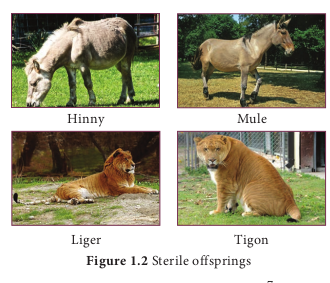
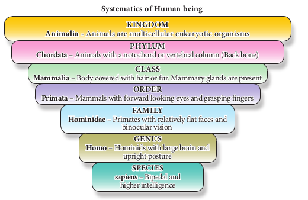
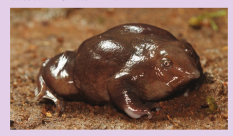

# Taxonomic hierarchy

In biological classification, the taxonomical hierarchy includes seven major categories namely kingdom, phylum, class, order, family, genus and species and other intermediate categories such as subkingdom, grade, division, subdivision, subphylum, superclass, subclass, superorder, suborder, superfamily, subfamily and subspecies.

**Species**

Species is the basic unit of classification in the taxonomic hierarchial system. It is a group of animals having similar morphological features (traits) and is reproductively isolated to produce fertile offspring. There are some exceptional animals which can produce **sterile offspring** because of mating with closely related species (Figure 1.2).

**Genus:** It is a group of closely related species which have evolved from a common ancestor. In some genus there is only one species which is called as **monotypic**

**genus** (e.g. Red panda is the only species in the genus Ailurus : Ailurus fulgens). If there are more than one species in the genus it is known as **polytypic genus**, for example ‘cats’ come under the Genus Felis, which has a number of closely related species, Felis domestica (domestic cat), Felis margarita (jungle cat). Felis silvestris (wild cat)

**Family:** It is a taxonomic category which includes a group of related genera with less similarity as compared to genus and species. For example, the family Felidae includes the genus Felis (cats) and the genus Panthera (lions, tigers, leopards).

**Order:** This category includes an assemblage of one or more related families which show few common features. One or more similar families are grouped together to form an order. For example, family Canidae and Felidae are placed in the order Carnivora.

**Class:** This category includes one or more related orders with some common characters. For example order Primata comprising monkeys, apes and man is placed in the Class Mammalia, along with

```
Crosses between
Male horse and Female Donkey results in Hinny (Sterile).

Male Donkey and Female Horse results in Mule (Sterile)


Male Lion and Female Tiger results in Liger

Male Tiger and Female Lion results in Tigon
```



> Recently discovered species in South India
> Scientists have discovered a new and
> unusual species of frog in the West-
> ern Ghats in India in August 2017.
> The frog has shiny, purple skin, a light
> blue ring around its eyes, and a pointy
> pig-nose. It is named as Bhupathy’s
> purple frog (Nasikabatrachus bhupathi)
> to honour Dr.Subramaniam Bhupathy,
> herpetologist who lost his life in the
> ­Western Ghats in 2014.
> 

the order Carnivora which includes dogs and cats.

**Phylum:** The group of classes with similar distinctive characteristics constitute a phylum. The classes Pisces, Amphibia, Reptilia, Aves and Mammalia constitute the next higher category, phylum Chordata. These classes share some common features like presence of a notochord and a dorsal tubular nerve cord hence included in the phylum Chordata.

**Kingdom:** All living animals belonging to various phyla are included

> Do You Know
> In July, 2017, a 9 years old boy discovered a new Freshwater species of Jellyfish in the Kodaikanal lake, ­Tamilnadu

> A newly discovered Himalayan forest thrush bird was named after the birdman of India, Ornithologist Dr. Salim Ali. The name of the bird is “ Zoothera salimalii”. A fruit bat is also named after him “Latidens salimalii”

in the Kingdom Animalia and it is the top most of the taxonomic hierarchy.
