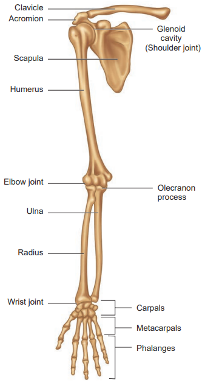
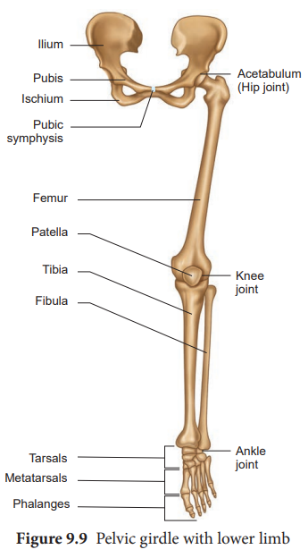
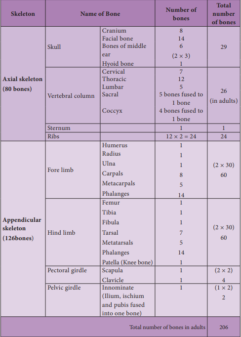

## The Appendicular skeleton

The bones of the upper and lower limbs along with their girdles constitute the appendicular skeleton. The appendicular skeleton is composed of 126 bones. 

**(a) The Pectoral girdle** 

The upper limbs are attached to the pectoral girdles. These are very light and allow the upper limbs a degree of mobility not seen anywhere else in the body. The girdle is formed of two halves.Each half of the pectoral girdle (Figure 9.8) consists of **a clavicle or collar bone and a scapula.** The scapula is a large, thin, triangular bone situated in the dorsal surface of the ribcage between the second and seventh ribs. It has a slightly elevated ridge called the spine which projects as a flat, expanded process called the **acromion.** The clavicle articulates with this process. Below the acromion is a depression called the **glenoid cavity** which articulates with the head of the humerus to form the shoulder joint. Each clavicle is a long slender bone with two curvatures which lies horizontally and connects axial skeleton with appendicular skeleton.

  

**The Upper limb**

The upper limb consists of 30 separate bones and is specialized for mobility. The skeleton of the arm, the region between the shoulder and elbow is the **humerus**. The head of humerus articulates with the **glenoid cavity** of the scapula and forms the shoulder joint. The distal end of humerus articulates with the two forearm bones the **radius** and **ulna**. The forearm is the region between the elbow and the wrist. **Olecranon process** is situated at the upper end of the ulna which forms the pointed portion of the elbow.The hand consists of **carpals, metacarpals** and **phalanges.**

**Figure 9. 8** Pectoral girdle with upper limb  

**Carpals,**the wrist bones, 8 in number are arranged in two rows of four each. The anterior surface of the wrist has tunnel- like appearance, due to the arrangement of carpals with the ligaments. This tunnel is termed as **carpal tunnel**.

---
**CTS-(Carpal Tunnel Syndrome**) – The narrow passage (tunnel) bounded by bones and ligaments in the wrist gets narrowed and pinches the median nerve. This syndrome is mostly seen among the clerks, software professionals and pregnant women and people who constantly play or text in mobile phones.

---

**Metacarpals,** the palm bones are 5 in number and **phalanges** the digits bones are 14 in number.

**(b) Pelvic Girdle**

The pelvic girdle is a heavy structure specialized for weight bearing. It is composed of two hip bones called coxal bones that secure the lower limbs to the axial skeleton (Figure 9.9). Together, with the sacrum and coccyx, the hip bones form the basin-like bony pelvis.

Each coxal bone consists of three fused bones, **ilium, ischium** and **pubis**. At the point of fusion of ilium, ischium, and pubis a deep hemispherical socket called the acetabulum is present on the lateral surface of the pelvis. It receives the head of the femur or thigh bone at the hip joint and helps in the articulation of the femur. Ventrally the two halves of the pelvic girdle meet and form the **pubic symphysis** containing fibrous cartilage.

The **ilium** is the superior flaring portion of the hip bone. Each ilium forms a secure joint with the sacrum posteriorly.

The **ischium** is a curved bar of bone. The V-shaped **pubic bones** articulate anteriorly at the **pubic symphysis.** The pelvis of male is deep and narrow with larger heavier bones and the female is shallow, wide and flexible in nature, and this helps during pregnancy which is influenced by female hormones.

---

The pelvic girdle is a heavy, strong girdle. How does its structure reflect its function?

---

**The Lower limb** The lower limb consists of 30 bones which carries the entire weight of the erect body and is subjected to exceptional forces when we jump or run. The bones of the lower limbs are thicker and stronger than the upper limbs. The three segments of each lower limb are **the thigh**, **the leg** or **the shank** and **the foot**. **The femur** is the single bone of the thigh. It is the largest, longest and strongest bone in the body. The head of femur articulates with **the acetabulum** of the pelvis to form the hip joint. Two parallel bones, **the tibia** and **fibula**, form the skeleton of the shank. A thick, triangular **patella** forms the knee cap, which protects the knee joint anteriorly and improves the leverage of thigh muscles acting across the knee. The foot includes the bones of ankle, **the tarsus**, **the metatarsus** and **the phalanges or toe bones**. The foot supports our body weight and acts as a lever to propel the body forward, while walking and running. **The tarsus** is made up of seven bones called tarsals. **The metatarsus** consists of five bones called metatarsals. The arrangement of the metatarsals is parallel to each other. There are 14 **phalanges** in the toes which are smaller than those of the fingers.

**Structure of a typical long bone** 
 A typical long bone has a **diaphysis**, **epiphyses** (singular-epiphysis) and **membranes** (Figure 9.10). A tubular diaphysis or shaft, forms the long axis of the bone. It is constructed of a thick collar of compact bone that surrounds a central **medullary cavity or marrow cavity.** The epiphyses are the bone ends. Compact bone forms the exterior of epiphyses and their interior contains spongy bone with red marrow. The region where the diaphysis and epiphyses meet is called the **metaphysis.** The external surface of the entire bone except

 ###### Table:9.1  Bones of skeletal system  

the joint surface is covered by a double- layered membrane called the **periosteum**. The outer fibrous layer is dense irregular connective tissue. The inner osteogenic layer consists of **osteoblasts** (bone- forming cells) which secrete bone matrix elements and **osteoclasts** (bone-destroying cells). In addition, there are primitive stem cells, osteogenic cells, that give rise to the osteoblasts. The periosteum is richly supplied with nerve fibres, lymphatic vessels and blood vessels. Internal bone surfaces are covered with a delicate connective tissue membrane called the **endosteum.** The endosteum covers the trabeculae of spongy bone and lines the canals that pass through the compact bone. It also contains both osteoblasts and osteoclasts. Between the epiphysis and diaphysis **epiphyseal plate** or **growth plate** is present.

###### Figure 9.10 Structure of a long bone 