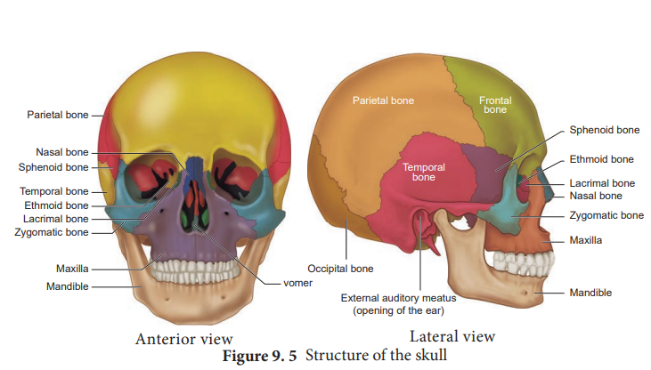

## The Axial skeleton
 Axial skeleton forms the main axis of the body. It consists of the skull, hyoid bone, vertebral column and thoracic cage.

**a) The Skull** 
The skull is composed of two sets of bones – cranial and facial bones. It consists of 22 bones of which 8 are cranial bones and 14 are facial bones (Figure 9.5). The cranial bones form the hard protective outer covering of the brain and called the brain box. The capacity of the cranium is 1500 cm3.. These bones are joined by sutures which are immovable. They are a **paired parietal, paired temporal** and **individual bones** such as the **frontal, sphenoid, occipital and ethmoid**.

  

The large hole in the temporal bone is the **external auditory meatus**. In the facial bones **maxilla, zygomatic, palatine, lacrimal, nasal** are paired bones whereas **mandible** or **lower jaw** and **vomer** are **unpaired bones.** They form the front part of the skull. A single U-shaped **hyoid bone** is present at the base of the buccal cavity. It is the only one bone without any joint. Each middle ear contains three tiny bones- **malleus**, **incus** and **stapes** collectively are called ear ossicles. The upper jaw is formed of the **maxilla** and the lower jaw is formed of the **mandible.** The upper jaw is fused with the cranium and is immovable. The lower jaw is connected to the cranium by muscles and is movable. The most prominent openings in the skull are **the orbits** and **the nasal cavity**. **Foramen magnum** is a large opening found at the posterior base of the skull. Through this opening the medulla oblongata of the brain descends down as the spinal cord.

**b) The Vertebral Column** 
Vertebral column is also called the back bone. It consists of 33 serially arranged vertebrae which are interc onnected by cartilage known as intervertebral disc (Figure 9.6). The vertebral column extends from the base of the skull to the pelvis and forms the main frame work of the trunk. The vertebral column has five major regions. They are, **the Cervical, Thoracic, Lumbar, Sacrum** (5 sacral vertebrae found in the infant which are fused to form one bone in the adult) and

  

**Coccyx** (4 coccygeal vertebrae found in the infant which are fused to form one bone in the adult).

Each vertebra has a central hollow portion, the neural canal, through which the spinal cord passes. The first vertebra is called as the **atlas** and the second vertebra is called as the **axis**. Atlas is articulated with the occipital condyles.

The vertebral column protects the spinal cord, supports the head and serves as the point of attachment for the ribs and musculature of the back.

**(c) The Sternum (Chest bone)** Sternum is a flat bone on the mid ventral line of the thorax. It provides space for the attachment of the thoracic ribs and abdominal muscles.

**(d) The Rib cage** There are 12 pairs of ribs (Figure 9.7). Each rib is a thin flat bone connected dorsally to the vertebral column and ventrally to the sternum. It has two articulation surfaces on its dorsal end, hence called bicephalic. The first seven pairs of ribs are called **‘true ribs’** or **vertebro–sternal ribs**. Dorsally they are attached to the thoracic vertebrae and ventrally connected to the sternum with the help of hyaline cartilages. The 8th,

9th and 10th pairs of ribs do not articulate directly with the sternum but joined with the cartilaginous (hyaline cartilage) part of the seventh rib. These are called ‘false ribs’ or vertebro-chondral ribs. The last 11th and 12th pairs of ribs are not connected ventrally. Therefore, they are called as ‘floating ribs’ or vertebral ribs. Thoracic vertebrae, ribs and sternum together form the ribcage.

Rib cage protects the lungs, heart, liver and also plays a role in breathing.  

