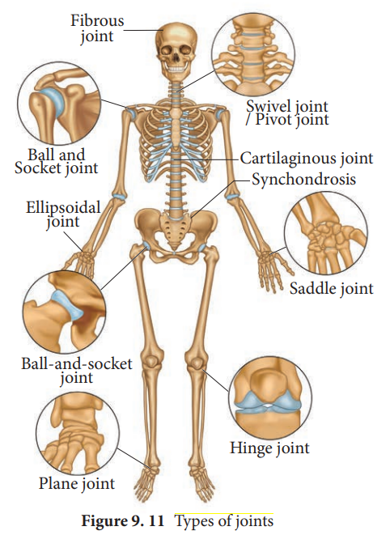

## Types of joints

 Joints are essential for all types of movements performed by the bony parts of the body. The joints are points of contact (Figure 9.11) between bones.

Sometimes they are playing a protective role in the process. Force generated by the muscles are used to carry out the movement through joints which helps human functional activity of daily living and ambulation. The joint acts as a fulcrum of a lever.
**(i) Fibrous joints or Synarthroses:** They are immovable fixed joints in which no movement between the bones is possible. Sutures of the flat skull bones are fibrous joints.

**(ii) Cartilaginous joints or Amphiarthroses: They are slightly** movable joints in which the joint surfaces are separated by a cartilage and slight movement is only possible. E.g., Joints of adjacent vertebrae of the vertebral column.

**(iii) Synovial joints or Diarthroses joints:** They are freely movable joints, the articulating bones are seperated by a cavity which is filled with synovial fluid

| Pivot joint  | between atlas and axis |
|-------------|--------------|
|    Plane/gliding joint | between the carpals |
|    Saddle joint     |   between the carpal and metacarpal   |
|    Ball and socket joint    |    between humerus and pectoral girdle    |
|    Hinge joint    |    knee joint   |
|    Condyloid or Angular or Ellipsoid   |   between radius and carpal   |

---
An exhausted student was attending a lecture. After 30 minutes or so, he lost interest and he let go with a tremendous yawn. To his great distress he couldn’t close his mouth –his lower jaw was locked open. What do you think would have caused it?

---

