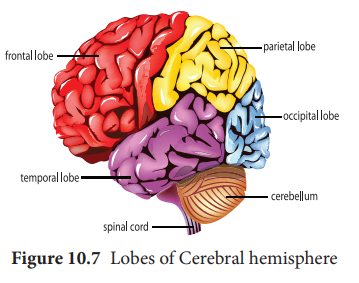

## Central Neural System (CNS)

The CNS includes the brain and the spinal cord, which are protected by the bones of the skull and vertebral column. During its embryonic development, CNS develops from the ectoderm.

>Can you state why some areas of the brain and spinal cord are grey and some are white?

### Brain
 The brain acts as the command and control system. It is the site of information processing. It is located in the cranial cavity and is covered by three cranial meninges. The outer thick layer is **Duramater** which lines the inner surface of the cranial cavity; the median thin layer is **Arachnoid mater** which is separated from the duramater by a narrow **subdural space**. The innermost layer is **Piamater** which is closely adhered to the brain but separated from the arachnoid mater by the **subarachnoid space**. The brain is divided into three major regions: Forebrain, Midbrain and Hindbrain.

**Fore Brain** 
It comprises the following regions: **Cerebrum** and **Diencephalon**. Cerebrum is the ‘seat of intelligence’ and forms the major part of the brain. The cerebrum consists of an outer cortex, inner medulla and basal nuclei. The superficial region of the cerebrum is called **cerebral cortex**, which looks grey due to the presence of unmyelinated nerve cells. Cerebral cortex consists of neuronal cell body, dendrites, associated glial and blood vessels. The surface of the cerebrum shows many convolutions (folds) and grooves. The folds are called **gyri** (singular gyrus); the shallow grooves between the gyri are called **sulci** (singular sulcus) and deep grooves are called fissures. These sulci and gyri increase the surface area of the cerebral cortex. Several sulci divide the cerebrum into eight lobes: a pair of **frontals, parietals, temporals and occipital lobes** (Figure10.7 & Table 10.2).

A median longitudinal fissure divides the cerebrum longitudinally into two cerebral hemispheres (Figure 10.7). A transverse fissure hseparates the cerebral hemispheres from the cerebellum. The hemispheres are connected by a tract  of nerve fibres called **corpus callosum.** Cerebral cortex has three functional areas namely **sensory areas** occur in the parietal, temporal and occipital lobes of the cortex. They receive and interpret the sensory impulses. **Motor area** of the cortex which controls voluntary muscular movements lies in the posterior part of the frontal lobes. The areas other than sensory and motor areas are called **Association areas** that deal with integrative functions such as memory, communications, learning and reasoning. Inner to the cortex is **medulla** which is white in colour and acts as a nerve tract between the cortex and the diencephalon.

**Table 10.2** Functions of brain lobes
| Structure |Functions |
|------|------|
| Frontal |B ehaviour, Intelligence, Memor y, Movement |
| Parietal |Language, Reading, Sensation |
| Temporal |Speech, Hearing, Memor y |
| Occipital |Visual processing |

**Diencephalon** consists largely of following three paired structures.

**Epithalamu**s forms the roof of the diencephalon and it is a non-nervous tissue. The anterior part of epithalamus is vascular and folded to form the anterior **choroid**

  

**plexus.** Just behind the choroid plexus, the epithalamus forms a short stalk which ends in a rounded body called **pineal body** which secretes the hormone, **melatonin** which regulates sleep and wake cycle.

**Thalamus** is composed of grey mater which serves as a relay centre for impulses between the spinal cord, brain stem and cerebrum. Within the thalamus, information is sorted and edited and plays a key role inlearning and memory. It is a major coordinating centre for sensory and motor signalling.

>Human brain is formed of a large number of parts like cerebrum, thalamus, hypothalamus, pons, cerebellum and medulla oblongata. Each part performs some specialized function and all the parts are essential for the survival of a person. Discuss the following statements :
 a) Thalami are called relay centres of the brain. 
 b) Damage to medulla may cause the death of organism.

 

**Hypothalamus** forms the floor of the diencephalon. The downward extension of the hypothalamus, the **infundibulum** connects the hypothalamus with the pituitary gland. The hypothalamus contains a pair of small rounded body called **mammillary bodies** that are involved in olfactory reflexes and emotional responses to odour. Hypothalamus maintains homeostasis and has many centres which control the body temperature, urge for eating and drinking. It also contains a group of neurosecretory cells which secrete the hypothalamic hormones. Hypothalamus also acts as the **satiety centre.**

>**Depression** is a functional deficiency of **seratonin** or **norepinephrine** or both. This disorder is characterized by a pervasive negative mood, loss of interest, an inability to experience pleasure and suicidal tendencies. Antidepressant drugs increase the available concentration of these neurotransmitters in the CNS. Hence depression is treatable.

**Limbic System** The inner part of the cerebral hemisphere constitutes the limbic system. The main components of limbic system are **olfactory bulbs, cingulate gyrus, mammillary body, amygdala, hippocampus and hypothalamus.** The limbic system is called ‘emotional brain’ because it plays a primary role in the regulation of pleasure, pain, anger, fear, sexual feeling and affection. The hippocampus and amygdala also play a role in memory (Figure 10.9).

**Brain stem** is the part of the brain between the spinal cord and the diencephalon. It consists of mid brain, pons varolii and medulla oblongata (Figure 10.10).

**Mid brain** 
The mid brain is located between the diencephalon and the pons. The lower portion of the midbrain consists of a pair of longitudinal bands of nervous tissue called **cerebral peduncles** which relay impulses back and forth between cerebrum, cerebellum, pons and medulla. The dorsal portion of the midbrain consists of four rounded bodies called **corpora quadrigemina** which acts as a reflex centre for vision and hearing.

**Hind brain**
 Rhombencephalon forms the hind brain. It comprises of cerebellum, pons varolii and medulla oblongata. **Cerebellum** is

  

the second largest part of the brain. It consists of two **cerebellar hemispheres** and central worm shaped part, **the vermis.** The cerebellum controls and coordinates muscular movements and body equilibrium. Any damage to cerebellum often results in uncoordinated voluntary muscle movements.

**Pons varoli** lies infront of the cerebellum between the midbrain and the medulla oblongata. The nerve fibres in the pons varolii form a bridge between the two cerebellar hemispheres and connect the medulla oblongata with the other region of the brain. The respiratory nuclei found in the pons cooperate with the medulla to control respiration.

**Medulla oblongata** forms the posterior most part of the brain. It connects the spinal cord with various parts of the brain. It receives and integrates signals from spinal cord and sends it to the cerebellum and thalamus. Medulla contains vital centres that control cardio vascular reflexes, respiration and gastric secretions.

**Ventricles of the Brain**
 The brain has four hollow, fluid filled spaces. The C- shaped space found inside each cerebral hemisphere forms the lateral **ventricles I and II** which are separated from each other by a thin membrane called the **septum pellucidum.** Each lateral ventricle communicates with the narrow III ventricle in the diencephalon through an opening called **interventricular foramen (foramen of Monro).** The ventricle III is continuous with the ventricle IV in the hind brain through a canal called **aqueduct of Sylvius (cerebral aqueduct).** Choroid plexus is a network of blood capillaries
 found in the roof of the ventricles and forms **cerebro spinal fluid (CSF)** from the blood. CSF provides buoyancy to the CNS structures; CSF acts as a shock absorber for the brain and spinal cord; it nourishes the brain cells by transporting constant supply of food and oxygen; it carries harmful metabolic wastes from the brain to the blood; and maintains a constant pressure inside the cranial vessels.

### Spinal Cord
 The spinal cord is a long, slender, cylindrical nervous tissue. It is protected by the vertebral column and surrounded by the three membranes as in the brain. The spinal cord that extends from the brain stem into the vertebral canal of the vertebral column up to the level of 1st or 2nd lumbar vertebra. So the nerve roots of the remaining nerves are greatly elongated to exit the vertebral column at their appropriate space. The thick bundle of elongated nerve roots within the lower vertebral canal is called the **cauda equina** (horse’s tail) because of its appearance.

 
In the cross section of spinal cord (Figure 10.11), there are two indentations: the posterior median sulcus and the anterior median fissure. Although there might be slight variations, the cross section of spinal cord is generally the same throughout its length. In contrast to the brain, the grey matter in the spinal cord forms an inner butterfly shaped region surrounded by the outer white matter**.** The grey matter consists of neuronal cell bodies and their dendrites, interneurons and glial cells. White matter consists of bundles of nerve fibres. In the center of the grey matter there is a central canal which is filled with CSF. Each half of the grey matter is divided into **a dorsal horn, a ventral horn** and **a lateral horn.**

The dorsal horn contains cell bodies of interneurons on which afferent neurons terminate. The ventral horn contains cell bodies of the efferent motor neurons supplying the skeletal muscle. Autonomic nerve fibres, supplying cardiac and smooth muscles and exocrine glands, originate from the cell bodies found in the lateral horn. In the white matter, the bundles of nerve fibres form two types of tracts namely **ascending tracts** which carry sensory impulses to the brain and descending **tracts** which carry motor impulses from the brain to the spinal nerves at various levels of the spinal cord. The spinal cord shows two enlargements, one in the cervical region and another one in the lumbosacral region. The **cervical enlargement** serves the upper limb and **lumbar enlargement** serves the lower limbs.

