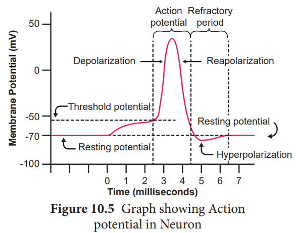

## Neuron as a Structural and Functional Unit of Neural System

A neuron is a microscopic structure composed of three major parts namely **cell body** (soma), **dendrites** and **axon.** The cell body is the spherical part of the neuron that contains all the cellular organelles as a typical cell (except centriole)**.** The plasma membrane covering the neuron is called **neurilemma** and the axon is **axolemma.** The repeatedly branched short fibres coming out of the cell body are called **dendrites,** which transmit impulses towards the cell body. The cell body and the dendrites contain cytoplasm and granulated endoplasmic reticulum called **Nissl’s granules.**

An axon is a long fibre that arises from a cone shaped area of the cell body called the **Axon hillock** and ends at the branched distal end. Axon hillock is the place where the nerve impulse is generated in the motor neurons. The axon of one-neuron branches and forms connections with many other neurons. An axon contains the same organelles found in the dendrites and cell body but lacks Nissl’s granules and Golgi apparatus.

The axon, particularly of peripheral nerves is surrounded by **Schwann cells** (a type of glial cell) to form myelin sheath, which act as an insulator. **Myelin sheath** is associated only with the axon; dendrites are always non-myelinated. Schwann cells are not continuous along  

the axon; so there are gaps in the myelin sheath between adjacent Schwann cells. These gaps are called **Nodes of Ranvier**. Large myelinated nerve fibres conduct impulses rapidly, whereas non- myelinated fibres conduct impulses quite slowly (Figure 10.1).

>The longest cells in the human body are the **neurons**. The **longest** axons in the **human body**, for example, are those of the sciatic nerve, which run from the base of the spine to the big toe of each foot. These single-cell fibers may extend a meter or even longer. The axons of the inter neurons in the CNS are the shortest.

Each branch at the distal end of the axon terminates into a bulb like structure called **synaptic knob** which possesses **synaptic vesicles** filled with **neurotransmitters**. The axon transmits nerve impulses away from the cell body to an **inter neural space** or to a **neuro-muscular junction.**

The neurons are divided into three types based on number of axon and dendrites they possess (Figure.10.2).

1. **Multipolar neurons** have many processes with one axon and two or more dendrites. They are mostly interneurons.

2.**Bipolar neurons** have two processes with one axon and one dendrite. These are found in the retina of the eye, inner ear and the olfactory area of the brain.

3. **Unipolar neurons** have a single short process and one axon. Unipolar neurons are located in the ganglia of cranial and spinal nerves.

  ### Generation and Conduction of Nerve Impulses

This section deals with how the nerve impulses are produced and conducted in our body. Sensation felt in the sensory organs are carried by the nerve fibres in the form of electrical impulses. A nerve impulse is a series of electrical impulses, which travel along the nerve fibre. Inner to the axolemma, the cytoplasm contains the **intracellular fluid** (**ICF**) with large amounts of potassium and magnesium phosphate along with negatively charged proteins and other organic molecules.**The extra cellular fluid (ECF)** found outside the axolemma contains large amounts of sodium chloride, bicarbonates, nutrients and oxygen for the cell; and carbon dioxide and metabolic wastes released by the neuronal cells. The ECF and ICF (cytosol) contains negatively charged particles (anions) and positively charged particles (cations). These charged particles are involved in the conduction of impulses.

The neurons maintain an uneven distribution of various inorganic ions across their axolemma for transmission of impulses. This unequal distribution of ions establishes the membrane potential across the axolemma. The axolemma contains a variety of membrane proteins that act as ionic channels and regulates the movement of ions across the axolemma. (Shown in Table 10.1).

### Transmission of Impulses
 The transmission of impulse involves two main phases; **Resting membrane potential** and **Action membrane potential.**

**Resting membrane Potential:** The electrical potential difference across the plasma membrane of a resting neuron is called the **resting potential** during which the interior of the cell is negative due to greater efflux of K+ outside the cell than

>**Note:** The charged particles have potential energy. The potential dif- ference is the measure of potential energy between two points which is measured in volts or millivolts.

**Table 10.1** Ionic Channels in the Axolemma

| **Leakage  Channels**  are  ionic  channels that remain open all the time |K+ leakage channels are  more in number than the Na+ leakage channels. Sarcolemma has greater permeability to K+ ions than Na+ ions.These ions keep moving cotinuosly maintain the potential difference across the axolemma. |
|------|------|
| **Ligand-gated Channels** are chemically gated channels which open or close in response to a chemical stimuli. |They are located between the presynaptic membrane of the first axon and post synaptic membrane of the cell body of second neuron [i .e. dendrites and cell bodies ]. The neurotransmitter acetylcholine opens ligand channels that allow Na* and Ca++  ions diffuse inward and K+  ions diffuse outward. |
| **Voltage-gated  Channels**  are mechanically gated channels which open in response to a physical stimulus in the form of vibration such as touch and pressure. |These channels open in response to a change in membrane potential.There are two types of voltage-gated channels.   **i. Sodium voltage-gated channel.** **ii. Potassium voltage-gated channel** |
  

Na+ influx into the cell. When the axon is not conducting any impulses i.e. in resting condition, the axon membrane is more permeable to K+ and less permeable to Na+ ions, whereas it remains impermeable to negatively charged protein ions.

The axoplasm contains high concentration of K+ and negatively charged proteins and low concentration of Na+ ions. In contrast, fluid outside the axon (ECF) contains low concentration of K+ and high concentration of Na+, and this forms a concentration gradient. This ionic gradient across the resting membrane is maintained by ATP driven **Sodium**\- **Potassium** pump, which exchanges 3Na+outwards for 2K+ into the cells. In this state, the cell membrane is said to be **polarized**. In neuron, the **resting membrane potential** ranges from -**40mV** to -**90mV**, and its normal value is -**70mV**. The minus sign indicates that the inside of the cell is negative with respect to the outside (Figure 10.4).

**Action Membrane Potential**
 An action potential occurs when a neuron sends information down an axon, away from the cell body. It includes following phases, depolarization, repolarisation and hypo polarization.

**Depolarization – Reversal of Polarity**
 When a nerve fibre is stimulated, **sodium voltage-gate opens** and makes the **axolemma** permeable to Na+ ions; meanwhile **the potassium voltage gate** closes. As a result, the rate of flow of Na+ ions into the **axoplasm** exceeds the rate of flow of K+ ions to the outside fluid [ECF]. Therefore, the axolemma becomes positively charged inside and negatively charged outside. This reversal of electrical charge is called **Depolarization**.

During depolarization, when enough Na+ ions enter the cell, the action potential reaches a certain level, called **threshold potential** \[-55mV]. The particular stimulus which is able to bring the membrane potential to threshold is called **threshold stimulus**.

The action potential occurs in response to a **threshold stimulus** but does not occur at **subthreshold stimuli.** This is called **all or none principle.** Due to the rapid influx of Na+ ions, the membrane potential shoots rapidly up to +45mV which is called the **Spike potential**.

**Repolarisation [Falling Phase]** 
When the membrane reaches the spike potential, **the sodium voltage-gate closes** and **potassium voltage-gate opens**. It checks influx of Na+ions and initiates the efflux of K+ions which lowers the number of positive ions within the cell. Thus, the potential falls back towards the resting potential. The reversal of membrane potential inside the axolemma to negative occurs due to the efflux of K+ ions. This is called **Repolarisation**.

**Hyperpolarization** 
If repolarization becomes more negative than the resting potential -70 mV to about -90 mV, it is called **Hyperpolarization**.

  

During this, K+ ion gates are more permeable to K+ even after reaching the threshold level as it closes slowly; hence called **Lazy gates**. The membrane potential returns to its original **resting state** when K+ ion channels close completely. During hyperpolarization the Na+ voltage gate remains closed (Figure 10.5).

**Conduction Speed of a nerve impulse**
 The conduction speed of a nerve impulse depends on the diameter of axon. The greater the axon’s diameter, the faster is the conduction. The myelinated axon conducts the impulse faster than the **non**\-**myelinated axon.** The voltage-gated Na+ and K+ channels** are concentrated at the **nodes of Ranvier**. As a result, the impulse jumps node to node, rather than travelling the entire length of the nerve fibre. This mechanism of conduction is called **Saltatory Conduction**. Nerve impulses travel at the speed of 1-300 m/s.

### Synaptic Transmission
 The junction between two neurons is called a **Synapse** through which a nerve impulse is transmitted. The first neuron involved in the synapse forms the **pre- synaptic neuron** and the second neuron is **the post-synaptic neuron**. A small gap between the pre and postsynaptic membranes is called **Synaptic Cleft** that forms a structural gap and a functional bridge between neurons. The axon terminals contain synaptic vesicles filled with **neurotransmitters**. When an impulse [action potential] arrives at the axon terminals, it depolarizes the pre- synaptic membrane, opening the voltage gated calcium channels. Influx of calcium ions stimulates the synaptic vesicles towards the pre-synaptic membrane and fuses with it. In the neurilemma, the vesicles release their neurotransmitters into the synaptic cleft by **exocytosis.** The released neurotransmitters bind to their specific receptors on the post-synaptic membrane, responding to chemical signals. The entry of the ions can generate a new potential in the post-synaptic neuron, which may be either **excitatory** or **inhibitory**. Excitatory post-synaptic potential causes depolarization whereas inhibitory post-synaptic potential causes **hyperpolarization** of post-synaptic membrane (Figure 10.6).

