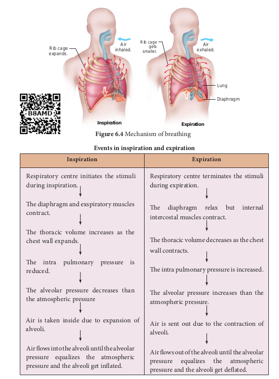
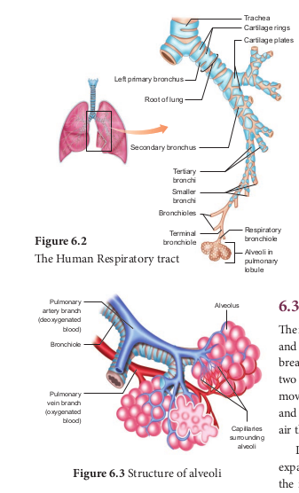
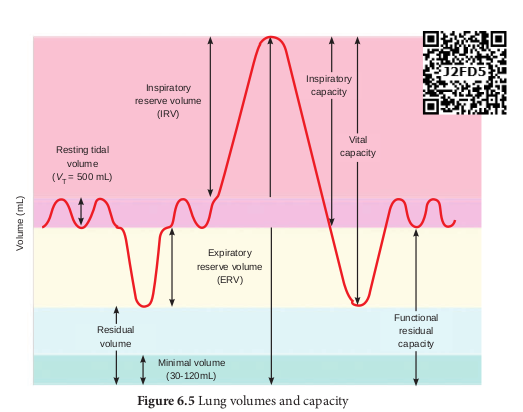
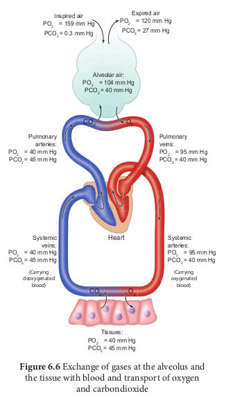
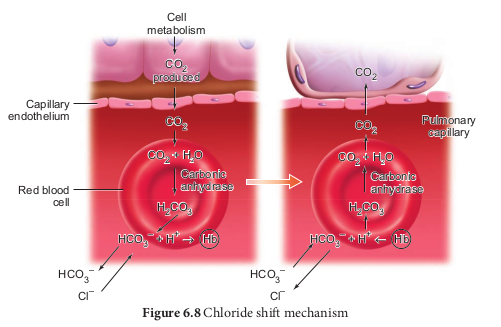
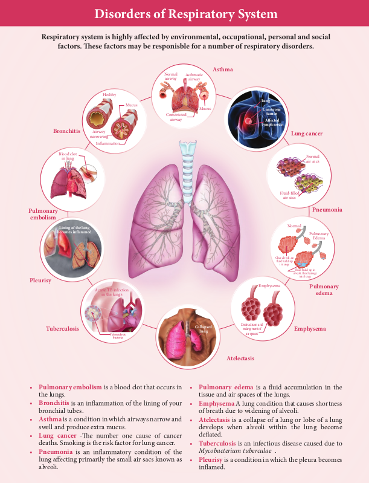

  

Chapter 6UNIT III

**Respiration**

**Chapter Outline**

6.1 Respiratory function 6.2 Respiratory organs in various organisms 6.3 Mechanism of breathing 6.4 Exchange of gases 6.5 Transport of gases 6.6 Regulation of respiration 6.7 Problems in oxygen transport 6.8 Disorders of respiratory system 6.9 Effects of smoking

_• Learns to describe the gross structure of the human gaseous exchange system_

_• Observes and draws the tissues and organs associated with the respiratory system_

_• Understands the process of gaseous exchange and transport of respiratory gases_

_• Knows the problems associated with oxygen transport_

_• Gains knowledge on the ill–effects of smoking._

**Learning Objectives:Learning Objectives:**  

We inhale and exhale air. Why is breathing so important for life? What happens when we breathe? Why energy is required for the body to perform various life processes? Where does the energy come from? We eat food for energy. Though the above raised questions look disconnected, we should know that the process of breathing is connected to the process of release of energy from food. Oxygen is utilized by the organisms to breakdown the biomolecules like glucose and to derive energy. During this breakdown carbondioxide, which is a harmful gas is also released. It is very obvious that oxygen has to be provided to cells continuously and the CO2 to be released immediately by the cells. So the need of a respiratory system is essential for life.

Exercise increases the rate and depth of breathing and supplies extra oxygen to the muscles and

removes more CO2 from the tissues.

  

We have discussed in the previous chapter how food provides energy for growth and repair of tissues. As mentioned earlier along with food, oxygen is necessary for breakdown of glucose to energy. In this chapter we shall discuss the respiratory organs of human, the mechanism of breathing, exchange and transport of gases and a few respiratory disorders.

The term respiration refers to the exchange of oxygen and carbondioxide between environment and cells of our body where organic nutrients are broken down enzymatically to release energy.

## Respiratory functions
 The five primary functions of the respiratory system are –

i. To exchange O2 and CO2 between the atmosphere and the blood.

ii. To maintain homeostatic regulation of body pH.

iii. To protect us from inhaled pathogens and pollutants.

iv. To maintain the vocal cords for normal communication (vocalization).

v. To remove the heat produced during cellular respiration.

## Respiratory organs in various organisms

Different animals have different organs for exchange of gases, depending upon their habitats and levels of organization. The amount of dissolved oxygen is very low in water compared to the amount of oxygen in the air. So the rate of breathing in aquatic organisms is much faster than land animals.  

In animals like sponges, coelenterates and flatworms exchange of gases takes place through the body surface by simple diffusion. Earthworms use their moist skin, whereas insects have tracheal tubes. Gills are used as respiratory organs in most of the aquatic Arthropods and Molluscs. Among vertebrates, fishes use gills whereas amphibians, reptiles, birds and mammals have well vascularised lungs. Frogs spend most of their time in water and also use their moist skin for respiration along with lungs and bucco pharynx

### Human Respiratory System

The respiratory system includes external nostrils, nasal cavity, pharynx, larynx, trachea, bronchi and bronchioles and lungs which contain **alveoli** (Figure 6.1). The parts starting from the external nostrils up to the terminal bronchioles constitute the conducting zone, whereas the alveoli and the ducts are called the respiratory zone. The parts of the conducting zone, humidifies and warms the incoming air.

In human beings, air enters the upper respiratory tract through the external nostrils. The air passing through the nostrils is filtered by fine hairs and mucus lining the passage. The external nostrils lead to the nasal chamber which opens into the nasopharynx which opens through the glottis of the larynx region into the trachea. The ciliated epithelial cells lining the trachea, bronchi and bronchioles secrete mucus. **Mucus membrane** lining the airway contains **goblet cells** which secrete mucus, a slimy material rich in glycoprotein. Microorganisms and dust particles attach in the mucus films and are carried upwards to pass down the

  

gullet during normal swallowing. During swallowing a thin elastic flap called epiglottis prevents the food from entering into the larynx and avoids choking of food.

The trachea is semiflexible tube supported by multiple cartilaginous rings which extends up to the midthoracic cavity and at the level of the 5th thoracic vertebra where it divides into right and left primary bronchi, one bronchus to each lung. Within the lungs the bronchi divides repeatedly into secondary and tertiary bronchi and further divides into terminal bronchioles and respiratory bronchioles.

Bronchi have ‘C’ shaped curved cartilage plates to ensure that the air passage does not collapse or burst as the air pressure changes during breathing. The bronchioles are without cartilaginous rings and have rigidity that prevent them from collapsing but are surrounded by smooth muscle which contracts or relaxes to adjust the diameter of these airways.

The fine respiratory bronchioles terminate into highly vascularised thin walled pouch like air sacs called alveoli

**Figure 6.1 The Human respiratory sy**  

meant for gaseous exchange (Figure 6.2, 6.3). The diffusion membrane of alveolus is made up of three layers – the thin squamous epithelial cells of the alveoli, the endothelium of the alveolar capillaries and the basement substance found in between them. The thin squamous epithelial cells of the **alveoli** are composed of Type I and

Type II cells. Type I cells are very thin so that gases can diffuse rapidly through them. Type II cells are thicker, synthesize and secrete a substance called **Surfactant**.

The lungs are light spongy tissues enclosed in the thoracic cavity surrounded by an airtight space. The thoracic cavity is bound dorsally by the vertebral column and ventrally by the sternum, laterally by the ribs and on the lower side by the dome shaped diaphragm.

The lungs are covered by double walled pleural membrane containing a several layers of elastic connective tissues and capillaries, which encloses the pleural fluid. Pleural fluid reduces friction when the lungs expand and contract.

**Characteristic features of respiratory surface:** • surface area must be very large and richly

supplied with blood vessels • should be extremely thin and kept moist • should be in direct contact with the

environment • should be permeable to respiratory gases

stem

|------|------|

|------|------|

  

The steps involved in respiration are i. The exchange of air between the

atmosphere and the lungs. ii. The exchange of O2 and CO2

between the lungs and the blood. iii. Transport of O2 and CO2 by the

blood. iv. Exchange of gases between the

blood and the cells. v. Uptake of O2 by the cells for various

activities and the release of CO2.

## Mechanism of breathing
 The movement of air between the atmosphere and the lungs is known as ventilation or breathing. Inspiration and expiration are the two phases of breathing. Inspiration is the movement of atmospheric air into the lungs and expiration is the movement of alveolar air that diffuse out of the lungs. (Figure 6.4)

Lungs do not contain muscle fibres but expands and contracts by the movement of the ribs and diaphragm. The diaphragm is a sheet of tissue which separates the thorax from the abdomen. In a relaxed state, the diaphragm is domed shaped. Ribs are moved by the intercostal muscles. External and internal intercostal muscles found between the ribs and the diaphragm helps in creating pressure gradients. Inspiration occurs if the pressure inside the lungs (intrapulmonary pressure) is less than the atmospheric pressure likewise expiration takes place when the pressure within the lungs is higher than the atmospheric pressure.

**SURFACTANTS** are the thin non– cellular films made of protein

and phospholipids covering the alveolar membrane. The surfactant lowers the surface tension in the alveoli and prevents the lungs from collapsing. It also prevents pulmonary oedema. Premature Babies have low levels of surfactant in the alveoli may develop the new born respiratory distress syndrome (NRDS) because the synthesis of surfactants begins only after the 25th week of gestation.

|------|------|------|

|------|------|------|------|------|------|

|------|------|

|------|------|

  

Air inhaled.Rib cage

expands.

Rib

sm

**Inspiration**

**Inspiration**

Respiratory centre initiates the stimuli during inspiration.

The diaphragm and exspiratory muscles contract.

The thoracic volume increases as the chest wall expands.

The intra pulmonary pressure is reduced.

The alveolar pressure decreases than the atmospheric pressure

Air is taken inside due to expansion of alveoli.

Air flows into the alveoli until the alveolar pressure equalizes the atmospheric pressure and the alveoli get inflated.

**Events in inspiratio**  

ism of breathing

Air exhaled.

cage gets aller.

Lung

Diaphragm

**Expiration**

**Expiration**

Respiratory centre terminates the stimuli during expiration.

The diaphragm relax but internal intercostal muscles contract.

The thoracic volume decreases as the chest wall contracts.

The intra pulmonary pressure is increased.

The alveolar pressure increases than the atmospheric pressure.

Air is sent out due to the contraction of alveoli.

Air flows out of the alveoli until the alveolar pressure equalizes the atmospheric pressure and the alveoli get deflated.

**n and expiration**

| In spi r at i on |E x pi r ati on |
|------|------|
| Respirator y cen tre ini tiates t he s timulidur ing in spiration.e diaphra gm and exspirator y mus clescontrac t.e t horacic v olume in creas es a s t hechest wa ll exp ands.e in tra p ulmonar y p ressure i sreduce d.e a lveolar p ressure de creas es t hanthe atmospher ic p ressureAir i s t aken in side d ue t o  exp ansio n o falveoli.Air ows into the alveoli until the alveolar pressure e qualizes t he a tmospheric pressure and the alveoli get inated. |Respirator y  centre  terminates  the  stimuli during expiration.e di aphragm r elax b ut  internal intercostal muscles contract.e thoracic volume decreases as the chest wall contracts.e intra pulmonar y pressure is increased.e a lveolar p ressure in creases t han t heatmospheric pressure.Air i s s ent o ut d ue t o t he co ntraction ofalveoli.Air ows out of the alveoli until the alveolarpressure e qualizes t he a tmospheric pressure and the alveoli get deated. |
  

Inspiraton is initiated by the contraction of the diaphragm muscles and external intercostal muscles, which pulls the ribs and sternum upwards and outwards and increases the volume of the thoracic chamber in the dorso–ventral axis, forcing the lungs to expand the pulmonary volume. The increase in pulmonary volume and decrease in the intrapulmonary pressure forces the fresh air from outside to enter the air passages into the lungs to equalize the pressure. This process is called inspiration.

Relaxation of the diaphragm allows the diaphragm and sternum to return to its dome shape and the internal intercostal muscles contract, pulling the ribs downward reducing the thoracic volume and pulmonary volume. This results in an increase in the intrapulmonary pressure slightly above the atmospheric pressure causing the expulsion of air from the lungs. This process is called expiration.

On an average, a healthy human breathes 12–16 times/minute. An instrument called **Spirometer** is used to measure the volume of air involved in breathing movements for clinical assessment of a person’s pulmonary function.

You are at high level in a mountain above the sea level. Suddenly you get palpitation and nausea. What condition are you suffering from? What are the other symptoms for this disease and how can it be reduced?

### Respiratory volumes and capacities

The volume of air present in various phases of respiration is denoted as  

**Respiratory volumes:** (Figure 6.5)

• **Tidal Volume (TV)** Tidal volume is the amount of air inspired or expired with each normal breath. It is approximately 500 mL., i.e. a normal human adult can inspire or expire approximately 6000 to 8000mL of air per minute. During vigorous exercise, the tidal volume is about 4–10 times higher.

• **Inspiratory Reserve volume (IRV)** Additional volume of air a person can inspire by forceful inspiration is called Inspiratory Reserve Volume. The normal value is 2500–3000 mL.

• **Expiratory Reserve volume (ERV)** Additional volume of air a person can forcefully exhale by forceful expiration is called Expiratory Reserve Volume. The normal value is 1000–1100 mL.

• **Residual Volume (RV)** The volume of air remaining in the lungs after a forceful expiration. It is approximately 1100–1200 mL.

**Respiratory capacities:**

• **Vital capacity (VC)** the maximum volume of air that can be moved out during a single breath following a maximal inspiration. A person first inspires maximally then expires maximally. VC = ERV+TV+IRV

• **Inspiratory capacity (IC)** The total volume of air a person can inhale after normal expiration. It includes tidal volume and inspiratory reserve volume. IC = TV+IRV

• **Expiratory capacity (EC)** The total volume of air a person can exhale after normal inspiration. It includes

  

tidal volume and expiratory reserve volume. EC=TV+ERV

• **Total Lung Capacity (TLC)** The total volume of air which the lungs can accommodate after forced inspiration is called Total Lung Capacity. This includes the vital capacity and the residual volume. It is approximately 6000mL. TLC=VC+RV

• **Minute Respiratory Volume** The amount of air that moves into the respiratory passage per minute is called minute respiratory volume.

Normal TV = 500mL; Normal respiratory rate = 12 times/minute

Therefore, minute respiratory volume = 6 Litres/minute (for a normal healthy man).

Minimal volume (30-120mL)

Vo lu

m e

(m L)

Resting tidal volume

(_V_T = 500 mL)

Expiratory reserve volum

(ERV)

Inspiratory reserve volume

(IRV)

Residual volume  

mes and capacity

Healthy lungs contain large amounts of elastic connective tissue around the alveoli, containing elastin, which makes the lung tissue elastic. People with emphysema and bronchitis have difficulty in exhaling because the enzyme elastase destroys the elastin around the alveoli and reduces the elasticity of the lungs.

e

Inspiratory capacity

Vital capacity

Functional residual capacity

**_Why do some people snore?_ –** Breathing with a hoarse sound during sleep is caused by the vibration of the soft palate. Snoring is caused by a partially closed upper air way (nose and throat) which becomes too narrow for enough air to travel through the lungs. This makes the surrounding tissues to vibrate and produces the snoring sound.

  

**Dead space** Some of the inspired air never reaches the gas exchange areas but fills the respiratory passages where exchange of gases does not occur. This air space is called dead space. Dead space is not involved in gaseous exchange. It amounts to approximately 150mL.

## Exchange of gases
 The primary site for the exchange of gases is the alveoli. The uptake of O2 and the release of CO2 occur between the blood and tissues by simple diffusion driven by partial pressure gradient of O2 and CO2. Partial pressure is the pressure contributed by an individual gas in a mixture of gases. It is represented as pO2 for oxygen and pCO2 for carbon–dioxide. Due to pressure gradients, O2 from the alveoli enters into the blood and reaches the tissues. CO2 enters into the blood from the tissues and reaches alveoli for elimination. As the solubility of CO2 is 20–25 times higher than that of O2, the partial pressure of CO2 is much higher than that of O2 (Table 6.1 and Figure 6.6).

**Respiratory pigments Haemoglobin** Haemoglobin belongs to the class of conjugated protein. The iron containing pigment portion haem constitutes only 4% and the rest colourless protein globin belongs to histone class. Haemoglobin has a molecular weight of 68,000

**Figur** the

(Carr deoxyg

blo  

daltons and contains four atoms of iron, each of which can combine with a molecule of oxygen. **Methaemoglobin** If the iron component of the haem is in the ferric state, than the normal ferrous state, it is called methaemoglobin. Methaemoglobin does not bind with O2. Normally RBC contains less than 1% methaemoglobin.

**e 6.6** Exchange of gases at the alveolus and tissue with blood and transport of oxygen

and carbondioxide

ying enated od)

(Carrying oxygenated

blood)

  

**Respiratory gases**

**Parti**

**Atmospheric air**

**Alveoli**

O2 159 104

CO2 0.3 40

**Table 6.1** Partial pressure of Oxygen and Ca those gases in th

## Transport of gases 6.5.1 Transport of oxygen

Molecular oxygen is carried in blood in two ways bound to haemoglobin within the red blood cells and dissolved in plasma. Oxygen is poorly soluble in water, so only 3% of the oxygen is transported in the dissolved form. 97% of oxygen binds with haemoglobin in a reversible manner to form oxyhaemoglobin (HbO2). The rate at which haemoglobin binds with O2 is regulated by the partial pressure of O2. Each haemoglobin carries maximum of four molecules of

**al pressure mm Hg**

**Deoxygenated Blood**

**Oxygenated blood**

**Tissues**

40 95 40

45 40 45

rbon dioxide (in mmHg) in comparison to e atmosphere

e

oxygen. In the alveoli high pO2, low pCO2, low temperature and less H+ concentration, favours the formation of oxyhaemoglobin, whereas in the tissues low pO2, high pCO2, high H+ and high temperature favours the dissociation of oxygen from oxyhaemoglobin.

A **sigmoid curve** (S–shaped) is obtained when percentage saturation of haemoglobin with oxygen is plotted

against pO2. This curve is called **oxygen haemoglobin dissociation curve** (Figure 6.7). This S–shaped curve has a steep slope for pO2 values between 10 and 50mmHg and then flattens between 70 and 100 mm Hg.

Under normal physiological conditions, every 100mL of oxygenated blood can deliver about 5mL of O2 to the tissues.

### Transport of Carbon
–**dioxide**

Blood transports CO2 from the tissue cells to the lungs in three ways

Breathing through nose is healthier than through mouth– Why?

| Re spi r ator yg as es |Par ti a l p ress ur e mm H g |
|------|------|------|------|------|------|
| Atmos p he ri cai r |Alv e o li |D e oxy ge na te dBl ood |Oxy ge na te db l ood |Tiss u es |
| O2 |159 |104 |40 |95 |40 |
| CO2 |0.3 |40 |45 |40 |45 |
  

i. **Dissolved in plasma** About 7 – 10% of CO2 is transported in a dissolved form in the plasma.

ii. **Bound to haemoglobin** About 20 – 25% of dissolved CO2 is bound and carried in the RBCs as carbaminohaemoglobin (Hb CO2) CO2 + Hb Hb CO2

iii. **As bicarbonate ions in plasma** about 70% of CO2 is transported as bicarbonate ions

This is influenced by pCO2 and the degree of haemoglobin oxygenation. RBCs contain a high concentration of the enzyme, carbonic anhydrase, whereas small amounts of carbonic anhydrase is present in the plasma.

At the tissues the pCO2 is high due to catabolism and diffuses into the blood to form HCO3

– and H+ ions. When CO2

diffuses into the RBCs, it combines with water forming carbonic acid (H2CO3) catalyzed by carbonic anhydrase. Carbonic acid is unstable and dissociates into hydrogen and bicarbonate ions.

Carbonic anhydrase facilitates the reaction in both directions.

CO2 + H2O carbonic anhydrase H2CO3

H2CO3 carbonic anhydrase HCO3 – + H+

The HCO3 – moves quickly from the RBCs

into the plasma, where it is carried to the lungs. At the alveolar site where pCO2 is low, the reaction is reversed leading to the formation of CO2 and water. Thus CO2 trapped as HCO3

– at the tissue level is transported to the alveoli and released out as CO2. Every 100mL of deoxygenated blood delivers 4mL of CO2 to the alveoli for elimination.  

**Bohr effect and Haldane effect** Increase in pCO2 and decrease in pH

decrease the affinity of haemoglobin for oxygen and shifts the oxyhaemoglobin dissociation curve to the right and facilitates unloading of oxygen from hemoglobin in the tissue. This effect of pCO2 and pH on the oxyhaemoglobin dissociation curve is called the **Bohr effect**.

The **Haldane effect**, on the other hand describes how oxygen concentrations determines hemoglobin’s affinity for carbon dioxide. The amount of carbon dioxide transported in blood is remarkably affected by the degree of oxygenation of the blood. The lower the partial pressure of O2 lower is the affinity of haemoglobin saturation with oxygen hence more CO2 is carried in the blood. This phenomenon is called **Haldane effect**. This effects CO2 exchanges in both the tissues and lungs.

In the lungs the process is reversed as the blood moves through the pulmonary capillaries, its pCO2 declines from 45mm Hg to 40mm Hg. For this to occur carbondioxide is freed from HCO3- ions and Cl- ions moves in to the plasma and reenters the RBC and binds with H+ to form carbonic acid which dissociates into CO2 and water. This CO2 diffuses along its partial gradient from the blood to the alveoli (Figure 6.8).

## Regulation of Respiration
 A specialised respiratory centre present in the medulla oblongata of the hind brain called **respiratory rhythm centre** is responsible for this regulation. **Pneumotaxic centre** present in pons varoli region of the brain moderates the function

  

of the respiratory rhythm centre to ensure normal breathing. The chemosensitive area found close to the rhythm centre is highly sensitive to CO2 and H+. And H+ are eliminated out by respiratory process. Receptors associated with the aortic arch and carotid artery send necessary signals to the rhythm centre for remedial action. The role of O2 is insignificant in the regulation of respiratory rhythm.

**Particulate matter PM** 2.5 in the air is increasing day by day which causes respiratory illness. Central Pollution Control Board (CPCB) reports that the quality of air is not good due to soot and smoke. So some cities in India are using CNG (Compressed Natural Gas) as fuel.

## Problems in Oxygen transport

When a person travels quickly from sea level to elevations above 8000ft, where

the atmospheric pressure and partial pressure of oxygen are lowered, the individual responds with symptoms of **acute mountain sickness** (AMS)– headache, shortness of breath, nausea and dizziness due to poor binding of O2 with haemoglobin. When the person moves on a long–term basis to mountains from sea level, the body begins to make respiratory and haematopoietic adjustments. To overcome this situation kidneys accelerate production of the hormone erythropoietin, which stimulates the bone marrow to produce more RBCs.

When a person descends deep into the sea, the pressure in the surrounding water increases which causes the lungs to decrease in volume. This decrease in volume increases the partial pressure of the gases within the lungs. This effect can be beneficial, because it tends to drive additional oxygen into the circulation, but this benefit also has a risk, the increased pressure can also drive nitrogen

e shift mechanism

|------|------|

|------|------|

  

gas into the circulation. This increase in blood nitrogen content can lead to a condition called **nitrogen narcosis.** When the diver ascends to the surface too quickly a condition called **‘bends’ or decompression sickness** occurs and nitrogen comes out of solution while still in the blood forming bubbles. Small bubbles in the blood are not harmful, but large bubbles can lodge in small capillaries, blocking blood flow or can press on nerve endings. Decompression sickness is associated with pain in joints and muscles and neurological problems including stroke. The risk of nitrogen narcosis and bends is common in **scuba divers**.

During carbon–dioxide poisoning, the demand for oxygen increases. As the O2 level in the blood decreases it leads to suffocation and the skin turns bluish black.

**Allergy** is caused by allergens. When we enter a polluted area, immediately we start

sneezing and coughing. The allergens in that place affect our respiratory tracts and the responses to the allergens start within minutes. Allergens provoke an inflammatory response. A common manifestation of allergy is Asthma.

## Disorders of the Respiratory system

Respiratory system is highly affected by environmental, occupational, personal and social factors. These factors may be responsible for a number of respiratory disorders. Some of the disorders are discussed here.  

**Asthma** It is characterized by narrowing and inflammation of bronchi and bronchioles and difficulty in breathing. Common allergens for asthma are dust, drugs, pollen grains, certain food items like fish, prawn and certain fruits etc.

**Emphysema** Emphysema is chronic breathlessness caused by gradual breakdown of the thin walls of the alveoli decreasing the total surface area of a gaseous exchange. i.e., widening of the alveoli is called emphysema. The major cause for this disease is cigarette smoking, which reduces the respiratory surface of the alveolar walls.

**Bronchitis** The bronchi when it gets inflated due to pollution smoke and cigarette smoking, causes bronchitis. The symptoms are cough, shortness of breath and sputum in the lungs.

**Pneumonia** Inflammation of the lungs due to infection caused by bacteria or virus is called pneumonia. The common symptoms are sputum production, nasal congestion, shortness of breath, sore throat etc.

**Tuberculosis** Tuberculosis is caused by _Mycobacterium tuberculae. This infection mainly occurs_ in the lungs and bones. Collection of fluid between the lungs and the chest wall is the main complication of this disease.

**Occupational respiratory disorders** The disorders due to one’s occupation of working in industries like grinding or stone breaking, construction sites, cotton industries, etc. Dust produced affects the respiratory tracts. Long exposure can give rise to inflammation leading to fibrosis.

  

**Silicosis** and **asbestosis** are occupational respiratory diseases resulting from inhalation of particle of silica from sand grinding and asbestos into the respiratory tract. Workers, working in such industries must wear protective masks.

## Effects of Smoking
 Today due to curiosity, excitement or adventure youngsters start to smoke and later get addicted to smoking. Research says about 80% of the lung cancer is due to cigarette smoking.

Smoking is inhaling the smoke from burning tobacco. There are thousands of known chemicals which includes nicotine, tar, carbon monoxide, ammonia, sulphur– dioxide and even small quantities of arsenic. Carbon monoxide and nicotine damage the cardiovascular system and tar damages the gaseous exchange system. Nicotine is the chemical that causes addiction and is a stimulant which makes the heart beat faster and the narrowing of blood vessels results in raised blood pressure and coronary heart diseases. Presence of carbon monoxide reduces oxygen supply. Lung cancer, cancer of the mouth and larynx is more common in smokers than non–smokers. Smoking also causes cancer of the stomach, pancreas and bladder and lowers sperm count in men. Smoking can cause lung diseases by damaging the airways and alveoli and results in emphysema and chronic bronchitis. These two diseases along with asthma are often referred as Chronic Obstructive **Pulmonary Disease** (COPD). When a person smokes, nearly 85% of the smoke released is inhaled by the smoker himself and others in the vicinity, called **passive**  

**smokers, are also affected. Guidance or** counselling should be done in such users to withdraw this habit.

**Summary**
 The process of intake of oxygen rich air and giving out of air rich in carbon dioxide is generally called respiration. Pollutants and microorganisms are filtered from the inspired air by the hair and mucus present in the nostrils. The two main steps in the mechanism of respiration are inspiration and expiration which takes place due to pressure gradient in the atmosphere and lungs.

O2 is transported in blood in dissolved form and is also bound to haemoglobin. One molecule of haemoglobin can bind four molecules of O2. The Sigmoid shape of the O2 haemoglobin dissociative curve shows increased affinity for each O2 molecule.

CO2 is transported in blood in dissolved form as carbamino haemoglobin and as H2CO3. It is produced in RBCs from CO2

and water catalysed by carbonic anhydrase. Breathing is controlled by medullary respiratory centre.

Respiratory volumes and capacities indicate the amount of air inspired and expired during normal respiration. Our respiratory system can be affected by pollutants, pathogens and other chemical substances found in air. Lung cancer and emphysema cannot be cured and these diseases are common among cigarette smokers.

People at higher level than the sea level are prompted to altitude sickness as the barometric pressure is low in those regions. Surfactant, emphysema, Asthma and Dead space have been discussed. During vigorous exercise the rate of respiration increases.

  

**• Pulmonary embolism** is a blood clot that occurs in the lungs.

**• Bronchitis** bronchial tubes.

**• Asthma** is a condition in which airways narrow and swell and produce extra mucus.

**• Lung cancer** deaths. Smoking is the risk factor for lung cancer.

**• Pneumonia**

alveoli.

**Disorders of Resp**

**Pulmonary embolism**

**Bronchitis**

**Tuberculosis**

**Pleurisy**

Blood clot in lung

Healthy

Mucus

**Tuberculosis bacteria**

Active TB infection in the lungs

**Lining of the lung**

Airway narrowing

As

Constricted airway

Normal airway  

**• Pulmonary edema** tissue and air spaces of the lungs.

**• Emphysema** A lung condition that causes shortness of breath due to widening of alveoli.

**• Atelectasis** is a collapse of a lung or lobe of a lung develops when alveoli within the lung become

**• Tuberculosis** is an infectious disease caused due to _Mycobacterium tuberculae_ .

**• Pleurisy** is a condition in which the pleura becomes

**iratory System**

**Pulmonary edema**

**Emphysema**

**Asthma**

**Lung cancer**

**Atelectasis**

**Pneumonia**

Mucus

Normal air sacs

Normal

Pulmonary Edema

Emphysema

air sacs

Clear alveoli, no

in lungs

Fluid build-up in

into lungs

Destructiuon and enlargement of

air spaces

**Lung**

thmatic airway

**Cancerous tumor**

**lymph node**

**Collapsed Lung**

| M |
|------|

|------|------|

| Muc |
|------|------|

  

**Evaluation** 1\. Breathing is controlled by

a. cerebrum b. medulla oblongata c. cerebellum d. pons

2\. Intercostal muscles are found between the a. vertebral column b. sternum c. ribs d. glottis

3\. The respiratory structures of insects are a. tracheal tubes b. gills c. green glands d. lungs

4\. Asthma is caused due to a. inflammation of bronchus and

bronchioles. b. inflammation of bronchione c. damage of diaphragm. d. infection of lungs

5\. The Oxygen Dissociation Curve is a. sigmoid b. straight line c. curved d. rectangular hyperbola

6\. The Tidal Volume of a normal person is a. 800 mL b. 1200 mL c. 500 mL d. 1100 – 1200 mL

7\. During inspiration, the diaphragm a. expands. b. unchanged c. relaxes to become domed–shaped. d. contracts and flattens

**Activity**

**To test the presence of CO**2 **in exhaled air** of clear lime water. Blow exhaled air into A into B with a help of a syringe for about 15 ti the tubes A and B. The lime water (Calcium  

8\. CO2 is transported through blood to lungs as a. carbonic acid b. oxyhaemoglobin c. carbamino haemoglobin d. carboxy haemoglobin

9\. When 1500 mL air is in the lungs, it is called a. vital capacity b. tidal volume c. residual volume d. inspiratory reserve volume

10\. Vital capacity is a. TV + IRV b. TV + ERV c. RV + ERV d. TV + IRV + ERV

11\. After a long deep breath, we do not respire for some seconds due to a. more CO2 in the blood b. more O2 in the blood c. less CO2 in the blood d. less O2 in the blood

12\. Which of the following substances in tobacco smoke damage the gas exchange system? a. carbon monoxide and carcinogens b. carbon monoxide and nicotine c. carcinogens and tar d. nicotine and tar

13\. Column I represents diseases and column II represents their symptoms. Choose the correctly paired option

Take two test tubes A and B with few mL with a help of a straw and pass normal air mes and observe the changes that occur in Hydroxide) in the test tube A turns milky.

  

Column I Column II

(P) Asthma (i) Recurring of bronchitis

(Q) Emphysema (ii) Accumulation of W.B.C in alveolus

(R) Pneumonia (iii) Allergy

a. P = iii, Q = ii, R = i b. P = iii, Q = i, R = ii c. P = ii, Q = iii, R = i d. P = ii, Q = i, R = iii

14\. Which of the following best describes the process of gas exchange in the lungs? a. Air moves in and out of the alveoli

during breathing. b. Carbon dioxide diffuses from

deoxygenated blood in capillaries into the alveolar air.

c. Oxygen and carbon dioxide diffuse down their concentration gradients between blood and alveolar air.

d. Oxygen diffuses from alveolar air into deoxygenated blood.

15\. Make the correct pairs. Columan–I Column–II

(P) IC i. maximum volume of air breathed in after forced inspiration.

(Q) EC ii. Volume of air present after expiration in lungs.

(R) VC iii. Volume of air inhaled after expiration.

(S) FRC iv. Volume of air present after inspiration in lungs.

(a) P – i , Q – ii , R – iii , S – iv (b) P – ii , Q – iii , R – iv , S – i (c) P – ii , Q – iii , R – i , S – iv (d) P – iii , Q – iv , R – i , S – ii  

16\. Make the correct pairs. Column–I Column–II

(P) Tidal volume

i. 1000 to 1100 ml

(Q) Residual volume

ii. 500 ml

(R) Expiratory reserve volume

iii. 2500 to 3000 ml

(S) Inspiratory reserve volume

iv. 1100 to 1200 ml

(a) P – ii , Q – iv , R – i , S – iii (b) P – iii , Q – ii , R – iv , S – i (c) P – ii , Q – iv , R – iii , S – i (d) P – iii , Q – iv , R – i , S – ii

17\. Name the respiratory organs of flatworm, earthworm, fish, prawn, cockroach and cat.

18\. Name the enzyme that catalyses the bicarbonate formation in RBCs.

19\. Air moving from the nose to the trachea passes through a number of structures. List in order of the structures.

20\. Which structure seals the larynx when we swallow?

21\. Resistance in the airways is typically low. Why? Give two reasons.

22\. How the body makes long–term adjustments when living in high altitude.

23\. Why is pneumonia considered a dangerous disease?

24\. Diffusion of gases occurs in the alveolar region only and not in any other part of the respiratory system. Discuss.

25\. Sketch a flow chart to show the path way of air flow during respiration.

26\. Explain the conditions which creates problems in oxygen transport.

  

**M ec**

**ha ni**

**sm o**

**f R es**

**pi ra**

**o n**

In sp

ira o

n an

d Ex

pi ra

o n

ha pp

en s d

ue to

p re

ss ur

e ch

an ge

s i n

th e

th or

ac ic

ca vi

ty .

By th

e co

nt ra

c on

a nd

ex

pa ns

io n

of d

ia ph

ra gm

, ex

te rn

al in

te rc

os ta

lm us

cle s

an d

in te

rn al

in te

rc os

ta l

m us

cle s t

he v

ol um

e of

th e

th or

ac ic

ca vi

ty is

re du

ce d

or

in cr

ea se

d.

Th e

ac t o

f b re

at hi

ng is

pe

rfo rm

ed b

y ex

pa ns

io n

an d

co nt

ra c

on o

f t he

th

or ac

ic ca

vi ty

.

**IN SP**

**IR AT**

**IO N**

An a

c ve

p ro

ce ss

b y

w hi

ch

fre sh

a ir

is dr

aw n

in to

th e

lu ng

s.

**EX PI**

**RA TI**

**O N**

A pa

ss iv

e pr

oc es

s b y w

hi ch

ai

r i s e

xh al

ed fro

m th

e lu

ng s.

**C on**

**ce pt**

**m ap**

Ai r

dr aw

n in

Ai r  

Th e

co nt

ra c

on o

f e xt

er na

l in

te rc

os ta

lm us

cle ca

us es

th

e rib

s t o

m ov

e an

te rio

rly an

d ou

tw ar

dl y.

Th e

co nt

ra c

on o

f t he

di

ap hr

ag m

le ad

s t o

fla e

ni ng

o f i

ne la

s c,

d om

e sh

ap ed

ce nt

ra l p

ar t o

f t he

di

ap hr

ag m

.

Th e

di ap

hr ag

m re

la xe

s a nd

ris

es to

re su

m e

its o

rig in

al

do m

e sh

ap e.

Th e

rib s t

ak e

th ei

r o rig

in al

po

si on

a s a

re su

lt of

co

nt ra

c on

o f t

he in

te rn

al

in te

rc os

ta lm

us cle

s.

**D ia**

**ph ra**

**gm do**

**w n**

**D ia**

**ph ra**

**gm up**

dr aw

n ou

t

rib s

ob liq

ue ly

u p

rib s

ob liq

ue ly

do w

n

| obliquely |
|------|------|------|

|------|------|------|

  

Respiratory System’s URL:

**https://www.getbodysmart.com/respiratory-sy**

Schematics of Gas exchange:

**https://www.wisc-online.com/learn/general-e physiology2/ap2404/respiratory-system-gas-ex**

**ICT Corner**

**Resp**

**Step 1 Step 2**

**Step – 1** Use the URL to reach the ‘Respiratory Syst and explore its structure and the functions.

**Step – 2** Now click back button on the top of the w ‘Pharynx’ from the grid and explore its ana

**Step – 3** Follow the above steps to explore each part

**Step – 4** Use the reference given below the page to ac

Let’s explore the anatomy and function

of the **Respiratory system.**

\* Pictures are indicative only  

**stem**

**ducation/anatomy-and- change**

**ire**

**Step 3 Step 4**

em’ page. In the grid select ‘Nasal cavity’

indow or use the ‘Backspace’ key. Select tomical regions.

and its functions.

quire additional details.

|------|------|

| Respir |
|------|------|------|------|

| ICT  CornerRespireLet’ s explore theanatomy and functionRoot of lungof the  Respiratorysystem.Secondary bronchusTertiaryStep – 1Use the URL to reach the ‘Respiratory System’ page. In the grid select ‘Nasal cavity’and explore its structure and the functions.Step – 2Now click back button on  the top of  the window  or use the ‘Backspace’ key.  Select‘Pharynx’  from the grid and explore its anatomical regions.Step – 3Follow the above steps to explore each part and its functions.Step – 4Use the reference given below the page to acquire additional details.Step 2 Step 3 Step 4smart.com/respiratory-systeme:om/learn/general-educaƟon/anatomy-and-espiratory-system-gas-exchange |
|------|------|

| Step 1Respiratory System’s URL:hƩps://www.getbodySchemaƟcs of Gas exchanghƩps://www.wisc-online.cphysiology2/ap2404/r* Pictures are indicaƟve only |
