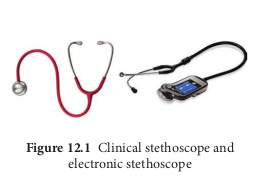
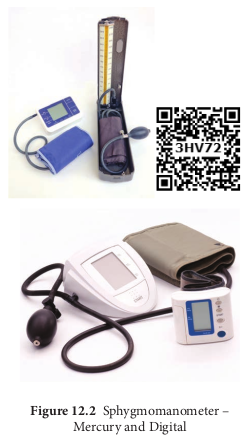
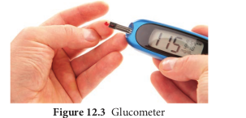
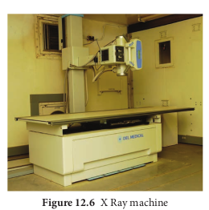
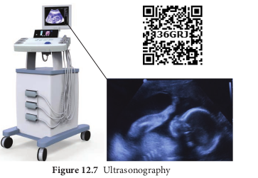
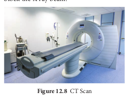
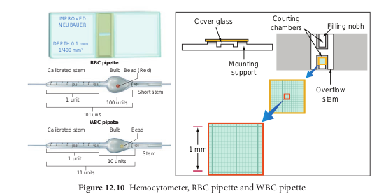
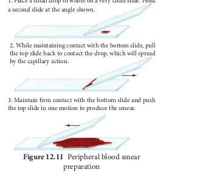
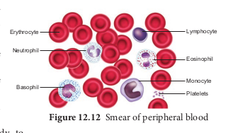

  

Chapter 12UNIT IV

**Basic Medical Instruments and Techniques**

**Chapter Outline**

12.1 Diagnostic and Monitoring Instruments

12.2 Imaging Instruments 12.3 Therapeutic Instruments 12.4 Biomedical Techniques

• _Understands the principles and working mechanisms of instruments_

• _Learn blood cell counting by haemocytometer_

• _Prepares blood smear and learns the different types of WBC_

Traditionally doctors employ simple instruments like thermometer, stethoscope, and sphygmomanometer to monitor the health conditions of individuals. Medical technology has blossomed during the last few decades and revolutionized medical practices which are immensely influencing life saving means in emergency care of patients. Modern hospitals are established

**Learning Objectives:**  

‘Smart contact lens sensor for diabetic and glaucoma diagnosis

with sophisticated medical instruments like autoanalysers, electrocardiograms, electroencephalograms, ultrasound scanners, CT scanners, NMRI, Isotope imaging and a variety of modern complex equipments for diagnosis and treatment of patients. In medical therapeutics both diagnosis and treatment are two important aspects. Diagnosis involves

• **Haematology**, is the branch of medicine concerned with the study of the cause, prognosis, treatment, and prevention of diseases related to blood.

• **Toxicology** is a discipline that involves the study of the adverse effects of chemical substances on living organisms and the practice of diagnosing and treating exposures to toxins and toxicants.

  

identifying or determining the nature of disease while treatment involves the curative aspects in order to eliminate the disease causing agent. Clinical laboratory tests help a physician in correct diagnosis and treatment, coupled with advanced communication technology, telemedicine, an emerging area are vital especially in rural health care.

## Diagnostic and Monitoring Instruments

**Stethoscope**

Stethoscope is a medical device used to hear the internal sounds of the human body such as heart beat, sounds due to inhalation and exhalation of air in the lungs, stomach, intestinal movements and also foetal movements. The modern electronic stethoscope is a high precision instrument used to hear with clarity the internal sounds of the human body even in a noisy environment or through the heavy clothing of the patient. A typical stethoscope consists of a disc shaped resonator that is placed against chest with two rubber tubes connected to earpieces. This is simply known as binaural stethoscope. It is a simple but an effective diagnostic tool to localize problems and to diagnose diseases (Figure12.1).

**Clinical significance of stethoscope**

1\. Stethoscope helps to find the normal and abnormal heart beat sounds and also to diagnose valve functions.

2\. It helps to diagnose lung diseases such as pneumonia, pulmonary edema, bronchitis and pleuritis.

3\. Stethoscopes along with sphygmomanometer are used to read the blood pressure.

4\. It outlines the status of cardiac, respiratory and intestinal disorders.

**Sphygmomanometer**

Sphygmomanometer is a device that measures the blood pressure hence known as blood pressure meter, blood pressure monitor or blood pressure gauge. It consists of a rubber cuff which is wrapped around the upper arm and the other end is connected to a mercury manometer which directly measures the pressure in a uniformly graduated scale ((Figure12.2). By gradually increasing and reducing the pressure in the cuff, the systolic and diastolic blood pressure is clearly monitored by the sounds of arterial blood flow. The cuff is smoothly wrapped around the upper arm 3 cm above the elbow. The resonator of the stethoscope is placed on the brachial artery at the elbow to hear the blood flow sounds. The cuff is then rapidly inflated to 180 mm Hg and is then slowly deflated. As the pressure in the cuff falls a “whooshing” sound is heard then the blood flow starts again in the artery. This indicates the patient’s systolic pressure. Then the pressure is slowly released until no sound is heard. This is measured as the diastolic

  

blood pressure. For better clinical understanding readings may be taken in both arms. **Types of sphygmomanometer**

1\. **Manual sphygmomanometer a. Mercury sphygmomanometer:** It

shows blood pressure by affecting the height of a column of mercury which does not require calibration.

**b. Aneuroid sphygmomanometer**: It is a mechanical type with a dial and it requires calibration checks unlike mercury manometer.

2\. **Digital sphygmomanometer:** It detects systolic and diastolic pressures by an oscillometric detector. It is easy to use even without training.

The maximum pressure exerted during the ventricular contraction is called **systolic pressure** and the minimum pressure exerted during the ventricular relaxation is called **diastolic pressure.**

Normal Blood Pressure = 120/80 mmHg Systolic pressure = 120 mm Hg Diastolic pressure = 80 mm Hg

**“WHITE COAT EFFECT” White coat** hypertension, more

commonly known as **white coat syndrome**, is a phenomenon in which the patients exhibit a blood pressure level above the normal range, in a clinical setting, though they do not exhibit in other settings.

**Clinical Significance** 1\. To diagnose pathological conditions

such as hypertension and hypotension 2. Helps to assess the state of blood

circulation. 3. Provides the functional details of heart.

**Glucometer** Glucometer is a simple and portable medical device used to record the approximate levels of blood glucose. It is a battery operated digital meter.

  

strip. The meter reads the blood sample and displays the glucose level in the units of mg/dL. Most glucometers are based on the electrochemical technology or colour reflectance principle (Figure12.3).

**Significance** 1\. Handy and portable 2. Immediate results, the results are

displayed in approximately 40 seconds. 3. Requires no calculation 4. No training is required for operating

the instrument **Normal Glucose Values in blood** Normal glucose value: 70 – 100 mg/dL Random blood sugar: 80 – 120 mg/dL Fasting blood sugar: 70 – 110 mg/dL Post – prandial blood sugar: 110 – 140mg/dL

**Autoanalyser** Autoanalyser is a computer controlled device. It is used for quick estimation of several bio-chemical parameters like glucose, urea, cholesterol, enzymes and other proteins present in body fluids. The analyser is fully integrated with all the necessary controls such as temperature of reaction, volumes of sample, reagents and transfer of fluids. More sophisticated multichannel autoanalysers with capabilities of selecting any type of analysis for any one set of samples are available now (Figure12.4).

## Imaging Instruments EEG – Electroencephalogram

EEG is a test to evaluate the electrical activities of the brain (Figure12.5). Brain cells communicate with each other through electrical impulses. An EEG  

tracks and records the brain wave patterns. It is a graphical recording of the electrical activities of the cortical and sub cortical regions of the brain. It is recorded by placing the surface electrodes on the scalp region. The electrodes analyse the electrical impulses in the brain and send signals to a computer which records the results. In 1929 Germen scientist Hans Berger was the first to analyse the EEG. Hence, EEG is also known as “Berger Wave”. The electrical activity recorded by EEG may have synchronised or desynchronised waves. It has four frequency waves/ rhythms namely alpha, beta, delta and theta waves**.**

**Clinical significance of EEG**

1\. EEG provides a means to study the functioning of the brain and its coordination with other parts of the body.

2\. It is useful in diagnosis of neurological and sleep disorders

  

**X-rays**

Radiography is the use of X-rays to visualize the internal structures of a patient (Figure12.6). X-Rays are a form of

**Wearable Healthcare devices** include smart watches, fitbit wristbands, fitness trackers, helmet-worn impact checkers, back pain posture checkers, necklaces, clip- ons, smart clothing and filament implant. These medical devices with select sensors can record real-time data on various physiological conditions and electronically send them to doctor, or via apps on smart phone. It has two main fitness apps such as **Activity app and Work out app.** Activity app is all about health, movement, wellness and daily routine; and **Workout app** tracks running, cycling and walking. The wearable healthcare devices are activity trackers, which offer health benefits by measuring number of steps, distance travelled, calories burned, heart rate, detects blood volume and capillary-size changes under pressure, body temperature and quality of sleep. It also tracks progress over time so that one can set daily goals for bodyweight, blood glucose level, blood pressure, sleep time, water intake, etc.

3\. EEG has proved to be a useful diagnostic tool in cases of serious head injuries, brain tumours and cerebral infections.

4\. It also helps to find the diseases like epilepsy and various degenerative disease of the nervous system.

5\. EEG is useful in assessing patients with suspected brain death.

**F**  

electromagnetic radiation, produced by an X-ray tube. The X-rays are passed through the body and captured behind the patient by a detector; film sensitive to x-rays or a digital detector. There is variation in absorption of the X-rays by different tissues within the body. Dense bones absorb more radiation, while soft tissue allows more rays to pass through. This variation produces contrast image within the image to give a 2D representation of all the structures. It is invasive. It is also available as a portable X ray unit. It is less costly when compared to the other imaging units like MRI or CT.

**Clinical significance** 1\. X- ray imaging is used for diagnosing

the disease of the heart, lungs and fractures of bones and joints

2\. It is also used to visualise hollow organs and blood vessels by filling them with certain chemical formulations containing barium and iodine

3\. Dental radiography is used in diagnosis of oral problems

4\. Mammography is a special type of X-ray imaging to create detail images of the breast tissues

5\. Fluoroscopy for real time images 6. X-rays are used in radiation therapy to

shrink cancerous tumours

**igure 12.5** EEG with waves

  

‘X rays were discovered by German physicist Sir Wilhelm Conard Roentgen in 1895,

while he was studying on high voltage discharge phenomenon in a Crooker’s tube. He noticed fluorescence of a barium platino cyanide screen lying several feet away in the same room.

**Ultrasound imaging**

Ultrasound literally means sound beyond the range of human hearing. Ultrasound waves are produced by a physical phenomenon known as Piezo-electric effect. When an electric potential is applied to certain crystals for example: Lead zirconate, they become excited, vibrate and produce ultrasound. When the ultrasound waves are introduced through homogenous tissue, they pass unimpeded until they

meet another tissue or organ. A part or whole of the ultrasound wave is reflected and received back by the same crystal and is converted into an electrical signal. This signal denoting reflecting interface is shown on the oscilloscope screen as a deflection from the base line (Figure12.7).

**Clinical significance**

1\. Ultrasound waves are used to image the foetus at different stages of pregnancy to study the progress of the developing foetus.

2\. They are used to hear foetal heart sound, blood flow, etc.

3\. Used in echocardiography to diagnose the damages in heart.

4\. Used for diagnosis of tumours, gall stones, kidney stones, obstructions in the genital tracts.

**Computed Tomographic (CT) Scanning**

Computed tomography is originally known as computed axial tomography (CAT or CT Scan). The word tomography

  

is derived from the Greek word _tomos_ means slice and _graphe_ means to write. It is a medical imaging technology employing tomography, were digital geometry processing is used to generate a three dimensional image of the internals of an object from a large series of two dimensional X ray images taken around a single axis of rotation (Figure12.8).

CT produces volumes of data which can be manipulated through a process known as windowing in order to demonstrate various structures based on their ability to block the X ray beam.

**Clinical significance** • Gives a clear image of bone, soft tissues

and blood vessels • Helps in the diagnosis of injuries of

the inner ears and sinuses • To detect cancer, heart and lung

disorders • For diagnosis of spinal problems and

skeletal injuries • Helps to measure bone mineral density • To detect stroke causing clots and

hemorrhage in the brain.

**Positron Emission Tomographic Scanning (PET)**

PET is also computerized imaging technique unlike CT. Positron emission  

tomography (PET) is a nuclear medicine procedure based on the measurement of positron emission from radiolabelled tracer molecules. These radiotracers allow biological processes to be measured and whole body images to be obtained which demonstrates sites of radiotracer accumulation. A PET image gives quantitative regional information on the metabolic and physiological processes. PET uses positron emitting radio isotopes (11C 13N 15O 18F) which are generated by the cyclotron. The most common radiotracer in use today is 18F-fluorodeoxyglucose (18F-FDG) which is a radio labelled sugar (glucose) molecule. These atoms are then incorporated by chemical methods into biological molecules like glucose, amino acids and ammonia. These positron emitting compounds are then injected in very small amounts into or inhaled by experimental animals or human subjects. The three dimensional distribution of the labeled trace is then probed by powerful PET cameras and the images are reconstructed by a computer. The quantitative interpretation of the image is done by varying mathematical models. They deal with the process of uptake and metabolism of the radioisotope.

**Clinical significance**

PET imaging is effectively used in the measurement of regional cerebral blood volume, blood flow, metabolic rates for glucose and oxygen in humans.

**MRI-Magnetic Resonance Imaging**

Magnetic resonance imaging (MRI) is a non-invasive medical test that physicians use to diagnose medical conditions.

  

Unlike conventional X-ray examinations and computed tomography (CT) scans, MRI does not utilize ionizing radiation. MRI uses a powerful magnetic field, radio frequency pulses and a computer to produce detailed pictures of organs, soft tissues, bone and virtually all other internal body structures. The radio frequency pulses re-align hydrogen atoms that naturally exist within the body while the patient is in the scanner without causing any chemical changes in the tissues. As the hydrogen atoms return to their usual alignment, they emit different amounts of energy that vary according to the type of body tissue from which they come. The MR scanner captures this energy and creates a picture of the tissues scanned based on this information (Figure12.9).

The magnetic field is produced by passing an electric current through wire coils in most MRI units. Other coils, located in the machine and in some cases, are placed around the part of the body being imaged, send and receive radio waves, producing signals that are detected by the coils. The electric current does not come in contact with the patient.

A computer then processes the signals and generates a series of images, each of which shows a thin slice of the body. The images can then be studied from different angles and interpreted by a radiologist.

Frequently, the differentiation of abnormal (diseased) tissue from normal tissues is better with MRI than with other imaging modalities such as X-ray, CT and ultrasound. Detailed MR images allow physicians to evaluate various parts of the body and determine the presence of certain diseases. The images can then be examined on a computer monitor,  

transmitted electronically, printed or copied to a CD or uploaded to a digital cloud server.

**Figure 12.9 Artificially coloured** MRI scan of human brain

**Clinical significance**

MR imaging of the body is performed to evaluate organs of the chest and abdomen, pelvic organs including the bladder and the reproductive organs, blood vessels and lymph nodes.

Physicians use an MR examination to help diagnose or monitor treatment for conditions such as:

• Tumours of the chest, abdomen or pelvis.

• Diseases of the liver, inflammatory bowel disease, heart problems, such as congenital heart disease.

• Malformation of the blood vessels and inflammation of the vessels (vasculitis).

• A foetus in the womb of a pregnant woman. • Visualising injuries, torn ligaments

especially in areas like wrist ankle or knee.

Why the magnetic resonance imaging technique gives excellent job of showing soft tissues and blood vessels?

  

## Therapeutic Instruments Pacemakers
 Pacemaker is a medical device which uses electrical impulses, delivered by electrodes contracting the heart muscles, to regulate the beating of the heart

The primary purpose of a pacemaker is to maintain an adequate heart rate, either because the heart’s natural pacemaker is not fast enough, or because there is a block in the hearts electrical conducting system.

The pacemaker system consists of pulse generator and a electrode. The pulse generator is a sealed box which contains lithium-halide cells to provide power and an electronic circuit to regulate the rate and pulse width of the electrical impulse.

This device uses low-energy electrical pulses to prompt the heart to beat at a normal rate. The pulse generator is placed under the skin below the collar bone. When required, the exhausted pulse generator can be replaced. Newer pacemakers also can monitor blood temperature, breathing, and other factors and adjust the heart rate.

Pacemaker batteries last between 5 and 15 years (average 6 to 7 years), depending on how active the pacemaker is. The wires of the pacemaker also may need to be replaced eventually.

**Sick sinus syndrome (SSS)** is characterized by dysfunction of the sinoatrial (SA) node. Treatment of SSS is directed at symptoms and typically involves the implantation of an artificial pacemaker.  

**Medical LASER**

Lasers are devices that emit a single, coherent wavelength of electromagnetic radiation that is used to cut, coagulate, or ablate tissue for a variety of clinical applications. The term “LASER” stands for **light amplification by stimulated emission of radiation**. Laser surgery uses non-ionizing radiation, so it does not have the same long-term risks as X-rays or other types of ionizing radiation. Laser systems produce a variety of wavelengths of varying pulse duration and energy levels.

Ordinary light, such as that from a light bulb, has many wavelengths and spreads in all directions. Laser light, on the other hand, has a specific wavelength. It is focused in a narrow beam and creates a very high-intensity light. Computer- based imaging and guidance systems allow procedures to be performed precisely, quickly, and with greater control. Although lasers are commonly used superficially for cutaneous and ocular applications, smaller efficient laser delivery systems are available for minimally invasive applications, including endoscopy, bronchoscopy, laparoscopy, and endovenous ablation.

Generally heart rate is low when resting. It’s a sign of good health. When it is too low the condition is called **bradycardia**. Normally, the heart beats 60 to 100 times a minute when you are at rest. But with bradycardia, it goes down to less than 60 beats a minute. When the heart beat is too high it is called **tachycardia**

  

## Biomedical Techniques Blood Cell Counting using Haemocytometer

The haemocytometer is a thick glass slide with a counting chamber in the middle. The counting chamber contains two grids with improved Neubaur rulings of 3 by 3 mm primary square. The primary square is further subdivide into 9 secondary squares, each 1 by 1 mm. The four corner squares are used for the white blood cell count which are further subdivided into 16 tertiary squares. The central secondary square is divided into 25 tertiary squares, each of which measure 0.2 by 0.2 mm, each single tertiary square is further divided into 16 smaller squares. The five black squares along with the shaded squares in the centre are used for platelet count, while the five black squares alone are used for red blood cells counting (Figure12.10).

**Diluting fluid**

The blood cells are diluted in specific diluting fluid to keep the cells intact. RBC diluting

IMPROVED NEUBAUER

DEPTH 0.1 mm 1/400 mm2

Co

1 m

**RBC pipette** Calibrated stem

1 unit

Bulb

100 units

101 units

1 unit 10 units

11 units

Bead (Red)

Calibrated stem Bulb Bead

Short stem

Stem

**WBC pipette**

fluid (Hayem’s) is isotonic with blood, hence haemolysis does not occur. The blood is diluted 1:200 times with RBC diluting fluid and the cells are counted under 45X objective of the microscope.

The diluting fluid used for WBC count is Turk’s solution which contains glacial acetic acid and Gentian violet. The glacial acetic acid lyses the red blood cells and the Gentian violet stains the nuclei of the leucocytes. The blood is diluted 1:20 times and the cell are counted under 10X objective of the microscope. The total number of cells counted is expressed in mm3.

**Blood cell counting using hemocytometer**

1\. The blood is collected till the 0.5 graduation in the pipette.

2\. The diluting fluid is taken till the graduations 11 and 101 of the WBC and RBC pipette respectively.

3\. The blood is diluted and mixed well with the respective diluting fluid by rotating the pipette horizontally several times.

ver glass

Mounting support

Courting chambers Filling nobh

Overflow stem

m

C pipette and WBC pipette

  

4\. The cover slip is placed on top of the counting chamber.

5\. The tip of the pipette is placed on the counting chamber and fluid discharged till it fills the chambers.

6\. The cells are allowed to settle for several minutes and the ruled area is viewed under the microscope.

**Preparation of Blood Smear** The examination of peripheral dry blood smear is a very important laboratory test as it is possible to

• Estimate approximately the number of cellular components

• Study the morphology of these components

• Observe the presence of blood parasites

• Study the response of the body to various diseases

The methodology for the preparation of blood smear is as follows (Figure12.11)

1\. Place a drop of blood on a clean glass slide about 1cm from one end

2\. Using another glass slide placed at an angle of about 45o to the previous slide.

3\. Spread the drop of blood quickly in one stroke as a thin film

4\. Stain the film using Leishman’s stain 5. Allow the slide to dry and wash the

excess stain 6. Observe the slide under a light

microscope (Figure12.12).

A person suffering from severe fever, head ach and fatigue so he visits his doctor. What type of diagnosing procedure does the doctor recommended for him. Name the medical equipment is used for it?  

1\. Place a small drop of whole on a very clean slide. Hold a second slide at the angle shown.

3\. Maintain firm contact with the bottom slide and push the top slide in one motion to produce the smear.

2\. While maintaining contact with the bottom slide, pull the top slide back to contact the drop, which will spread by the capillary action.

**Cell Differential Count**

**Neutrophil 50-70%**

**Eosinophil 1-4%**

**Basophil 0-1%**

**Monocyte 2-8%**

**Lymphocyte 20-40%**

**Figure 12.13 Differential Count of** White blood cells

| C ell |Dierential C ount |
|------|------|
| Neutrophil |50-70% |
| Eosinophil |1-4% |
| Basophil |0-1% |
| Monoc yte |2-8% |
| Lymphoc yte |20-40% |
  

**Differential Count**

The differential WBC count is the method in which the numbers of different types of white blood cells present in the blood are counted by examining a well stained peripheral blood smear (prepared by the above method). The number of each type of white blood cell is then expressed as a percentage of the total number of cells counted (Figure12.13).

**Summary**
 Medical instruments help in correct diagnosis and treatment to observing patients, examining organs, making measurements and administering medication. Today’s medical instruments are considerably more complicated and diverse, primarily because they incorporate electronic systems for sensing, transducing, manipulating, storing, and displaying data or information. The modern electronic stethoscope is a high precision instrument used to hear with clarity the internal sounds of the human body even in a noisy environment or through the heavy clothing of the patient. The sphygmomanometer is a device to diagnose pathological conditions such as hypertension and hypotension. A glucometer is a simple and portable medical device used to find out the approximate levels of blood glucose. Autoanalyser is a computer controlled device and used to quick estimation of various bio-chemical substances like glucose, urea, cholesterol, enzymes and other proteins present in body fluids.

Imaging instruments produce diagnostic images and help in the detection of the diseases or defects in an organ at a very early stage, when there are no clinical  

manifestations or the disease is undetected by the conventional methods of investigations. Then proper therapeutic or surgical measures can be adopted. An EEG is a test to evaluate the electrical activities of the brain. X-Rays are a form of electromagnetic radiation to visualize the internal structures of a patient. Ultrasound waves are used to image the foetus at different stages of pregnancy used to hear foetal heart sound, blood flow, diagnose the damages in heart and diagnosis of tumours, gall stones, kidney stones, and obstructions in the genital tracts.

**Evaluation** 1\. The instrument used to

measure blood pressure is a. Stethoscope b. Haemocytometer c. Sphygmomanometer d. Haemoglobinometer

2\. Blood smear is used to study a. Total RBC b. Total WBC c. Haemoglobin d. Differential count of WBC

3\. Diluting fluid used for total RBC count is a. Turk’s solution b. Toisson solution c. Hayem’s solution d. Folin phenol reagent

4\. Normal diastolic blood pressure is a. 80 mmHg b. 100 mmHg c.120 mmHg d.140 mmHg

5\. Foetus development can be observed using a. Ultra sonogram b. X-Ray c. ECG d. EEG

  

6\. When electrical impulses in the heart are not generated properly \_\_\_\_\_ is used a. EEG b. Pace maker c. Auto analyser d. Glucometer

7\. PET scan uses a. Radio isotopes b. UV rays c. Ultra sound d. IR waves

8\. Write the normal values of total RBC and WBC.  

9\. What does a pace maker do? 10. What are the advantages of CT over

other imaging techniques? 11. Enumerate the uses of stethoscope. 12. Explain the working of MRI. 13. How does a normal EEG appear? 14. Write the clinical significance of ultra

sonogram. 15. Explain the principle involved in PET

scan.

  

**Activity**

**What’s with all the Pressure?** Students learn how to take blood pressure b then practicing on fellow classmates in sma of this activity is completed, the class brain might affect a person’s health.

**Learning Objectives**

◆ Describe the tools used to measure blood ◆ Measure a persons blood pressure using a ◆ Describe how blood pressure is measured

reading of systolic over diastolic pressure in

**Measuring Blood Pressure Worksheet**

1\. Place the blood pressure cuff on the uppe clothing is very thick, you may need to a the bottom of the cuff to be just above th

2\. Place the stethoscope so that it is between cuff. You want to place it just above the inside crook of the arm. This way, it is pla

3\. Tighten the cuff around the patient’s arm an 4. Make sure the relief valve (the screw knob

cuff) is completely closed, and press the b reads 200

5\. While listening through the stethoscope, s escapes at a slow but steady rate. You sho yet, and you should note that the needle o

6\. Continue to release air and listen until you Mentally record the number the needle i number is the patient’s systolic pressure.

7\. Continue to release air and listen, this time The number that the needle is on when the s

8\. Record both numbers below. Release any and the stethoscope from the patient.

Record Results Student #1 Systolic Pressure.........  

y observing a teacher demonstration and ll groups. Once the hands-on component storms and discusses how blood pressure

pressure. ppropriate equipment. with a sphygmomanometer, which gives a units of mmHG (millimeters of mercury).

r arm of the student volunteer “patient” (if sk them to roll up their sleeve). You want eir elbow the patient’s skin and the blood pressure elbow, on the inside of the arm-on the ced over the brachial artery

d stethoscope so that is it snug, but not tight. attached to the bulb of the blood pressure ulb several times until the dial on the cuff

lowly turn the relief valve so that some air uld not hear any pulse in the stethoscope n the dial is slowly going down.

first hear a pulse through the stethoscope. s on when you first hear the sound. This

until the pulse sound goes completely away. ound stops is the patient’s diastolic pressure. residual air from the cuff, and remove it

Name........... Diastolic Pressure..........

  

**C on**

**ce pt**

**M ap**

